# Module #1-1: Exercise (bc-online)

> Part of: Module 1: Getting Started with Business Central

## [**Exercise - Sign in to Business Central**](https://learn.microsoft.com/en-us/training/modules/trial-dynamics-365-business-central/6-exercise)

## **Own Exercise**

### Enable HTTPS on BC on-prem with Self-signed Cert

- Generate a self-signed certificate for bc-server.example
- On the Hyper-V guest, run PowerShell as admin: New-SelfSignedCertificate -DnsName "**bc-server.example**" -CertStoreLocation cert:\LocalMachine\My. The DNS name must exactly match the hostname in your BC URL (bc-server.example), not a FQDN, since that's what the client browses to. Note the returned Thumbprint.
- 2
- Grant the service account access to the cert's private key
- Open mmc.exe → Add Snap-in → Certificates → Computer account → Local Computer. Find the new cert under Personal, right-click → All Tasks → Manage Private Keys, and grant Full Control to the account running the BC/IIS app pool (often **NETWORK SERVICE** or the BC service account). Without this, the HTTPS binding will fail silently or the site will throw 503s.
- 3
- Add an HTTPS binding in IIS
- Open IIS Manager, **expand Sites**, select the** site hosting BC280 (port 8080)**. In the Actions pane choose** Bindings** → Add. Set Type: https, Port: 443 (or 8443 if 443 is taken), Host name: **bc-server.example**, and select the certificate you created. Click **OK.**

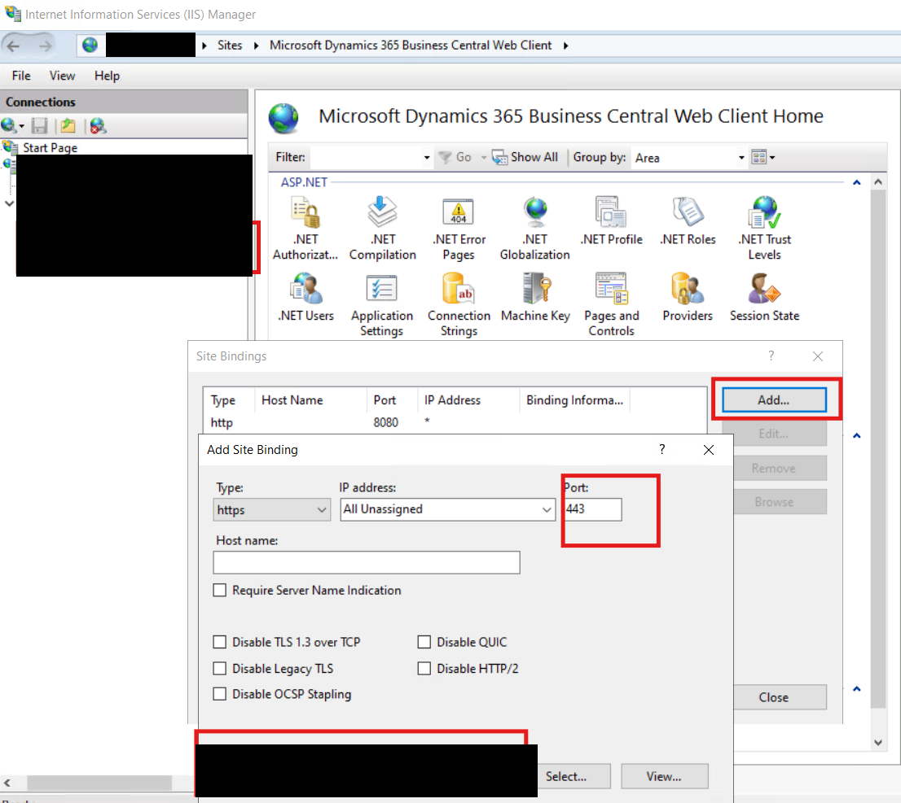
<!-- Screenshot manually reviewed; raster flattened, metadata stripped, and any sensitive fields covered with opaque masks. -->

- Update BC's PublicWebBaseUrl to the HTTPS address
- Open Business Central Administration Shell and run **Set-NAVServerConfiguration -ServerInstance BC280 -KeyName PublicWebBaseUrl -KeyValue "https://bc-server.example:443/BC280/"** (adjust port if you used 8443). This matters because BC generates the OAuthLanding.htm redirect URI from this value — if it still points to the http/8080 URL, Entra will reject the redirect even though the site itself is now HTTPS-capable. Restart the BC280 server instance afterward.
- Get Current value
 get-navserverConfiguration -ServerInstance BC280 -KeyName PublicWebBaseUrl
- http://bc-server.example:8080/BC280/Webclient/
- After change value:
- https://bc-server.example:443/BC280/
- 5
- Trust the certificate on the machine you browse from
- Export the cert (or just the public part) and import it into Trusted Root Certification Authorities on whichever machine's browser you use to access BC. This isn't strictly required for Entra's server-side validation, but browsers can silently block or interrupt the OAuth redirect on an untrusted cert warning, which looks like the same 'insecure redirect' failure.

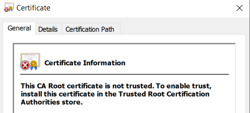
<!-- Screenshot manually reviewed; raster flattened, metadata stripped, and any sensitive fields covered with opaque masks. -->

- From MMC click on cert with CTRL+(COPY) to Trusted Root CA
- Not required to import as trusted

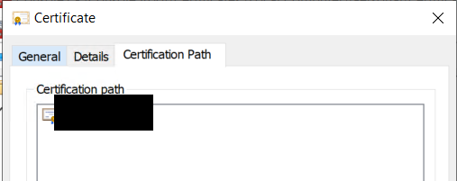
<!-- Screenshot manually reviewed; raster flattened, metadata stripped, and any sensitive fields covered with opaque masks. -->

- 6
- Register the exact HTTPS redirect URI in Entra ID
- In the Entra app registration used for BC (Azure Portal → App registrations → your BC app → Authentication), add the redirect URI exactly as BC will send it: **https://bc-server.example:443/BC280/OAuthLanding.htm** (match port precisely). Entra does exact string matching, so a trailing slash or wrong port will still fail.
- 7
- Retest the email account setup
- Browse to the new https://bc-server.example/BC280/... URL, go to the Email Accounts page, and add the personal Microsoft 365 account via OAuth again. The consent popup should now complete without the 'redirect URI requires secure connection' error.

### Enable SSL SOAP and OData Service

I am using Copilot github CLI to enable SOAP and OData service with SSL enabled.
The “ServicesCertificateThumbprint” config need to populated to enable services. I am use earlier self-signed certification thumbprint to ask the agent to implement the changes.

**Enable the Plan mode:** /Plan
**Choose the agent model**: /Model

Prompt instruction 1:
`“This is the SSL thumbprint <CERTIFICATE-THUMBPRINT> and I want to enable SSL for SOAP and OData services for BC Server instance BC280.”`

Agent response with plan:
**Plan.MD**
`# Enable SSL for BC280 SOAP and OData`

`## Problem and approach`

``BC280` currently has SOAP and OData enabled over HTTP on ports 7047 and 7048. The supplied certificate is present in `Cert:\LocalMachine\My`, has a private key, includes the Server Authentication EKU, and is valid for `CN=bc-server.example`. Add a reusable Business Central Administration Shell helper that validates and applies the certificate and HTTPS settings, plus a dedicated standalone guide for this configuration.`

`The implementation will preserve the existing ports and paths, but change the service endpoints to HTTPS:`

`- OData: `https://bc-server.example:7048/BC280/``
`- SOAP: `https://bc-server.example:7047/BC280/WS/``

`## Todos`

`1. Add a parameterized PowerShell helper under `scripts\` that accepts the BC server instance, certificate thumbprint, and public SOAP/OData URLs; validates that the certificate exists in `LocalMachine\My` and has a private key; sets `ServicesCertificateThumbprint`, the two SSL-enabled flags, and the two public base URLs; restarts the instance; and outputs the resulting configuration.`
`2. Create `docs\enable-ssl-odata-and-soap.md`, titled **Enable SSL OData and SOAP**, with the BC280 command using thumbprint `<CERTIFICATE-THUMBPRINT>`, endpoint URLs, the `NETWORK SERVICE` private-key ACL requirement, expected HTTPS service URLs, and post-restart validation guidance.`
`3. Review the helper’s parameter validation and the documentation commands against the installed BC280 configuration, ensuring the HTTPS URLs retain the existing host, ports, instance path, and SOAP `/WS/` suffix.`

`## Considerations`

`- The certificate thumbprint will be used only in documentation as an environment-specific example; no certificate material or private key will be stored in the repository.`
`- SSL is configured at the Business Central Server endpoint. IIS binding changes remain limited to the web client and are not a replacement for enabling the SOAP and OData SSL flags.`
`- The BC280 server runs as `NT AUTHORITY\NETWORK SERVICE`; it must retain read access to the certificate private key or the service cannot bind it after restart.`
`- The helper will use existing `Set-NAVServerConfiguration`, `Restart-NAVServerInstance`, and `Get-NAVServerConfiguration` cmdlets to match the repository’s existing administration-shell script convention.`
`- Existing `docs\lab-01-enable-https.md` and `README.md` will not be modified.`

Prompt instruction 2:
modification to the plan:
do not update the existing MD file

Agent Response:
`BC280 SOAP and OData SSL are enabled with certificate  <CERTIFICATE-THUMBPRINT> .`

`• OData:  https://bc-server.example:7048/BC280/ODataV4/ `
`• SOAP:  https://bc-server.example:7047/BC280/WS/ `

`Added  scripts\lab-01-enable-odata-soap-ssl.ps1  and  docs\enable-ssl-odata-and-soap.md . The existing Lab 1 guide and README were not changed.`

Following key config were affected:

-KeyName 'ServicesCertificateThumbprint'
-KeyName 'ODataServicesSSLEnabled'
-KeyName 'SOAPServicesSSLEnabled'
-KeyName 'PublicODataBaseUrl'
-KeyName 'PublicSOAPBaseUrl'

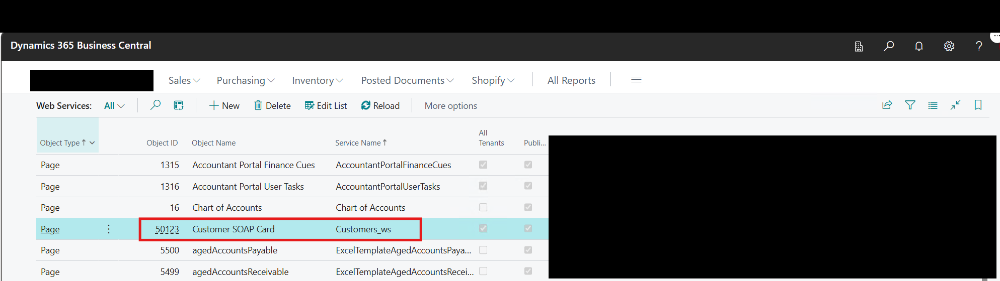
<!-- Screenshot manually reviewed; raster flattened, metadata stripped, and any sensitive fields covered with opaque masks. -->

### Setup: Business Central 28 (Hyper-V VM) — External HTTPS API Access

**Goal:** Make BC28's OData/API service (hosted on a Hyper-V VM, e.g. bc-server.example) accessible from the internet over a trusted HTTPS connection, for dev/test purposes, using a home router's DDNS feature.
**Router requirement:**
- Supports **DDNS **with a built-in free **Let's Encrypt cert **option (used here: ASUS)
- Supports port forwarding
- **Public IP **from ISP (not CGNAT/double-NAT)

**Step 1: Set up DDNS on the router
** On the router (ASUS in this example), go to WAN > DDNS. Enable DDNS, select a DDNS server (e.g.[ WWW.ASUS.COM](http://www.asus.com)), and set a hostname (e.g. demo-host → bc.example.com). This gives a stable public hostname even when the ISP-assigned IP changes.
**Step 2: Port forward BC's API port
** Add a port forwarding rule: external port 7048 → internal IP of the BC VM (e.g. 192.0.2.10), internal port 7048, protocol TCP.
**Step 3: Allow the port through Windows Firewall on the VM
** Confirm Windows Firewall on the BC VM has an inbound rule allowing TCP 7048 from any remote address.
**Step 4: Verify raw external reachability
** Test from an external network (phone on mobile data, not home WiFi) by browsing to:
 https://<ddns-hostname>:7048/BC280/ODataV4/...
 This confirms the API is reachable, even though the cert will show as untrusted/self-signed at this point.
**Step 5: Get a real trusted cert via the router's built-in Let's Encrypt option
** On the router's WAN-DDNS page, switch HTTPS/SSL Certificate from "Auto" (self-signed) to "Free Certificate from Let's Encrypt," then click Apply. The router requests a real trusted cert for the DDNS hostname directly through its own DDNS provider infrastructure — no port 80 forwarding or external validation needed.

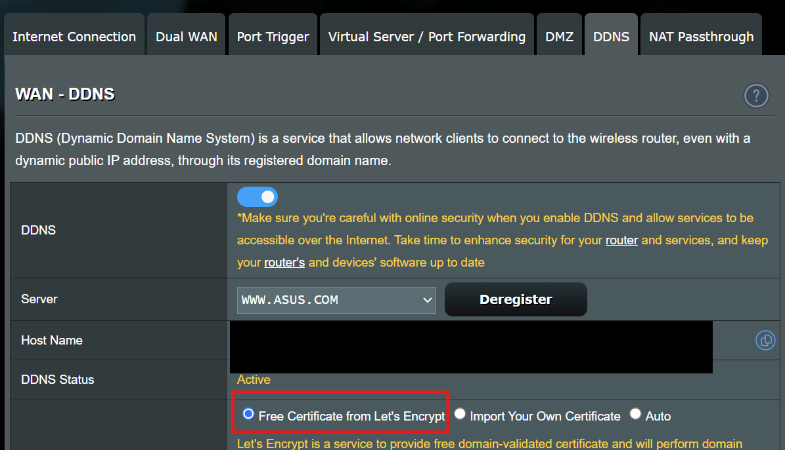
<!-- Screenshot manually reviewed; raster flattened, metadata stripped, and any sensitive fields covered with opaque masks. -->

**Step 6: Export the cert + key from the router
** Once issued, go to the Server Certificate section and click Export to download cert.pem and key.pem.
**Step 7: Combine cert + key into a PFX**
**_Option A — Native PowerShell (no OpenSSL required)_**
Requires PowerShell 7 (pwsh). Check with pwsh -v; if not installed, run `winget install --id Microsoft.PowerShell first.`
Copy cert.pem and key.pem onto the BC VM, then in a PowerShell 7 (pwsh) session:
`$cert = [System.Security.Cryptography.X509Certificates.X509Certificate2]::CreateFromPemFile("cert.pem", "key.pem")`
`$pfxBytes = $cert.Export([System.Security.Cryptography.X509Certificates.X509ContentType]::Pfx, "YourPassword")`
`[System.IO.File]::WriteAllBytes("bc-cert.pfx", $pfxBytes)`
If key.pem is passphrase-protected, use CreateFromEncryptedPemFile("cert.pem", "keyPassphrase", "key.pem") instead.
**_Option B — Using OpenSSL_**
Install OpenSSL if not already present: download the Win64 build from `slproweb.com/products/Win32OpenSSL.html`, or use the copy bundled with Git for Windows (usually at C:\Program Files\Git\usr\bin\openssl.exe).
Copy cert.pem and key.pem onto the BC VM, then in an elevated Command Prompt (cd to the folder containing the files):
openssl pkcs12 -export -out bc-cert.pfx -inkey key.pem -in cert.pem
It will prompt for an export password — this protects the PFX file and is separate from any BC configuration; re-enter it during import in Step 8.
Either option produces the same result: a bc-cert.pfx file ready to import into the Windows Certificate Store.

The Installed OpenSSL path located at:
**C:\Program Files\OpenSSL-Win64**
**
**

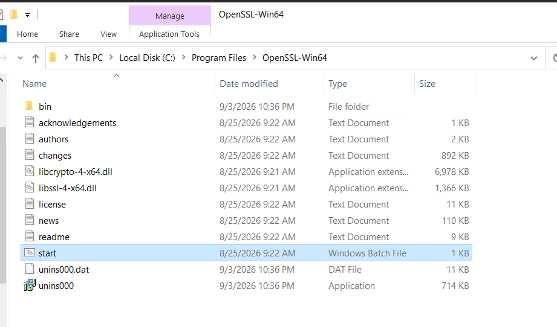
<!-- Screenshot manually reviewed; raster flattened, metadata stripped, and any sensitive fields covered with opaque masks. -->

`Run the start.Bat  (it open the CMD)`

**Step 8: Import the PFX into the Windows Certificate Store
** Run certlm.msc → Personal > Certificates → All Tasks > Import → select bc-cert.pfx → enter the password → store under Personal.
**Step 9: Get the new certificate's thumbprint
** In PowerShell:
Get-ChildItem -Path Cert:\LocalMachine\My | Format-List Subject, Thumbprint
Find the entry matching the DDNS hostname and copy its thumbprint (remove spaces).
**Step 10: Bind the new cert to BC's API port with netsh
** In an elevated Command Prompt:
`netsh http delete sslcert ipport=0.0.0.0:7048`
`netsh http add sslcert ipport=0.0.0.0:7048 certhash=<thumbprint> appid={XXXXXXXX-XXXX-XXXX-XXXX-XXXXXXXXXXXX}`

`C:\certs>``openssl pkcs12 -export -out bc-cert.pfx -inkey key.pem -in cert.pem`
`Enter Export Password:`
`Verifying - Enter Export Password:`

`C:\certs>``netsh http delete sslcert ipport=0.0.0.0:7048`

`SSL Certificate successfully deleted`

`C:\certs>``netsh http add sslcert ipport=0.0.0.0:7048 certhash=<CERTIFICATE-THUMBPRINT> appid={XXXXXXXX-XXXX-XXXX-XXXX-XXXXXXXXXXXX}`

`SSL Certificate successfully added`

`C:\certs>``netsh http show sslcert ipport=0.0.0.0:7048`

`SSL Certificate bindings:`
`-------------------------`

`    IP:port                      : 0.0.0.0:7048`
`    Certificate Hash             : <CERTIFICATE-THUMBPRINT>`
`    Application ID               : {XXXXXXXX-XXXX-XXXX-XXXX-XXXXXXXXXXXX}`
`    Certificate Store Name       : (null)`
`    Verify Client Certificate Revocation : Enabled`
`    Verify Revocation Using Cached Client Certificate Only : Disabled`
`    Usage Check                  : Enabled`
`    Revocation Freshness Time    : 0`
`    URL Retrieval Timeout        : 0`
`    Ctl Identifier               : (null)`
`    Ctl Store Name               : (null)`
`    DS Mapper Usage              : Disabled`
`    Negotiate Client Certificate : Disabled`
`    Reject Connections           : Disabled`
`    Disable HTTP2                : Not Set`
`    Disable QUIC                 : Not Set`
`    Disable TLS1.2               : Not Set`
`    Disable TLS1.3               : Not Set`
`    Disable OCSP Stapling        : Not Set`
`    Enable Token Binding         : Not Set`
`    Log Extended Events          : Not Set`
`    Disable Legacy TLS Versions  : Not Set`
`    Enable Session Ticket        : Not Set`
`    Enable Caching Client Hello  : Not Set`
` Extended Properties:`
`    PropertyId                   : 0`
`    Receive Window               : 1048576`
` Extended Properties:`
`    PropertyId                   : 1`
`    Max Settings Per Frame       : 2796202`
`    Max Settings Per Minute      : 4294967295`
` Extended Properties:`
`    PropertyId                   : 2`
` Extended Properties:`
`    PropertyId                   : 3`
` Extended Properties:`
`    PropertyId                   : 4`
**Step 11: Restart the BC service tier
** Via Services.msc, restart the Business Central Server service instance so it picks up the new cert binding.
**Step 12: Final verification
** From an external network, browse to:
 `https://<ddns-hostname>:7048/BC280/ODataV4/Company('My%20Test%20Company')/Customers_ws`
 Should now show a clean, trusted padlock with no warnings.

**Note on renewal:** The router auto-renews the Let's Encrypt cert on its own DDNS schedule, but BC's port 7048 binding does NOT automatically pick up the renewed cert. Repeat Steps 6–11 (export → convert → import → thumbprint → netsh bind → restart) each time the cert renews (Let's Encrypt certs expire every ~90 days).

`bc.example.com:7048``/BC280/api/microsoft/app/v2.0/companies(XXXXXXXX-XXXX-XXXX-XXXX-XXXXXXXXXXXX)/customerSOAPCards`

<!-- Screenshot manually reviewed; raster flattened, metadata stripped, and any sensitive fields covered with opaque masks. -->

### Create new Application Registration for BC Onprem Integration

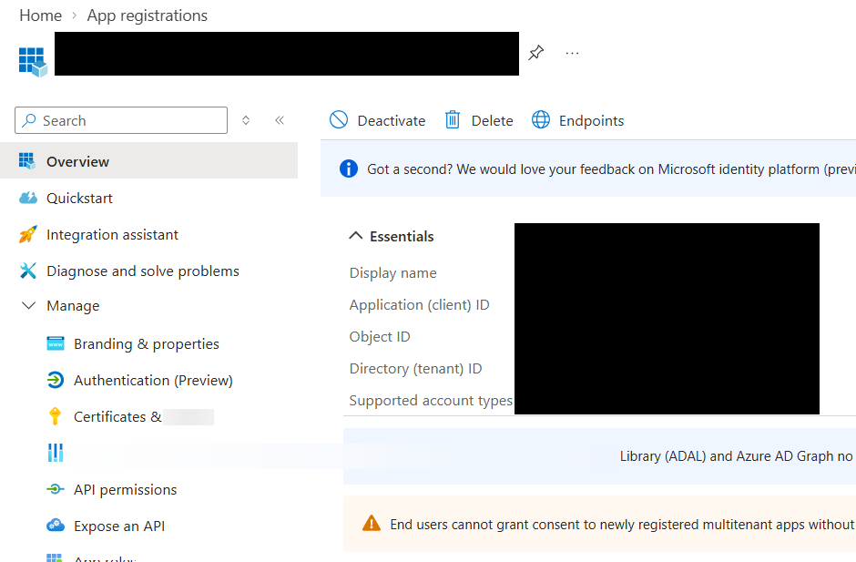
<!-- Screenshot manually reviewed; raster flattened, metadata stripped, and any sensitive fields covered with opaque masks. -->

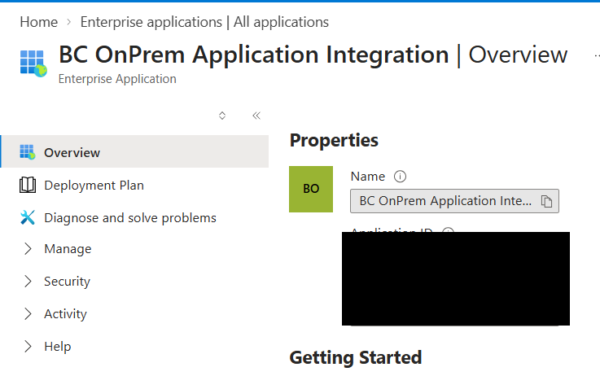
<!-- Screenshot manually reviewed; raster flattened, metadata stripped, and any sensitive fields covered with opaque masks. -->

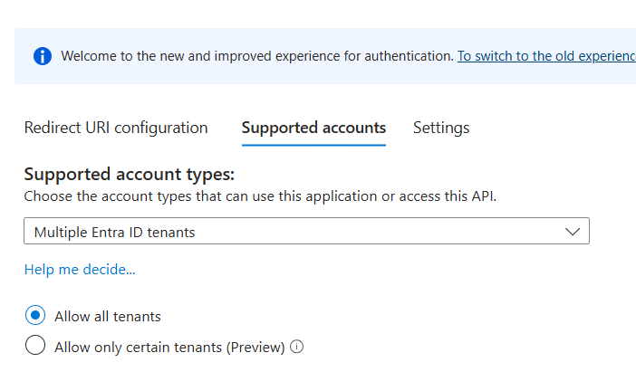
<!-- Screenshot manually reviewed; raster flattened, metadata stripped, and any sensitive fields covered with opaque masks. -->

App Registration		: `BC OnPrem Application Integration`
Client ID 			:` XXXXXXXX-XXXX-XXXX-XXXX-XXXXXXXXXXXX`
Tenant ID			:** **`XXXXXXXX-XXXX-XXXX-XXXX-XXXXXXXXXXXX`
Supported Account Type 	: `Multiple Entra ID tenant`
Application Object ID 	: `XXXXXXXX-XXXX-XXXX-XXXX-XXXXXXXXXXXX`
Enterprise App Object ID	: `XXXXXXXX-XXXX-XXXX-XXXX-XXXXXXXXXXXX`
`(SPN)`

`Dynamics BC need Allow all tenant`
Following error occurs at the email setup for current user where it allowed my own organization only

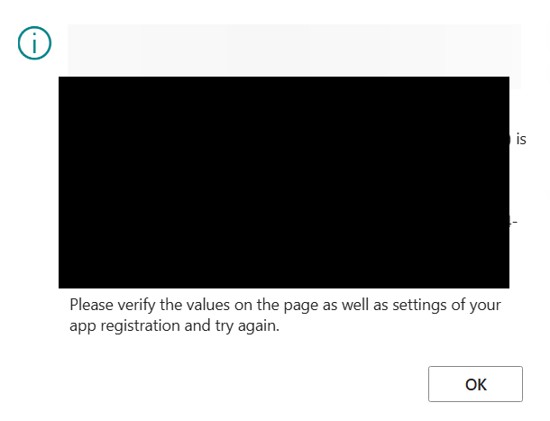
<!-- Screenshot manually reviewed; raster flattened, metadata stripped, and any sensitive fields covered with opaque masks. -->

### Creating New Server Instance BC280-Entra with OAuth2.0(MS Entra ID) Authentication

#### Create the new server instance pointed at the same database

`New-NAVServerInstance ``
`  -ServerInstance '``BC280-Entra``' ``
`  -ManagementServicesPort 7145 ``
`  -ClientServicesPort 7146 ``
`  -SOAPServicesPort 7147 ``
`  -ODataServicesPort 7148 ``
`  -DatabaseServer 'bc-server.example' ``
`  -DatabaseInstance 'BCDEMO' ``
`  -DatabaseName 'Demo Database BC (28-0)' ``
`  -ClientServicesCredentialType ``AccessControlService`` ``
`  -ServiceAccount NetworkService`

#### Explicitly enable SOAP, OData , API services

Note: thumbprint SSL of on-prem host (bc-server.example)
`Set-NAVServerConfiguration -ServerInstance 'BC280-Entra' ``
`-KeyName ServicesCertificateThumbprint -KeyValue ‘<CERTIFICATE-THUMBPRINT>’`

`Set-NAVServerConfiguration -ServerInstance 'BC280-Entra' ``
`-KeyName ODataServicesEnabled -KeyValue true`
`Set-NAVServerConfiguration -ServerInstance 'BC280-Entra' ``
`-KeyName ODataServicesSSLEnabled -KeyValue true`
`Set-NAVServerConfiguration -ServerInstance 'BC280-Entra' ``
`-KeyName ApiServicesEnabled -KeyValue true`
`Set-NAVServerConfiguration -ServerInstance 'BC280-Entra' ``
`-KeyName ApiSubscriptionsEnabled -KeyValue true`
`Set-NAVServerConfiguration -ServerInstance 'BC280-Entra' ``
`-KeyName SOAPServicesEnabled -KeyValue true`
`Set-NAVServerConfiguration -ServerInstance 'BC280-Entra' ``
`-KeyName SOAPServicesSSLEnabled -KeyValue true`

#### Extend the shared app registration for this new instance

Using the app registration of “**BC OnPrem Email Integration**”
App ID	: XXXXXXXX-XXXX-XXXX-XXXX-XXXXXXXXXXXX
Tenant ID	: XXXXXXXX-XXXX-XXXX-XXXX-XXXXXXXXXXXX

Expose an API to create application ID URI

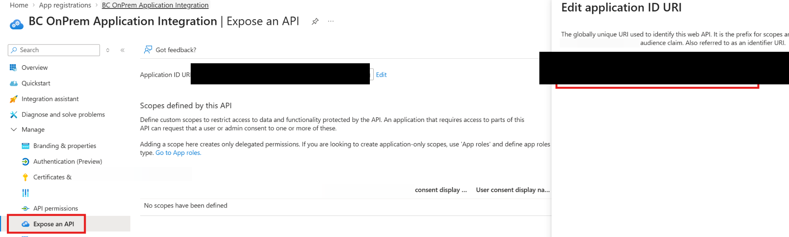
<!-- Screenshot manually reviewed; raster flattened, metadata stripped, and any sensitive fields covered with opaque masks. -->

App ID URI: `api://XXXXXXXX-XXXX-XXXX-XXXX-XXXXXXXXXXXX/BC280-Entra`
`                    `

Unable to use existing redirect URL because of instance server name is part of URI
Error sign in, the url is not match

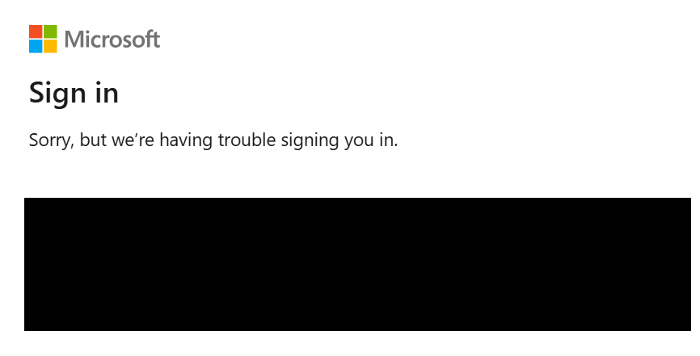
<!-- Screenshot manually reviewed; raster flattened, metadata stripped, and any sensitive fields covered with opaque masks. -->

Notice the end path “/SignIn” is BC on prem signatures

Create new redirect URL: https://bc-server.example/BC280-Entra/SignIn

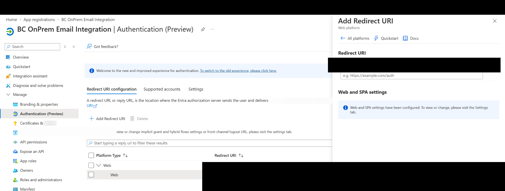
<!-- Screenshot manually reviewed; raster flattened, metadata stripped, and any sensitive fields covered with opaque masks. -->

Checked the ID tokens

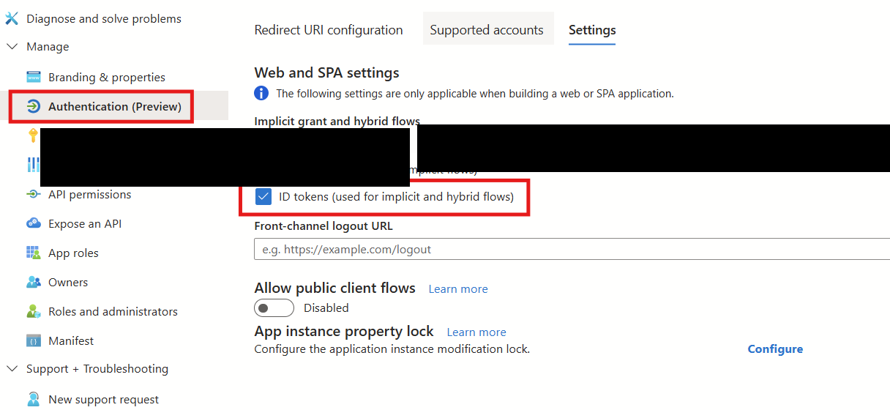
<!-- Screenshot manually reviewed; raster flattened, metadata stripped, and any sensitive fields covered with opaque masks. -->

#### Point the server instance at the shared app registration

`Set-NAVServerConfiguration ``
`  -ServerInstance 'BC280-Entra' ``
`  -KeyName AppIdUri ``
`  -KeyValue "api://XXXXXXXX-XXXX-XXXX-XXXX-XXXXXXXXXXXX/BC280-Entra"`

Below setting tells the new instance to trust tokens issued for that same app.
`Set-NAVServerConfiguration ``
`  -ServerInstance 'BC280-Entra' ``
`  -KeyName ValidAudiences ``
`  -KeyValue "XXXXXXXX-XXXX-XXXX-XXXX-XXXXXXXXXXXX"`

Below setting tells the NAV/BC service tier where to fetch the OpenID Connect discovery **document** for your Entra tenant, so it knows how to validate tokens presented during sign-in.

`Set-NAVServerConfiguration ``
`   -ServerInstance BC280-Entra ``
`   -KeyName ADOpenIdMetadataLocation -KeyValue "https://login.microsoftonline.com/XXXXXXXX-XXXX-XXXX-XXXX-XXXXXXXXXXXX/.well-known/openid-configuration"`

#### Additional config

`Disabled task scheduler`

`Set-NAVServerConfiguration -ServerInstance BC280-Entra -KeyName EnableTaskScheduler -KeyValue false`

#### Configure new web server instance to match

`New-NAVWebServerInstance ``
`  -WebServerInstance 'BC280-Entra' ``
`  -Server 'localhost' ``
`  -ServerInstance 'BC280-Entra'`

`Set-NAVWebServerInstanceConfiguration ``
`  -WebServerInstance 'BC280-Entra' ``
`  -KeyName ClientServicesCredentialType ``
`  -KeyValue AccessControlService`

`Set-NAVWebServerInstanceConfiguration ``
`  -WebServerInstance 'BC280-Entra' ``
`  -KeyName AadApplicationId ``
`  -KeyValue 'XXXXXXXX-XXXX-XXXX-XXXX-XXXXXXXXXXXX'`

`Set-NAVWebServerInstanceConfiguration ``
`  -WebServerInstance 'BC280-Entra' ``
`  -KeyName AadAuthorityUri ``
`  -KeyValue 'https://login.microsoftonline.com/XXXXXXXX-XXXX-XXXX-XXXX-XXXXXXXXXXXX'`

`Set-NAVWebServerInstanceConfiguration ``
`  -WebServerInstance 'BC280-Entra' ``
`  -KeyName ClientServicesPort ``
`  -KeyValue 7146`

`Set-NAVWebServerInstanceConfiguration ``
`  -WebServerInstance 'BC280-Entra' ``
`  -KeyName ManagementServicesPort ``
`  -KeyValue 7145`

#### Adding a new valid MS Entra User by email

Using the default server instance to add MS Entra User
Use : user@contoso.example
Note: given “Super” permission set

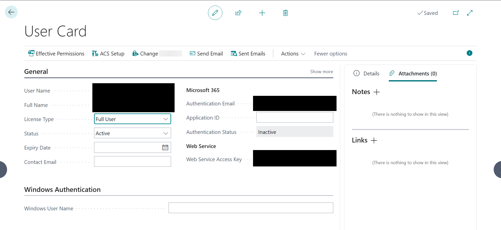
<!-- Screenshot manually reviewed; raster flattened, metadata stripped, and any sensitive fields covered with opaque masks. -->

#### Restart services and populate the API tables

Restart-NAVServerInstance -ServerInstance BC280-Entra
Stop and Start Web Server Instance BC280-Entra

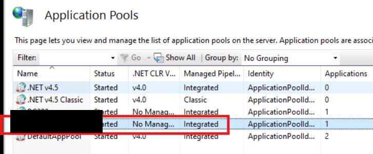
<!-- Screenshot manually reviewed; raster flattened, metadata stripped, and any sensitive fields covered with opaque masks. -->

#### Test Web Client BC280-Entra

https://bc-server.example/BC280-Entra/Default

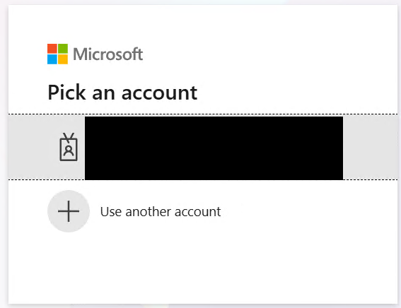
<!-- Screenshot manually reviewed; raster flattened, metadata stripped, and any sensitive fields covered with opaque masks. -->

Demo user account is able to sign in.

<!-- Screenshot manually reviewed; raster flattened, metadata stripped, and any sensitive fields covered with opaque masks. -->

### Expose Server Instance BC280-EntraService to External HTTPS

#### BC Onprem Client to External HTTPS

Enable Port 443 Forwarding from External Router to Internal BC server bc-server.example

Add redirect URL:
`https://bc.example.com/BC280-Entra/SignIn`

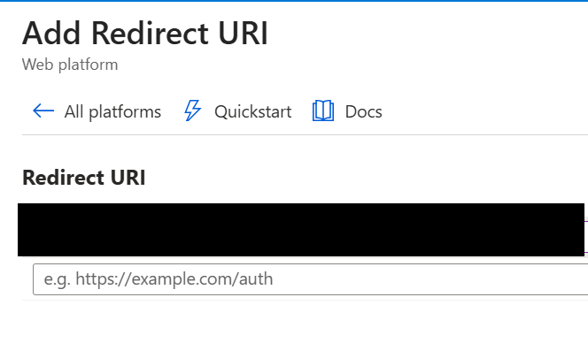
<!-- Screenshot manually reviewed; raster flattened, metadata stripped, and any sensitive fields covered with opaque masks. -->

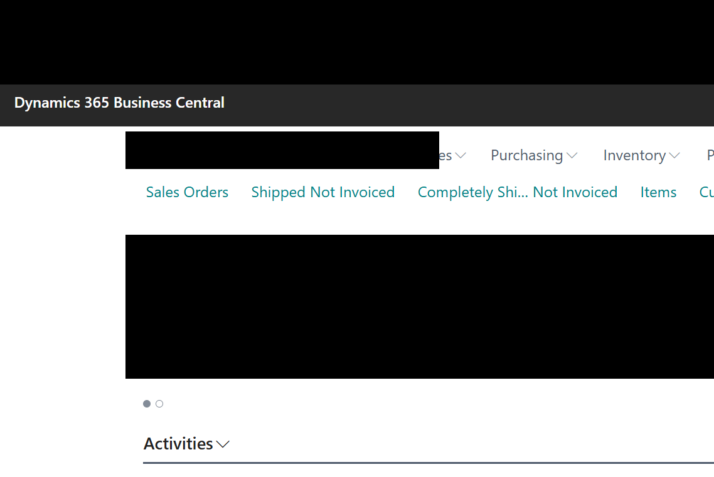
<!-- Screenshot manually reviewed; raster flattened, metadata stripped, and any sensitive fields covered with opaque masks. -->

**Note: **The connection is not secured because port 443 binding with DDNS certificate is not done yet.  Let the BC client be accessed by an internal network only.

#### Bind your existing trusted cert to the OData/API Port 7148 ports

`netsh http delete sslcert ipport=0.0.0.0:7148`

`netsh http add sslcert ipport=0.0.0.0:7148 certhash=<CERTIFICATE-THUMBPRINT> appid={XXXXXXXX-XXXX-XXXX-XXXX-XXXXXXXXXXXX}`

`netsh http show sslcert ipport=0.0.0.0:7148`

`SSL Certificate bindings:`
`-------------------------`

`    IP:port                      : 0.0.0.0:7148`
`    Certificate Hash             : <CERTIFICATE-THUMBPRINT>`
`    Application ID               : {XXXXXXXX-XXXX-XXXX-XXXX-XXXXXXXXXXXX}`
`    Certificate Store Name       : (null)`
`    Verify Client Certificate Revocation : Enabled`
`    Verify Revocation Using Cached Client Certificate Only : Disabled`
`    Usage Check                  : Enabled`
`    Revocation Freshness Time    : 0`
`    URL Retrieval Timeout        : 0`
`    Ctl Identifier               : (null)`
`    Ctl Store Name               : (null)`
`    DS Mapper Usage              : Disabled`
`    Negotiate Client Certificate : Disabled`
`    Reject Connections           : Disabled`
`    Disable HTTP2                : Not Set`
`    Disable QUIC                 : Not Set`
`    Disable TLS1.2               : Not Set`
`    Disable TLS1.3               : Not Set`
`    Disable OCSP Stapling        : Not Set`
`    Enable Token Binding         : Not Set`
`    Log Extended Events          : Not Set`
`    Disable Legacy TLS Versions  : Not Set`
`    Enable Session Ticket        : Not Set`
`    Enable Caching Client Hello  : Not Set`
` Extended Properties:`
`    PropertyId                   : 0`
`    Receive Window               : 1048576`
` Extended Properties:`
`    PropertyId                   : 1`
`    Max Settings Per Frame       : 2796202`
`    Max Settings Per Minute      : 4294967295`
` Extended Properties:`
`    PropertyId                   : 2`
` Extended Properties:`
`    PropertyId                   : 3`
` Extended Properties:`
`    PropertyId                   : 4`

#### Verify OData, SOAP, and API all authenticate via Entra

API URL:
`https://bc.example.com:7148/BC280-Entra/api/microsoft/app/v2.0/companies`

`API URI for contoso Publisher
`[`https://bc.example.com:7248/BC280-NAVUP/api/contoso/ak_app/v2.0`](https://bc.example.com:7248/BC280-NAVUP/api/contoso/ak_app/v2.0)

`API URI List customer`
[`bc.example.com:7248/BC280-NAVUP/api/contoso/ak_app/v2.0/companies(XXXXXXXX-XXXX-XXXX-XXXX-XXXXXXXXXXXX)/ak_customers`](https://bc.example.com:7248/BC280-NAVUP/api/contoso/ak_app/v2.0/companies(XXXXXXXX-XXXX-XXXX-XXXX-XXXXXXXXXXXX)/ak_customers)` `

It prompts Windows basic authentication instead because the API services were meant for system integration and not for users.

**Test with Postman **

Key name
Key Value
`Token Name`
`BC API `
`Grant Type`
`Authorization Code`
`Callback URL`
`https://oauth.pstmn.io/v1/browser-callback `
`Auth URL`
`https://login.microsoftonline.com/XXXXXXXX-XXXX-XXXX-XXXX-XXXXXXXXXXXX/oauth2/v2.0/authorize `
`Access Token URL`
`https://login.microsoftonline.com/XXXXXXXX-XXXX-XXXX-XXXX-XXXXXXXXXXXX/oauth2/v2.0/token `
`Client ID`
`XXXXXXXX-XXXX-XXXX-XXXX-XXXXXXXXXXXX`
`Client Secret`
`<YOUR-CLIENT-SECRET>`
`Scope`
`XXXXXXXX-XXXX-XXXX-XXXX-XXXXXXXXXXXX/.default `
`Client Authentication`
`Send As Basic Auth Header`

**Add the PostMan callback as redirect URL  in app registration **

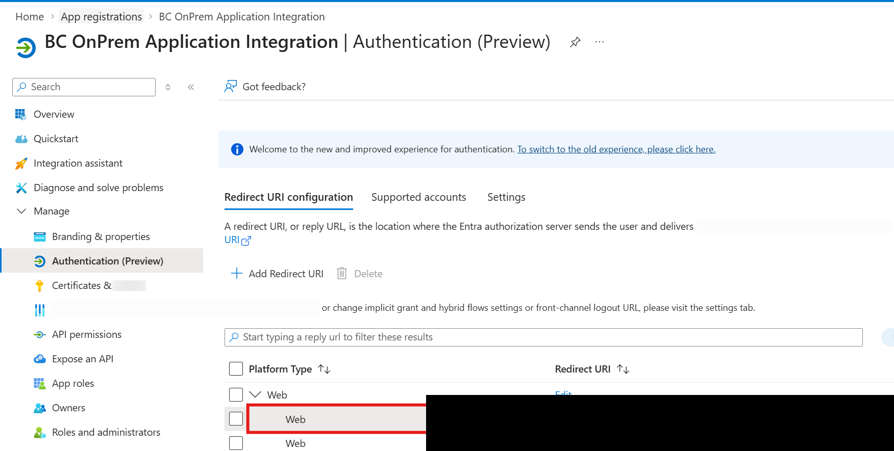
<!-- Screenshot manually reviewed; raster flattened, metadata stripped, and any sensitive fields covered with opaque masks. -->

**New Client Secret for Postman in app registration**

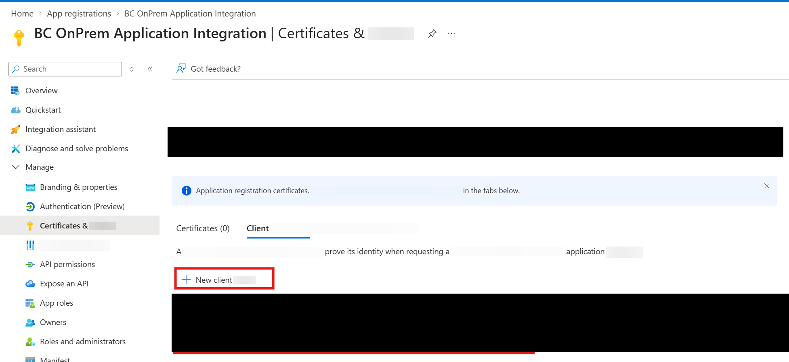
<!-- Screenshot manually reviewed; raster flattened, metadata stripped, and any sensitive fields covered with opaque masks. -->

**Create New Request in PostMan Online**

Get method with following URL:
`https://bc.example.com:7148/BC280-Entra/api/microsoft/app/v2.0/companies `

**Choose Auth Type: OAuth 2.0**

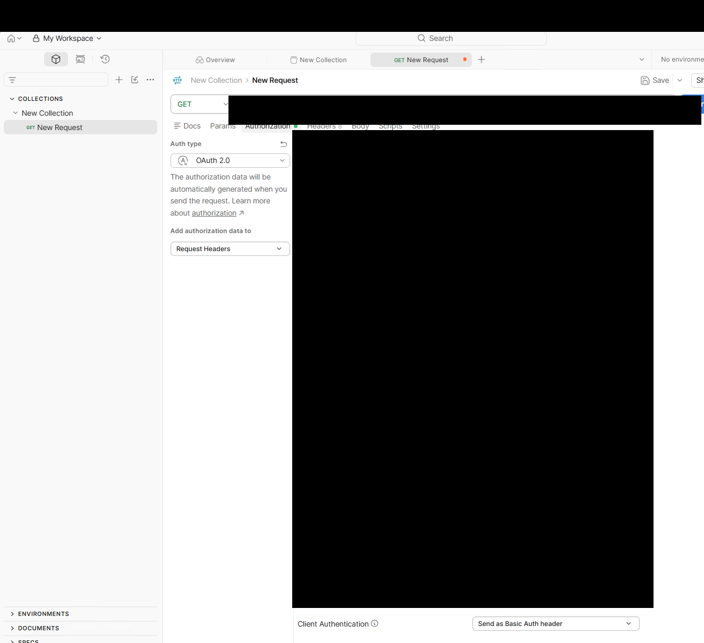
<!-- Screenshot manually reviewed; raster flattened, metadata stripped, and any sensitive fields covered with opaque masks. -->

**Click “Get new access token”**

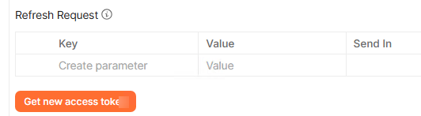
<!-- Screenshot manually reviewed; raster flattened, metadata stripped, and any sensitive fields covered with opaque masks. -->

**Click “Use Token”**

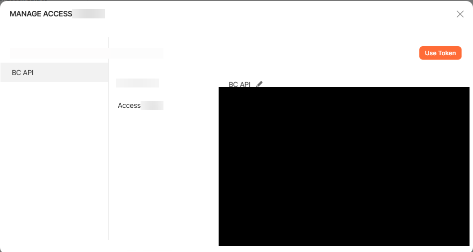
<!-- Screenshot manually reviewed; raster flattened, metadata stripped, and any sensitive fields covered with opaque masks. -->

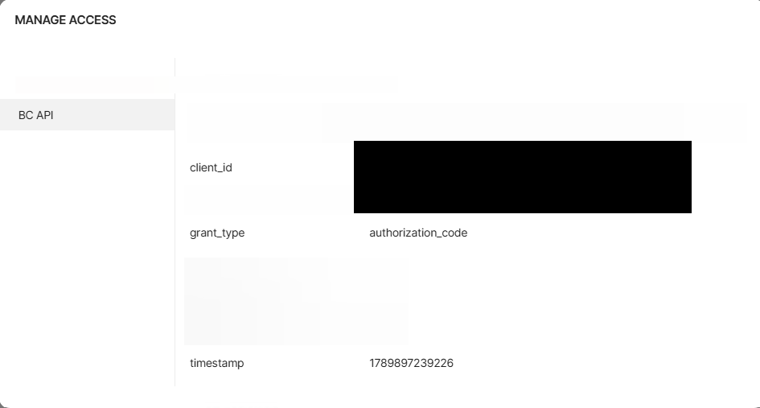
<!-- Screenshot manually reviewed; raster flattened, metadata stripped, and any sensitive fields covered with opaque masks. -->

**Click “Send”**

Check the JSON response

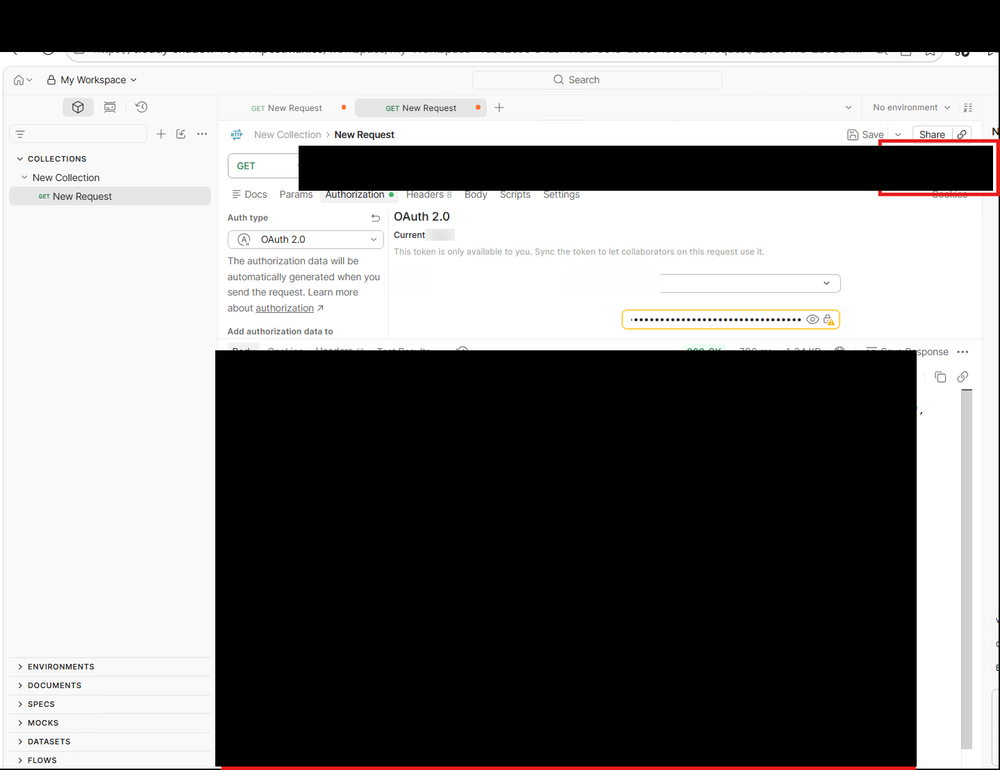
<!-- Screenshot manually reviewed; raster flattened, metadata stripped, and any sensitive fields covered with opaque masks. -->

### Creating New Server Instance BC280-NAVUP with NAVUserPassword Authentication

New Instance name : BC280-NAVUP

`New-NAVServerInstance ``
`  -ServerInstance 'BC280-NAVUP' ``
`  -ManagementServicesPort 7245 ``
`  -ClientServicesPort 7246 ``
`  -SOAPServicesPort 7247 ``
`  -ODataServicesPort 7248 ``
`  -DatabaseServer 'bc-server.example' ``
`  -DatabaseInstance 'BCDEMO' ``
`  -DatabaseName 'Demo Database BC (28-0)' ``
`  -ClientServicesCredentialType NavUserPassword ``
`  -ServiceAccount NetworkService`

`Set-NAVServerConfiguration -ServerInstance 'BC280-NAVUP' ``
`-KeyName ServicesCertificateThumbprint -KeyValue '<CERTIFICATE-THUMBPRINT>'`

`Set-NAVServerConfiguration -ServerInstance 'BC280-NAVUP' ``
`-KeyName ODataServicesEnabled -KeyValue true`
`Set-NAVServerConfiguration -ServerInstance 'BC280-NAVUP' ``
`-KeyName ODataServicesSSLEnabled -KeyValue true`
`Set-NAVServerConfiguration -ServerInstance 'BC280-NAVUP' ``
`-KeyName ApiServicesEnabled -KeyValue true`
`Set-NAVServerConfiguration -ServerInstance 'BC280-NAVUP' ``
`-KeyName ApiSubscriptionsEnabled -KeyValue true`
`Set-NAVServerConfiguration -ServerInstance 'BC280-NAVUP' ``
`-KeyName SOAPServicesEnabled -KeyValue true`
`Set-NAVServerConfiguration -ServerInstance 'BC280-NAVUP' ``
`-KeyName SOAPServicesSSLEnabled -KeyValue true`

Additional config
**Disabled Task Scheduler**

`Set-NAVServerConfiguration -ServerInstance ‘BC280-NAVUP’ ``
`-KeyName EnableTaskScheduler -KeyValue false`

`New-NAVWebServerInstance ``
`  -WebServerInstance 'BC280-NAVUP' ``
`  -Server 'localhost' ``
`  -ServerInstance 'BC280-NAVUP'`

`Set-NAVWebServerInstanceConfiguration ``
`  -WebServerInstance 'BC280-NAVUP' ``
`  -KeyName ClientServicesCredentialType ``
`  -KeyValue NavUserPassword`

`Set-NAVWebServerInstanceConfiguration ``
`  -WebServerInstance 'BC280-NAVUP' ``
`  -KeyName ClientServicesPort ``
`  -KeyValue 7246`

`Set-NAVWebServerInstanceConfiguration ``
`  -WebServerInstance 'BC280-NAVUP' ``
`  -KeyName ManagementServicesPort ``
`  -KeyValue 7245`

`Start-NAVServerInstance -ServerInstance BC280-NAVUP`

Creating new user NAVUSERONE using BC Password authentication
Note: permissionset is SUPER

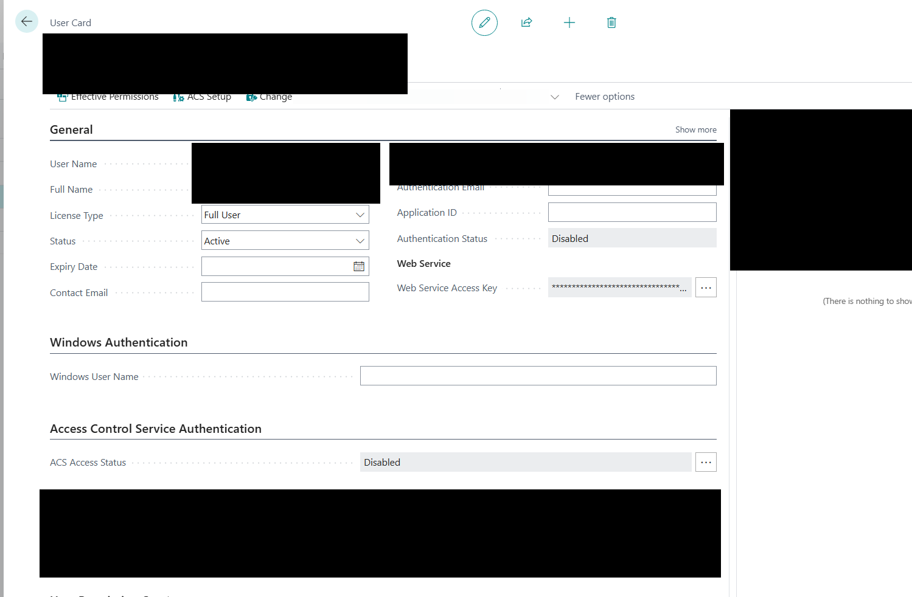
<!-- Screenshot manually reviewed; raster flattened, metadata stripped, and any sensitive fields covered with opaque masks. -->

### Expose Server Instance BC280-NAVUP to External HTTPS

Bind your existing trusted cert to the OData/API Port 7248 ports

`netsh http delete sslcert ipport=0.0.0.0:7248`

`netsh http add sslcert ipport=0.0.0.0:7248 certhash=<CERTIFICATE-THUMBPRINT> appid={XXXXXXXX-XXXX-XXXX-XXXX-XXXXXXXXXXXX}`
