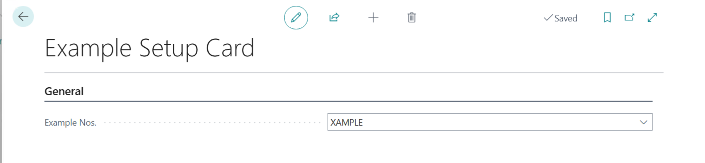
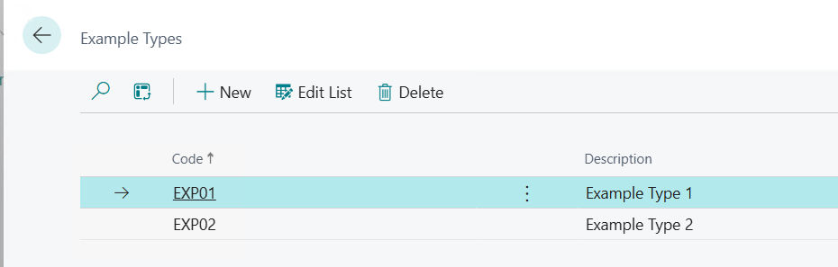
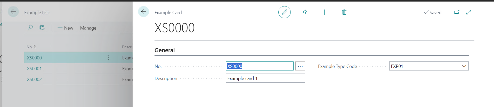

# Module #10-3: Exercise

> Part of: Module 10: Business Logic & Workflows

## [Exercise - Add tables and pages for master data](https://learn.microsoft.com/en-us/training/modules/work-with-master-data-business-central/6a-exercise)

`Vscode Path: Labs\M10_3_Add_MasterTablePage`
`Agent Model: GPT-5.6 Luna`

Prompt Instruction 1: (**switch to plan mode**)
`“``/al-lab-object-planning`` “`
`
`Agent Response: (agent ask 2 questions as per skill prompt)
`“
Q: What is the URL link to the lab exercise to analyze?`
`A: https://learn.microsoft.com/en-us/training/modules/work-with-master-data-business-central/6a-exercise`
`Q: What workspace folder should contain the new or updated AL objects?`
`A: M10_3_Add_MasterTablePage`
_“_

_“_
`5. Consolidated Implementation Plan`
`Create the seven new AL objects in M10_3_Add_MasterTablePage.`
`Implement ExampleType first because Example references it.`
`Implement Example Setup and its card page for No. Series configuration.`
`Implement Example with the table relation and current No. Series API.`
`Add the Example card/list pages and the Example Types list page.`
`Set lookup, drill-down, and card-page references between the objects.`
`Optionally update launch.json so the startup object is page 50139 (Example List) for lab testing. The current startup object is page 22.`
`Compile and publish the extension.`
`Test the following workflow:`
`Create an Example Type.`
`Configure Example Nos. in Example Setup Card.`
`Create an Example with a blank number.`
`Verify automatic numbering.`
`Test No. AssistEdit.`
`Verify Example Type lookup and Example List to Example Card navigation.`
`No app.json change is needed. The proposed IDs fit the existing range.`

`6. Final Recommendation`
`Create the seven new objects with IDs 50134..50140 under M10_3_Add_MasterTablePage. Use the modern BC 28 No. Series API rather than copying the exercise’s legacy NoSeriesManagement implementation without verification. Keep the current app.json range unchanged, and update launch.json only if the Example List should become the default startup page.`

`One residual consideration: the repository contains unrelated duplicate object IDs in other lab folders. The proposed IDs avoid the known collisions, but a full-project compile may still report those pre-existing issues.`

`Planning model: No model was explicitly requested, and the host did not expose a verifiable approved friendly-label selection.`
_“_

Prompt Instruction 2: (**switch to agent mode**)
`“Start implementation”`

<!-- Auto-reviewed via OCR redaction pipeline: 0 sensitive text regions detected. OCR cannot catch non-text sensitive content (logos, photos, stylized graphics) -- please still skim before a public push. -->

`Create new Nos. “XAMPLE”`

<!-- Auto-reviewed via OCR redaction pipeline: 0 sensitive text regions detected. OCR cannot catch non-text sensitive content (logos, photos, stylized graphics) -- please still skim before a public push. -->

`
Example list and card`

<!-- Auto-reviewed via OCR redaction pipeline: 0 sensitive text regions detected. OCR cannot catch non-text sensitive content (logos, photos, stylized graphics) -- please still skim before a public push. -->
