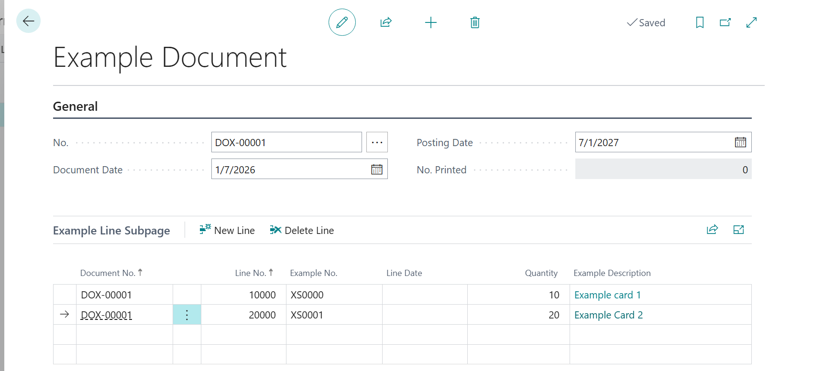

# Module #10-4: Exercise

> Part of: Module 10: Business Logic & Workflows

## [Exercise - Create example documents](https://learn.microsoft.com/en-us/training/modules/use-document-standards-business-central/4b-exercise)

`Vscode Path: Labs\M10_4_Create_Sample_Document`
`Agent Model: GPT-5.6 Luna`

Prompt Instruction 1: (**switch to plan mode**)
`“``/al-lab-object-planning`` “`

Agent Response: (agent ask 2 questions as per skill prompt)
`“`
`Q: What is the URL of the lab exercise to analyze?`
`A: https://learn.microsoft.com/en-us/training/modules/use-document-standards-business-central/4b-exercise`
`Q: Which workspace folder should contain the new or updated AL objects?`
`A: M10_4_Create_Sample_Document`
`“`

`“`
`Decisions`
- `New files go directly in M10_4_Create_Sample_Document, matching your selected target-folder preference.`
- `Existing setup objects are updated in M10_3_Add_MasterTablePage; duplicates will not be created.`
- `Tutorial IDs are preserved where available. Colliding page IDs use the next free valid IDs.`
- `app.json requires no change.`
- `No unrelated lab cleanup or refactoring is included.`
`Planning model: Claude Sonnet 4.6, an approved model for repository-aware planning.`
`“`

Prompt Instruction 2: (**switch to agent mode**)
`“Start implementation”`

<!-- Auto-reviewed via OCR redaction pipeline: 0 sensitive text regions detected. OCR cannot catch non-text sensitive content (logos, photos, stylized graphics) -- please still skim before a public push. -->
