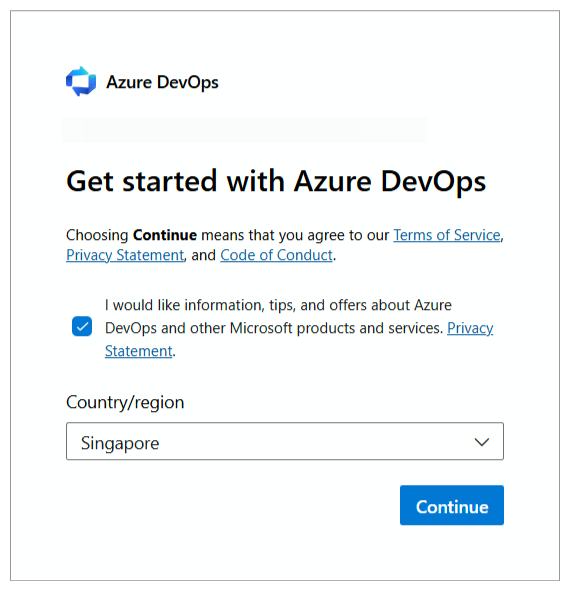
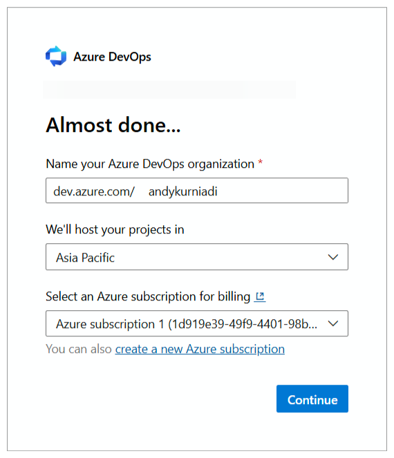
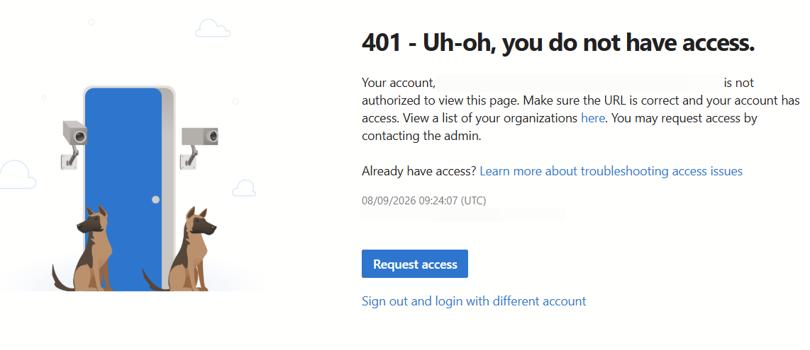
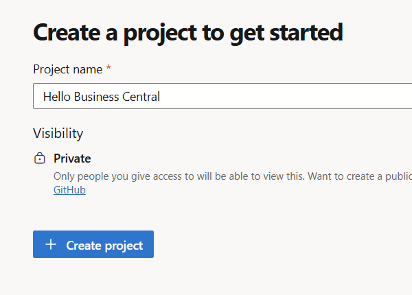
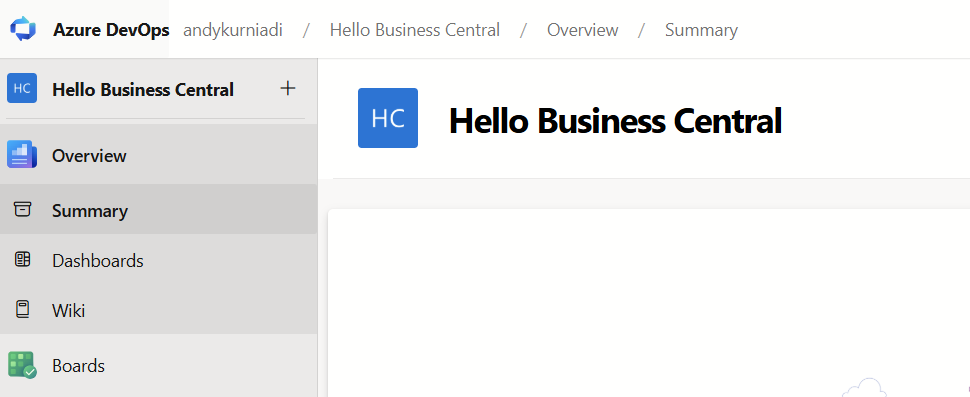
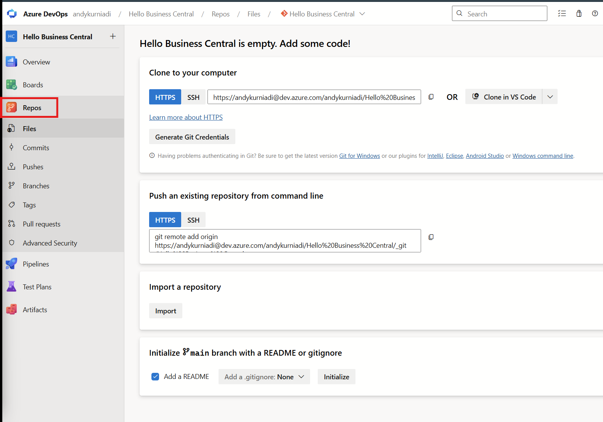
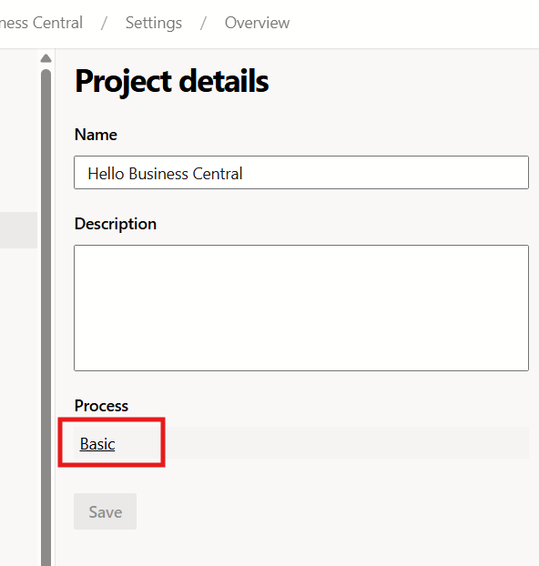
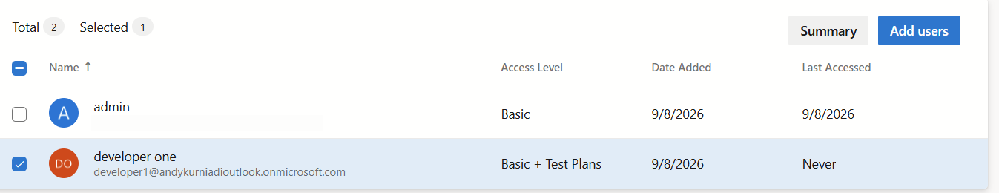
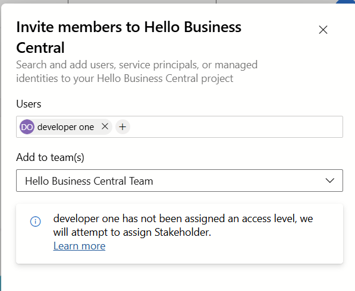
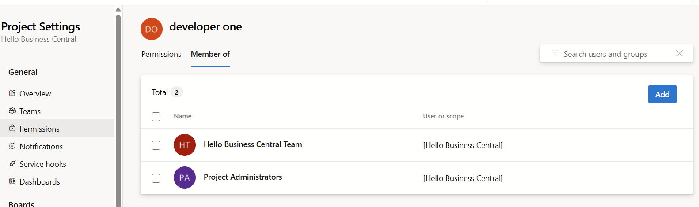

# Module #11-1: Exercise

> Part of: Module 11: DevOps & CI/CD

## [Exercise - Create an Azure DevOps organization and project](https://learn.microsoft.com/en-us/training/modules/use-application-lifecycle/7-exercise)

Link: https://dev.azure.com

Need to sign in as admin

<!-- Auto-blurred via OCR redaction pipeline (1 region(s) detected: GUIDs/emails/secret-token keywords/hostnames/IPs). Please spot-check before relying on this for a public push. -->

<!-- Auto-blurred via OCR redaction pipeline (1 region(s) detected: GUIDs/emails/secret-token keywords/hostnames/IPs). Please spot-check before relying on this for a public push. -->

Below error due lack permission for dev1.

<!-- Auto-blurred via OCR redaction pipeline (2 region(s) detected: GUIDs/emails/secret-token keywords/hostnames/IPs). Please spot-check before relying on this for a public push. -->

<!-- Auto-reviewed via OCR redaction pipeline: 0 sensitive text regions detected. OCR cannot catch non-text sensitive content (logos, photos, stylized graphics) -- please still skim before a public push. -->

<!-- Auto-reviewed via OCR redaction pipeline: 0 sensitive text regions detected. OCR cannot catch non-text sensitive content (logos, photos, stylized graphics) -- please still skim before a public push. -->

This is basic and use Git

<!-- Auto-reviewed via OCR redaction pipeline: 0 sensitive text regions detected. OCR cannot catch non-text sensitive content (logos, photos, stylized graphics) -- please still skim before a public push. -->

<!-- Auto-reviewed via OCR redaction pipeline: 0 sensitive text regions detected. OCR cannot catch non-text sensitive content (logos, photos, stylized graphics) -- please still skim before a public push. -->

Organization setting→ users

<!-- Auto-blurred via OCR redaction pipeline (1 region(s) detected: GUIDs/emails/secret-token keywords/hostnames/IPs). Please spot-check before relying on this for a public push. -->

Invite developer 1 → add per projects

<!-- Auto-reviewed via OCR redaction pipeline: 0 sensitive text regions detected. OCR cannot catch non-text sensitive content (logos, photos, stylized graphics) -- please still skim before a public push. -->

Add developer1 as project administrators

<!-- Auto-reviewed via OCR redaction pipeline: 0 sensitive text regions detected. OCR cannot catch non-text sensitive content (logos, photos, stylized graphics) -- please still skim before a public push. -->
