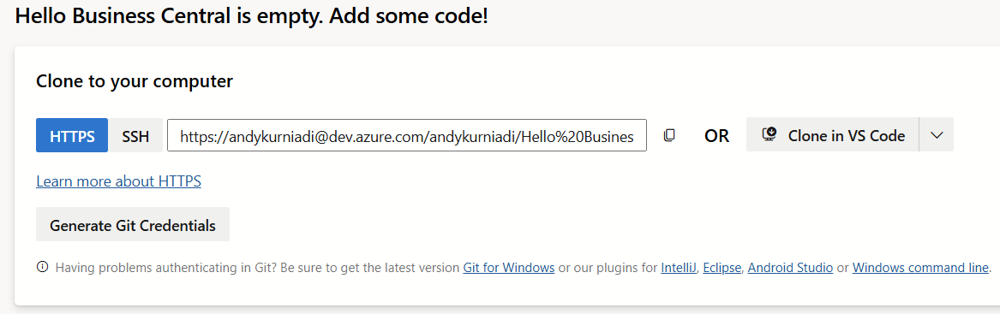
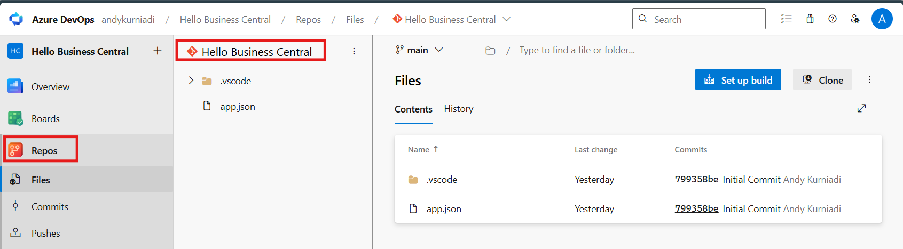
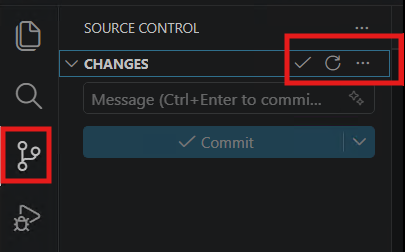
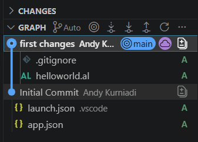
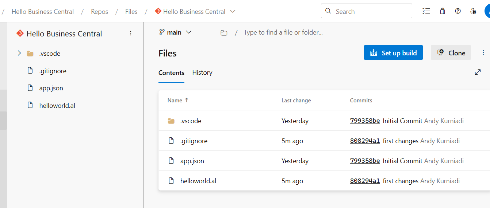

# Module #11-2: Exercise

> Part of: Module 11: DevOps & CI/CD

## [Exercise - Source control with Git](https://learn.microsoft.com/en-us/training/modules/work-source-control-git/11-exercise)

`Vscode Path: bc28onprem-workshopGit\Labs\M11_2_Sourcecode_Git`

<!-- Auto-reviewed via OCR redaction pipeline: 0 sensitive text regions detected. OCR cannot catch non-text sensitive content (logos, photos, stylized graphics) -- please still skim before a public push. -->

https://dev.azure.com/[your ID]/<project>/_git/<repo>

From AL Project extension:

Ctrl+Shift+P : Git: Add Remote
The url
https://dev.azure.com/[your ID]/<project>/_git/<repo>
→ it will pop up for oauth2.0 client authentication →use dev1

Remote name is : ORIGIN

Click the **Publish** icon at the left bottom of your Visual Studio Code window

<!-- Auto-reviewed via OCR redaction pipeline: 0 sensitive text regions detected. OCR cannot catch non-text sensitive content (logos, photos, stylized graphics) -- please still skim before a public push. -->

Made changes on [helloworld.al](http://helloworld.al)

Need to click the refresh to show the Unstaged changes.
Add to stage and make the first commit

<!-- Auto-reviewed via OCR redaction pipeline: 0 sensitive text regions detected. OCR cannot catch non-text sensitive content (logos, photos, stylized graphics) -- please still skim before a public push. -->

Push the changes from the …

<!-- Auto-reviewed via OCR redaction pipeline: 0 sensitive text regions detected. OCR cannot catch non-text sensitive content (logos, photos, stylized graphics) -- please still skim before a public push. -->

The changes reflected in remote repo azure devops

<!-- Auto-reviewed via OCR redaction pipeline: 0 sensitive text regions detected. OCR cannot catch non-text sensitive content (logos, photos, stylized graphics) -- please still skim before a public push. -->
