# Module #11-3: Exercise

> Part of: Module 11: DevOps & CI/CD

## [Exercise - Use branching and merging with Git](https://learn.microsoft.com/en-us/training/modules/use-branch-merge-git/7-exercise)

**Repo→main branch..vertical … client policies.**

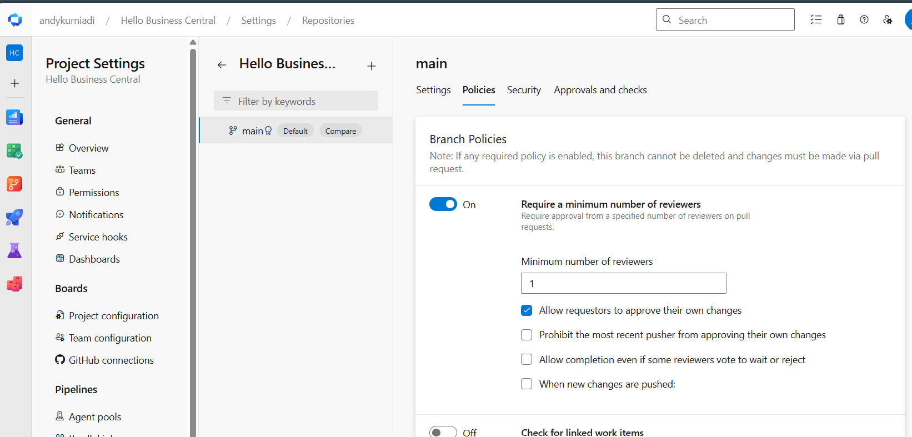
<!-- Auto-reviewed via OCR redaction pipeline: 0 sensitive text regions detected. OCR cannot catch non-text sensitive content (logos, photos, stylized graphics) -- please still skim before a public push. -->

Create a new branch: feature-linked

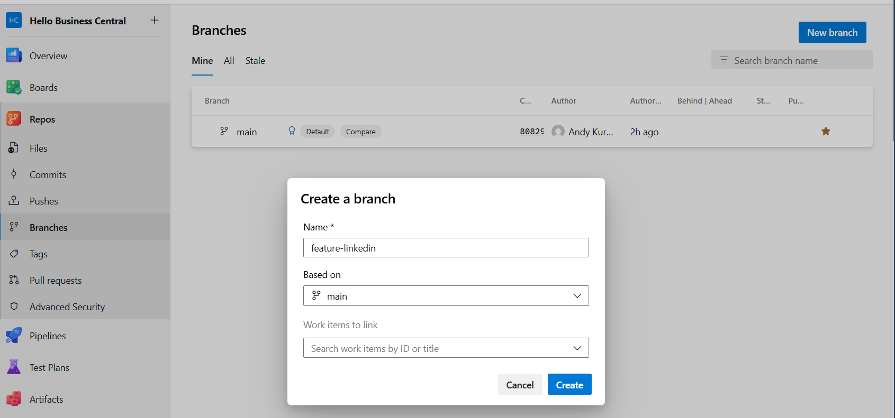
<!-- Auto-reviewed via OCR redaction pipeline: 0 sensitive text regions detected. OCR cannot catch non-text sensitive content (logos, photos, stylized graphics) -- please still skim before a public push. -->

In visual studio code → Git:Fetch →to retrieve the changes

Select the branch from main to feature-linkedin
Left bottom corner of vs code

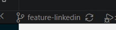
<!-- Auto-reviewed via OCR redaction pipeline: 0 sensitive text regions detected. OCR cannot catch non-text sensitive content (logos, photos, stylized graphics) -- please still skim before a public push. -->

Create a new table extension and new field → Telegram.
Add to stage

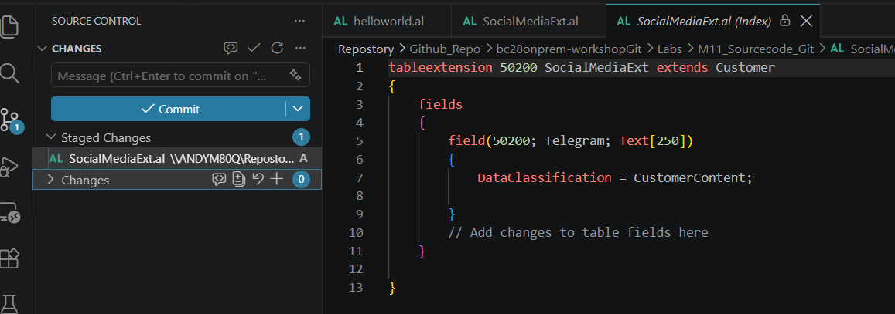
<!-- Auto-reviewed via OCR redaction pipeline: 0 sensitive text regions detected. OCR cannot catch non-text sensitive content (logos, photos, stylized graphics) -- please still skim before a public push. -->

Add the commit

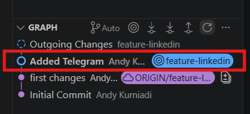
<!-- Auto-reviewed via OCR redaction pipeline: 0 sensitive text regions detected. OCR cannot catch non-text sensitive content (logos, photos, stylized graphics) -- please still skim before a public push. -->

Sync Changes

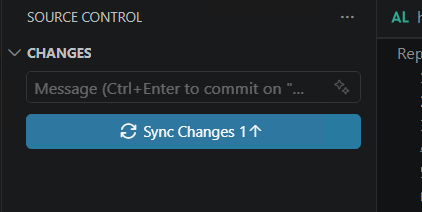
<!-- Auto-reviewed via OCR redaction pipeline: 0 sensitive text regions detected. OCR cannot catch non-text sensitive content (logos, photos, stylized graphics) -- please still skim before a public push. -->

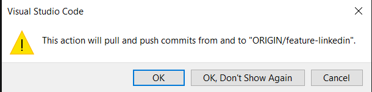
<!-- Auto-reviewed via OCR redaction pipeline: 0 sensitive text regions detected. OCR cannot catch non-text sensitive content (logos, photos, stylized graphics) -- please still skim before a public push. -->

In Devops project→Branches

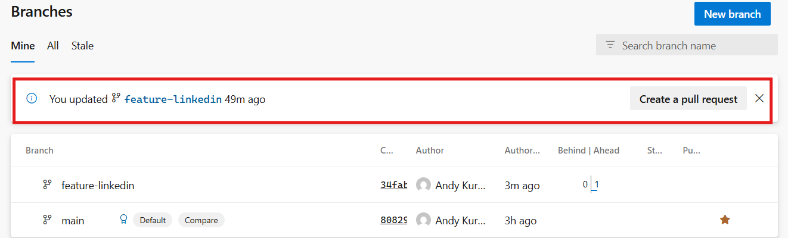
<!-- Auto-reviewed via OCR redaction pipeline: 0 sensitive text regions detected. OCR cannot catch non-text sensitive content (logos, photos, stylized graphics) -- please still skim before a public push. -->

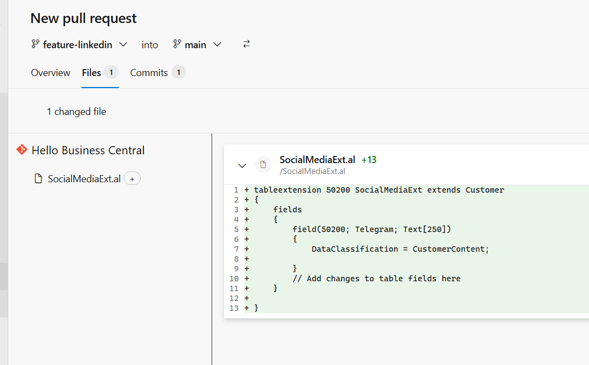
<!-- Auto-reviewed via OCR redaction pipeline: 0 sensitive text regions detected. OCR cannot catch non-text sensitive content (logos, photos, stylized graphics) -- please still skim before a public push. -->

Admin approved and add dev1 approval

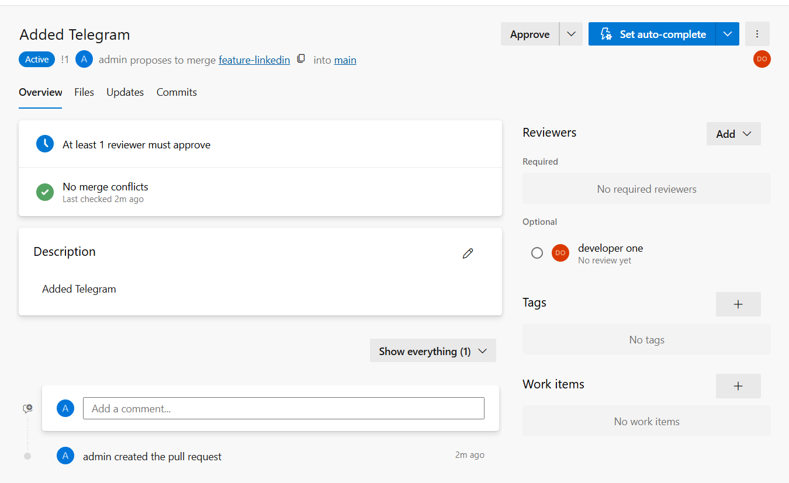
<!-- Auto-reviewed via OCR redaction pipeline: 0 sensitive text regions detected. OCR cannot catch non-text sensitive content (logos, photos, stylized graphics) -- please still skim before a public push. -->

Dev1 approve

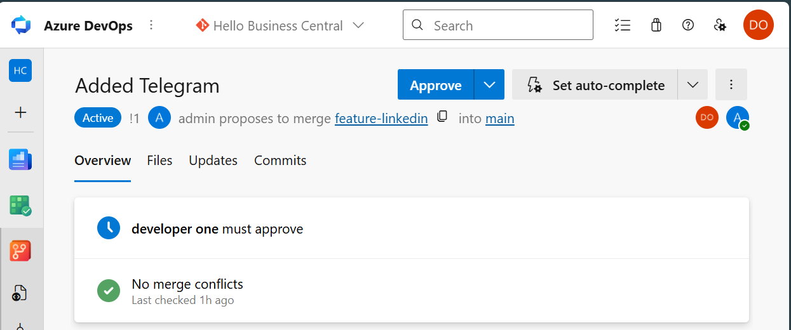
<!-- Auto-reviewed via OCR redaction pipeline: 0 sensitive text regions detected. OCR cannot catch non-text sensitive content (logos, photos, stylized graphics) -- please still skim before a public push. -->

To allow complete and delete branches after merge.
Enable force push security setting in branch
**Note:** need to select the correct group/user to enable this permission

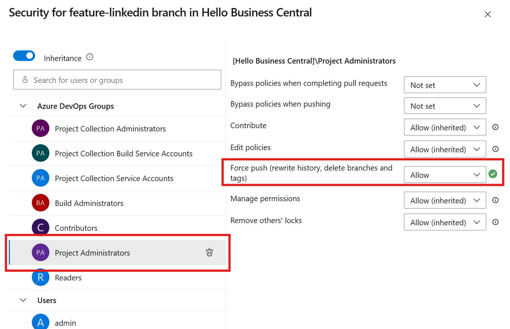
<!-- Auto-reviewed via OCR redaction pipeline: 0 sensitive text regions detected. OCR cannot catch non-text sensitive content (logos, photos, stylized graphics) -- please still skim before a public push. -->

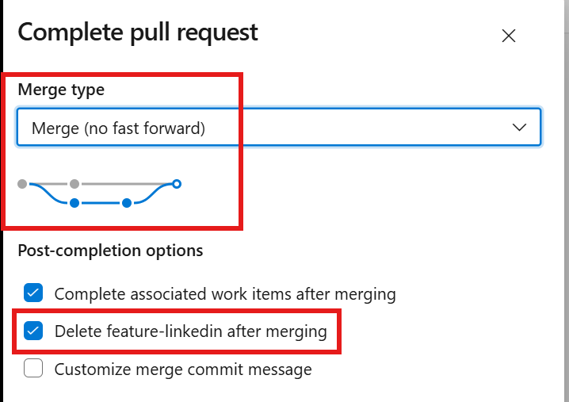
<!-- Auto-reviewed via OCR redaction pipeline: 0 sensitive text regions detected. OCR cannot catch non-text sensitive content (logos, photos, stylized graphics) -- please still skim before a public push. -->

Push “Complete Merge”

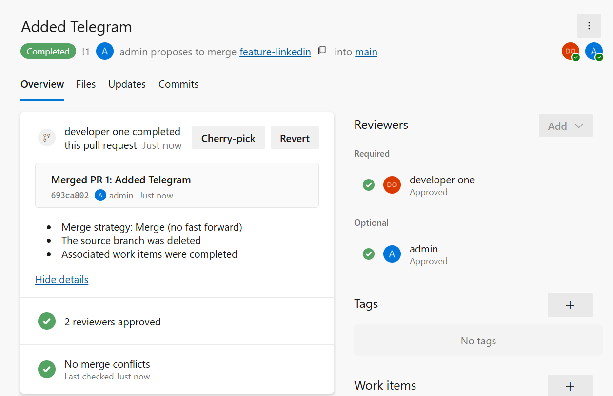
<!-- Auto-reviewed via OCR redaction pipeline: 0 sensitive text regions detected. OCR cannot catch non-text sensitive content (logos, photos, stylized graphics) -- please still skim before a public push. -->

Feature-linkedin branch deleted.
