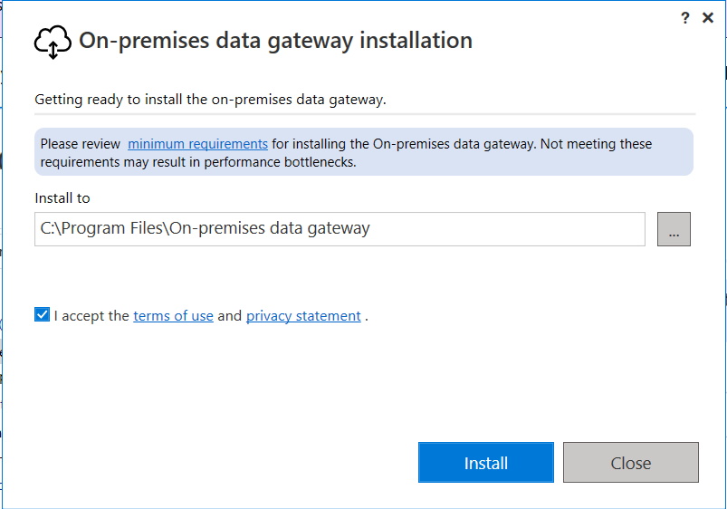
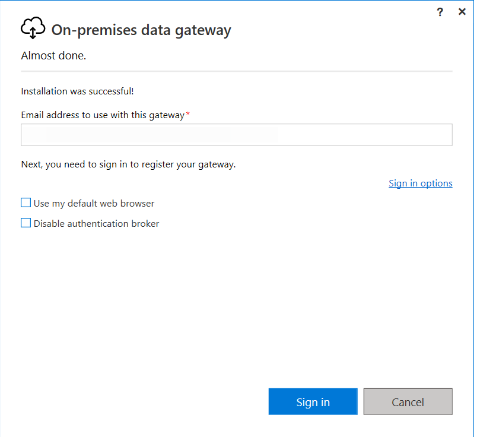
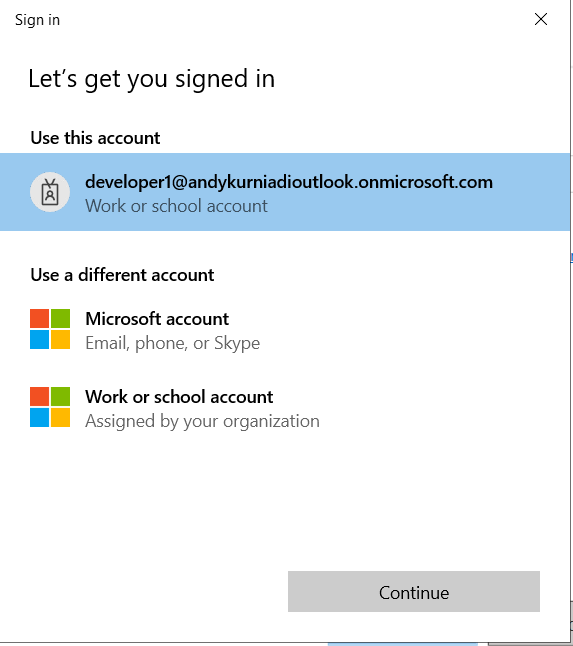
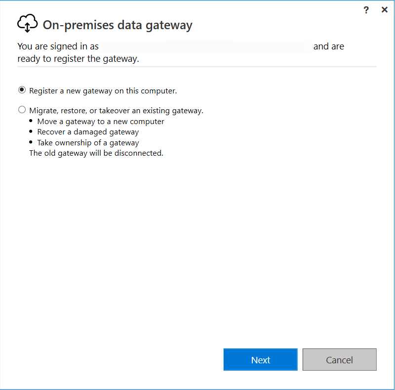
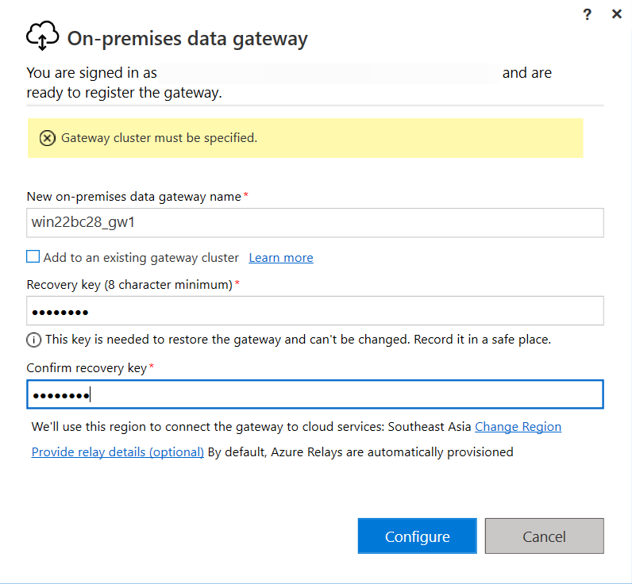
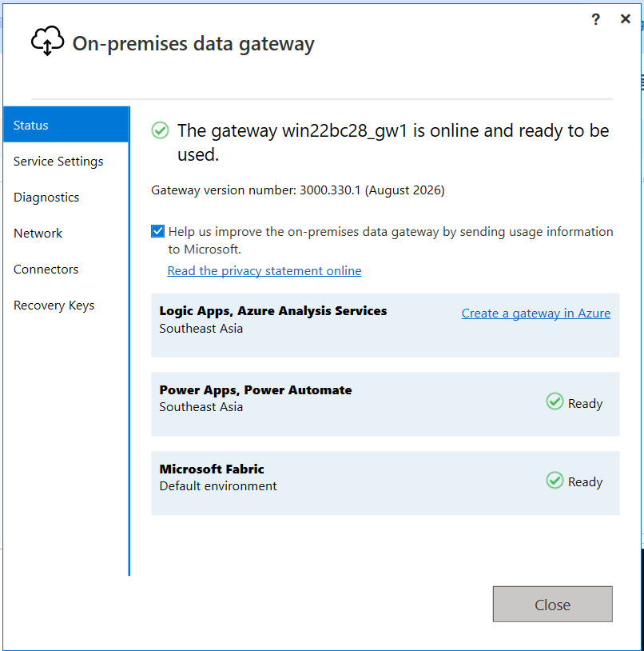
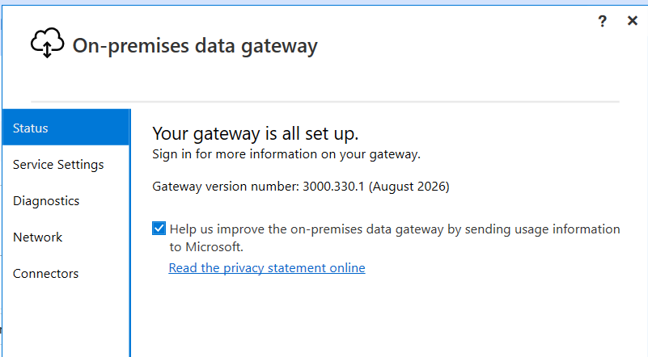
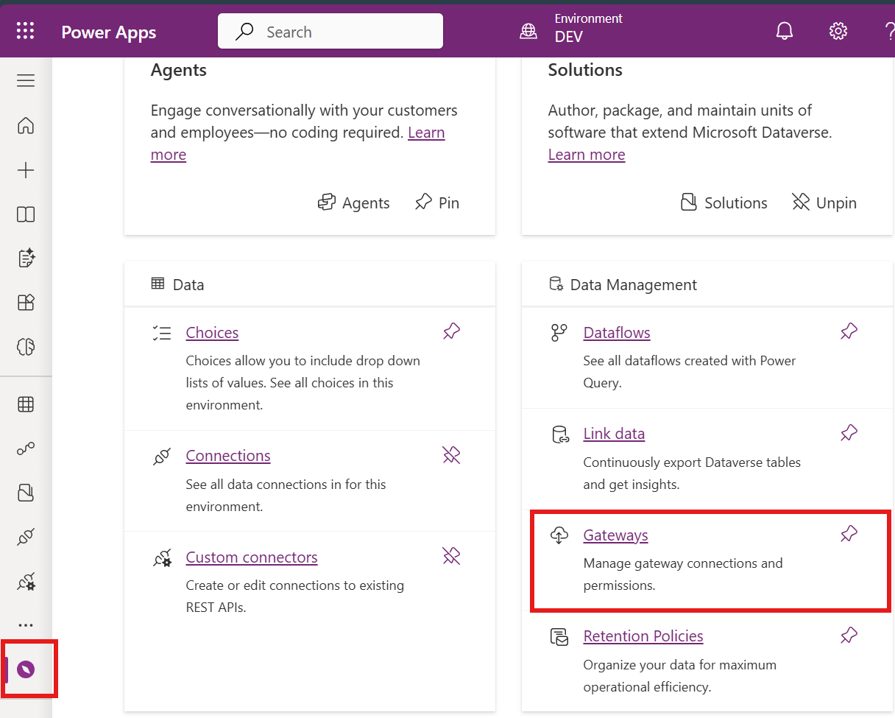
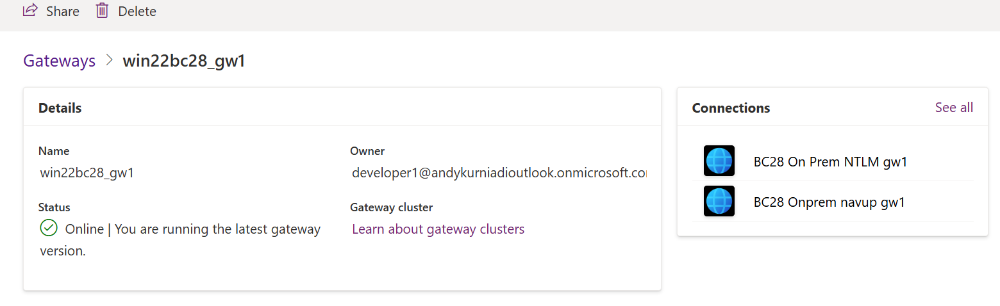

# Module #12-1: Exercise

> Part of: Module 12: Power Platform & Advanced Integration

## Own Exercise:

### Install and configure On-prem DataGateway

Install the gateway in BC on prem host server
[Install an on-premises data gateway | Microsoft Learn](https://learn.microsoft.com/en-us/data-integration/gateway/service-gateway-install)

<!-- Auto-reviewed via OCR redaction pipeline: 0 sensitive text regions detected. OCR cannot catch non-text sensitive content (logos, photos, stylized graphics) -- please still skim before a public push. -->

<!-- Auto-blurred via OCR redaction pipeline (1 region(s) detected: GUIDs/emails/secret-token keywords/hostnames/IPs). Please spot-check before relying on this for a public push. -->

<!-- Auto-reviewed via OCR redaction pipeline: 0 sensitive text regions detected. OCR cannot catch non-text sensitive content (logos, photos, stylized graphics) -- please still skim before a public push. -->

<!-- Auto-blurred via OCR redaction pipeline (1 region(s) detected: GUIDs/emails/secret-token keywords/hostnames/IPs). Please spot-check before relying on this for a public push. -->

<!-- Auto-blurred via OCR redaction pipeline (1 region(s) detected: GUIDs/emails/secret-token keywords/hostnames/IPs). Please spot-check before relying on this for a public push. -->

Key: P455w0rd

<!-- Auto-reviewed via OCR redaction pipeline: 0 sensitive text regions detected. OCR cannot catch non-text sensitive content (logos, photos, stylized graphics) -- please still skim before a public push. -->

<!-- Auto-reviewed via OCR redaction pipeline: 0 sensitive text regions detected. OCR cannot catch non-text sensitive content (logos, photos, stylized graphics) -- please still skim before a public push. -->

Check the Gateways in power platform Discovers

<!-- Auto-reviewed via OCR redaction pipeline: 0 sensitive text regions detected. OCR cannot catch non-text sensitive content (logos, photos, stylized graphics) -- please still skim before a public push. -->

<!-- Auto-reviewed via OCR redaction pipeline: 0 sensitive text regions detected. OCR cannot catch non-text sensitive content (logos, photos, stylized graphics) -- please still skim before a public push. -->
