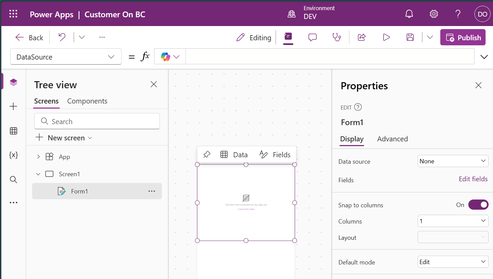
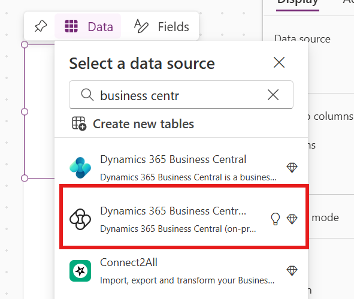
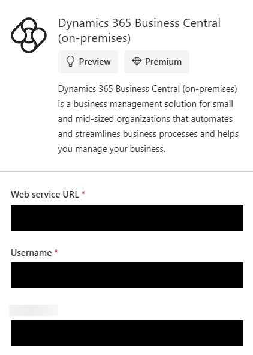
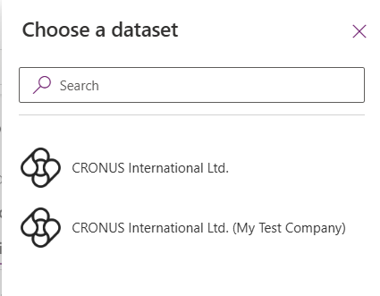
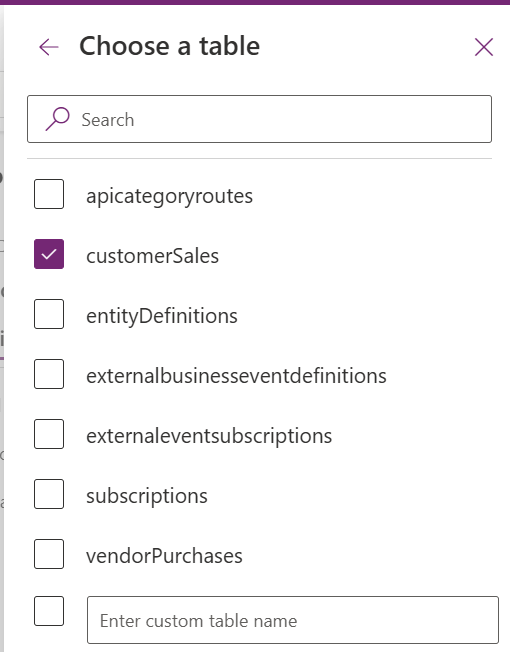
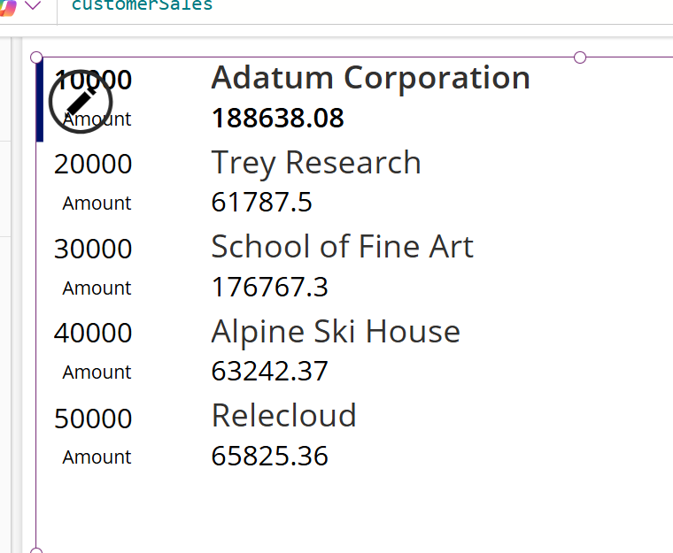

# Module #12-2: Exercise

> Part of: Module 12: Power Platform & Advanced Integration

## [Exercise - Create the customer financial details app in Power Apps](https://learn.microsoft.com/en-us/training/modules/create-canvas-app/7-exercise)

Ensure the Server Instance BC on-prem is using windows NavUserPassword Authentication
The customer financial table is not available.

Created new solution:

<!-- Auto-reviewed via OCR redaction pipeline: 0 sensitive text regions detected. OCR cannot catch non-text sensitive content (logos, photos, stylized graphics) -- please still skim before a public push. -->

<!-- Auto-reviewed via OCR redaction pipeline: 0 sensitive text regions detected. OCR cannot catch non-text sensitive content (logos, photos, stylized graphics) -- please still skim before a public push. -->

After some test, the Dynamics 365 Business Central On-Prem

<!-- Auto-blurred via OCR redaction pipeline (1 region(s) detected: GUIDs/emails/secret-token keywords/hostnames/IPs). Please spot-check before relying on this for a public push. -->

`Note: current connector is Preview`

**The connector picker fixed to the api/beta**
`https://[your ID].example.com:7248/BC280-NAVUP/api/beta`
`{`
`  "@odata.context": "https://[your ID].example.com:7248/BC280-NAVUP/api/beta/$metadata",`
`  "value": [`
`    {`
`      "name": "entityDefinitions",`
`      "kind": "EntitySet",`
`      "url": "entityDefinitions"`
`    },`
`    {`
`      "name": "companies",`
`      "kind": "EntitySet",`
`      "url": "companies"`
`    },`
`    {`
`      "name": "subscriptions",`
`      "kind": "EntitySet",`
`      "url": "subscriptions"`
`    },`
`    {`
`      "name": "externaleventsubscriptions",`
`      "kind": "EntitySet",`
`      "url": "externaleventsubscriptions"`
`    },`
`    {`
`      "name": "externalbusinesseventdefinitions",`
`      "kind": "EntitySet",`
`      "url": "externalbusinesseventdefinitions"`
`    },`
`    {`
`      "name": "apicategoryroutes",`
`      "kind": "EntitySet",`
`      "url": "apicategoryroutes"`
`    },`
`    {`
`      "name": "customerSales",`
`      "kind": "EntitySet",`
`      "url": "customerSales"`
`    },`
`    {`
`      "name": "vendorPurchases",`
`      "kind": "EntitySet",`
`      "url": "vendorPurchases"`
`    }`
`  ]`
`}`

`API available routes list`
`https://[your ID].example.com:7248/BC280-NAVUP/api/beta/apicategoryroutes`

Select company (My Test Company)

<!-- Auto-reviewed via OCR redaction pipeline: 0 sensitive text regions detected. OCR cannot catch non-text sensitive content (logos, photos, stylized graphics) -- please still skim before a public push. -->

<!-- Auto-reviewed via OCR redaction pipeline: 0 sensitive text regions detected. OCR cannot catch non-text sensitive content (logos, photos, stylized graphics) -- please still skim before a public push. -->

Select table based on list above. (api/ beta)

Insert Vertical gallery to display the CustomerSales Table.
There are only few fields available in this table

<!-- Auto-reviewed via OCR redaction pipeline: 0 sensitive text regions detected. OCR cannot catch non-text sensitive content (logos, photos, stylized graphics) -- please still skim before a public push. -->
