# Module #12-4: Exercise

> Part of: Module 12: Power Platform & Advanced Integration

## [Exercise - Create a table in Microsoft Dataverse](https://learn.microsoft.com/en-us/training/modules/use-model-driven-apps-common-data-service/7-exercise)

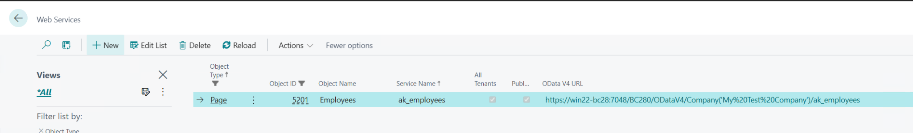
<!-- Auto-reviewed via OCR redaction pipeline: 0 sensitive text regions detected. OCR cannot catch non-text sensitive content (logos, photos, stylized graphics) -- please still skim before a public push. -->

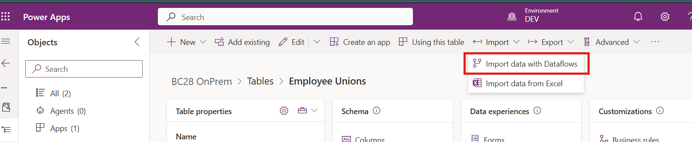
<!-- Auto-reviewed via OCR redaction pipeline: 0 sensitive text regions detected. OCR cannot catch non-text sensitive content (logos, photos, stylized graphics) -- please still skim before a public push. -->

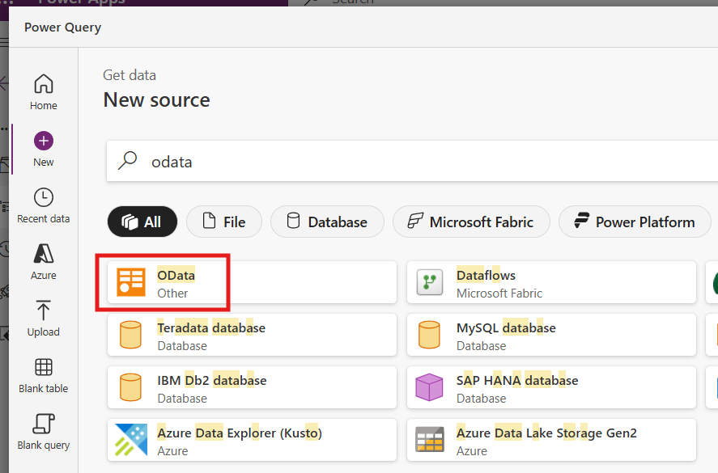
<!-- Auto-reviewed via OCR redaction pipeline: 0 sensitive text regions detected. OCR cannot catch non-text sensitive content (logos, photos, stylized graphics) -- please still skim before a public push. -->

Connection with on prem data gateway enable

Using Windows → NTLM
`https://[your ID].example.com:7048/BC280/ODataV4/Company('<your-company>')/ak_employees`

`<your-server>\<your-user>`

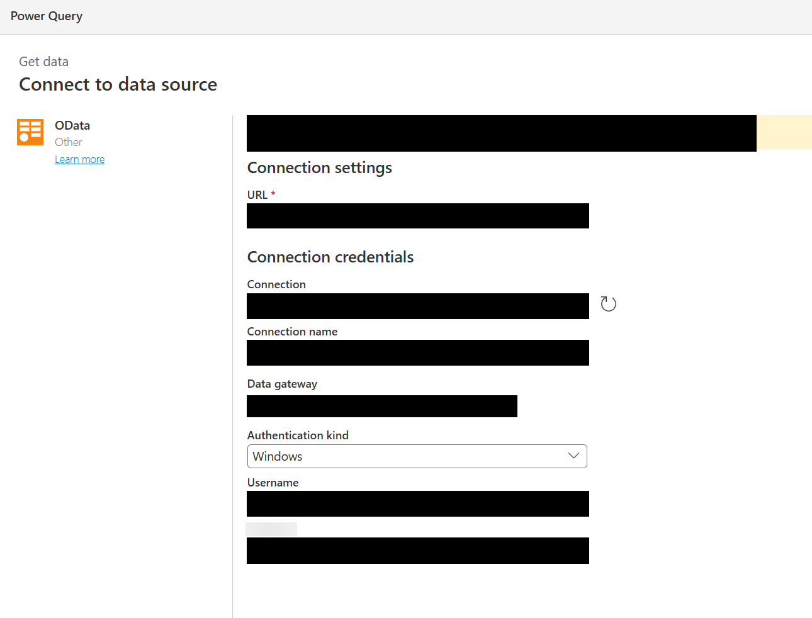
<!-- Auto-blurred via OCR redaction pipeline (1 region(s) detected: GUIDs/emails/secret-token keywords/hostnames/IPs). Please spot-check before relying on this for a public push. -->

Does not work: NTLM and SPNEGO

Using Navision User Password
`https://[your ID].example.com:7248/BC280-NAVUP/ODataV4/Company('<your-company>')/ak_employees`

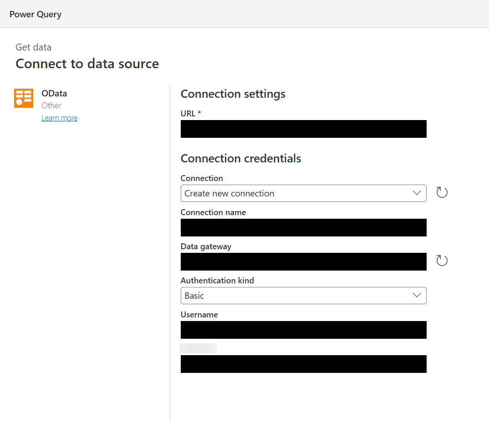
<!-- Auto-blurred via OCR redaction pipeline (2 region(s) detected: GUIDs/emails/secret-token keywords/hostnames/IPs). Please spot-check before relying on this for a public push. -->

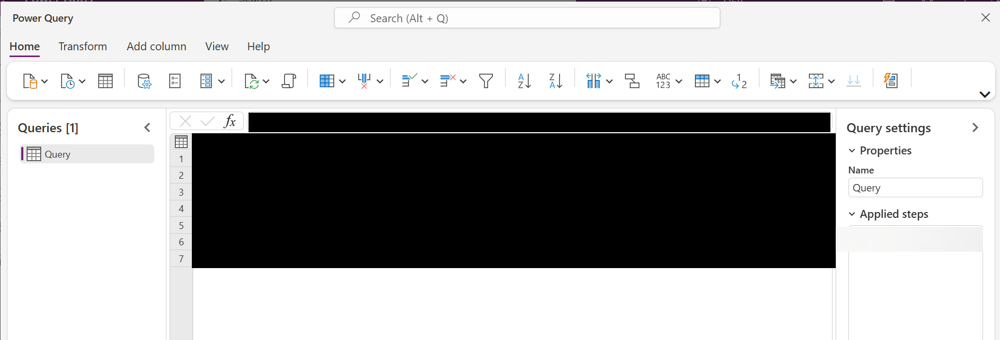
<!-- Auto-blurred via OCR redaction pipeline (1 region(s) detected: GUIDs/emails/secret-token keywords/hostnames/IPs). Please spot-check before relying on this for a public push. -->

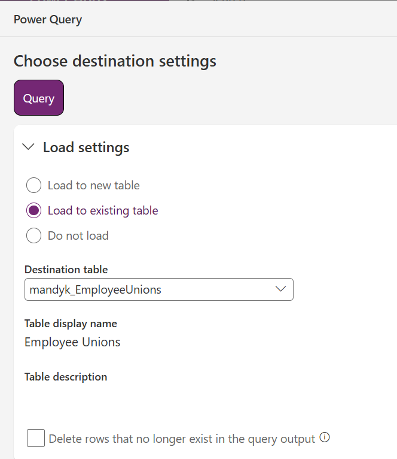
<!-- Auto-reviewed via OCR redaction pipeline: 0 sensitive text regions detected. OCR cannot catch non-text sensitive content (logos, photos, stylized graphics) -- please still skim before a public push. -->

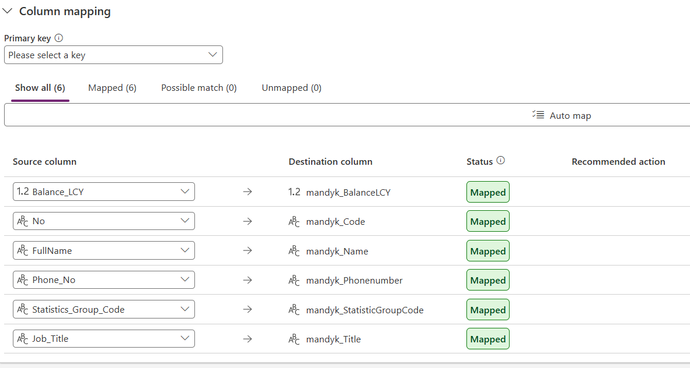
<!-- Auto-reviewed via OCR redaction pipeline: 0 sensitive text regions detected. OCR cannot catch non-text sensitive content (logos, photos, stylized graphics) -- please still skim before a public push. -->

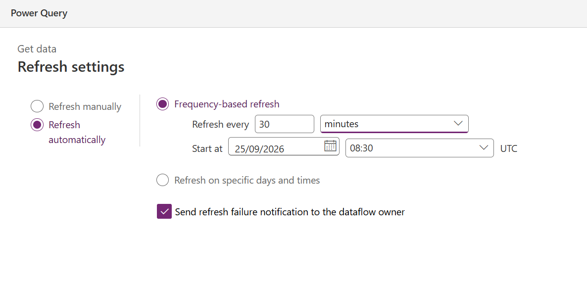
<!-- Auto-reviewed via OCR redaction pipeline: 0 sensitive text regions detected. OCR cannot catch non-text sensitive content (logos, photos, stylized graphics) -- please still skim before a public push. -->

The refresh max 48 times per days

Dataflow:

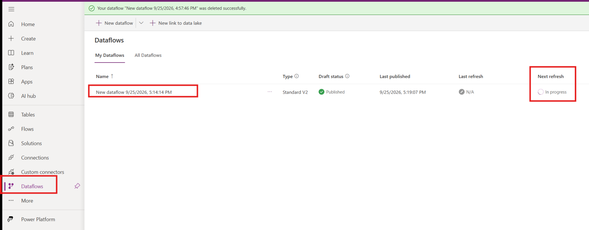
<!-- Auto-reviewed via OCR redaction pipeline: 0 sensitive text regions detected. OCR cannot catch non-text sensitive content (logos, photos, stylized graphics) -- please still skim before a public push. -->

Features in dataflows:

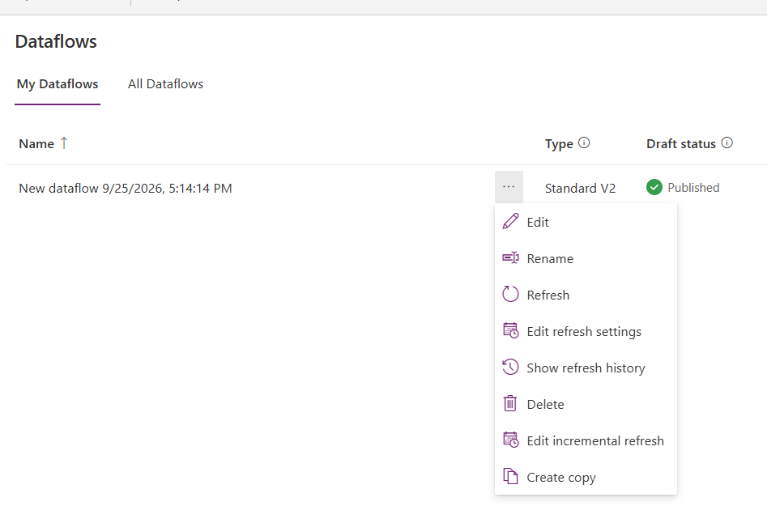
<!-- Auto-reviewed via OCR redaction pipeline: 0 sensitive text regions detected. OCR cannot catch non-text sensitive content (logos, photos, stylized graphics) -- please still skim before a public push. -->

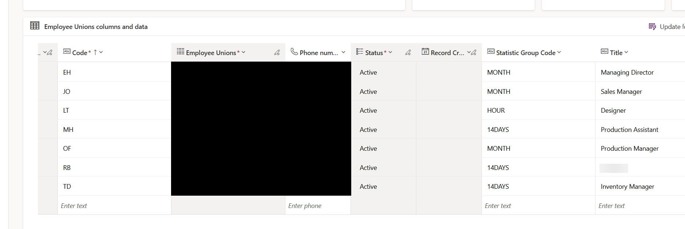
<!-- Auto-blurred via OCR redaction pipeline (1 region(s) detected: GUIDs/emails/secret-token keywords/hostnames/IPs). Please spot-check before relying on this for a public push. -->

The refresh took a while despite of small number of records

## Own Exercise - Connect to Dataverse

#### Setup the connection

Use : My Test Company

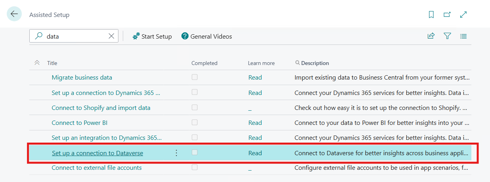
<!-- Auto-reviewed via OCR redaction pipeline: 0 sensitive text regions detected. OCR cannot catch non-text sensitive content (logos, photos, stylized graphics) -- please still skim before a public push. -->

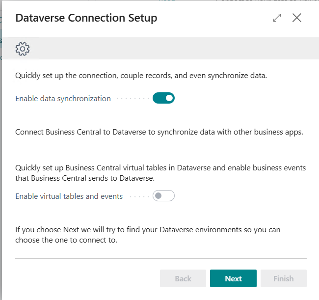
<!-- Auto-reviewed via OCR redaction pipeline: 0 sensitive text regions detected. OCR cannot catch non-text sensitive content (logos, photos, stylized graphics) -- please still skim before a public push. -->

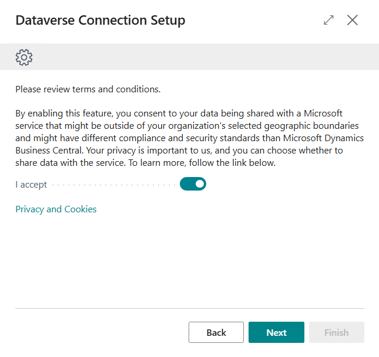
<!-- Auto-reviewed via OCR redaction pipeline: 0 sensitive text regions detected. OCR cannot catch non-text sensitive content (logos, photos, stylized graphics) -- please still skim before a public push. -->

Client ID:  ID of  `BC OnPrem Application Integration`
Client Secret: `<client secret value>`
Redirect URL: `https://<your-server>/BC280/OAuthLanding.htm`

`Add this redirect URL at azure application registration`

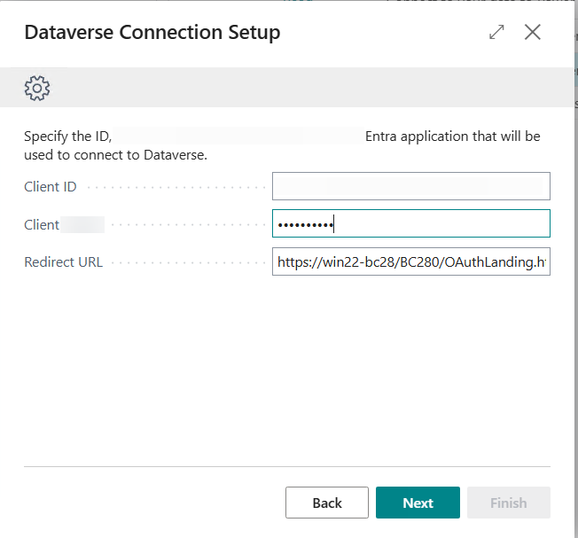
<!-- Auto-blurred via OCR redaction pipeline (3 region(s) detected: GUIDs/emails/secret-token keywords/hostnames/IPs). Please spot-check before relying on this for a public push. -->

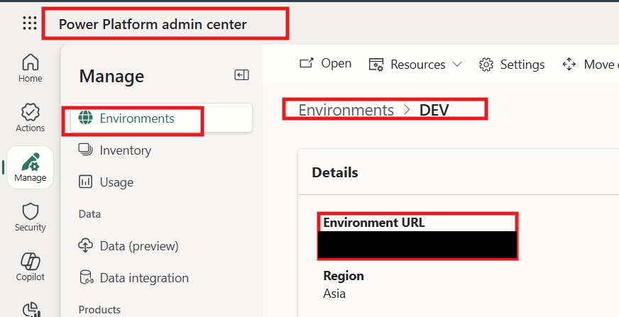
<!-- Auto-blurred via OCR redaction pipeline (1 region(s) detected: GUIDs/emails/secret-token keywords/hostnames/IPs). Please spot-check before relying on this for a public push. -->

`https://<your-org>.crm5.dynamics.com`

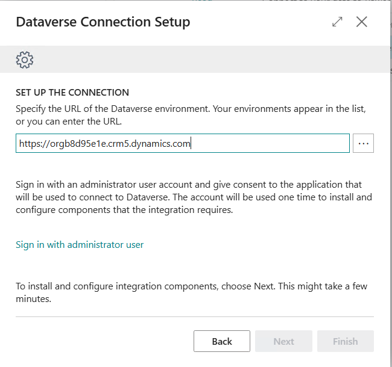
<!-- Auto-reviewed via OCR redaction pipeline: 0 sensitive text regions detected. OCR cannot catch non-text sensitive content (logos, photos, stylized graphics) -- please still skim before a public push. -->

Grant access permission.

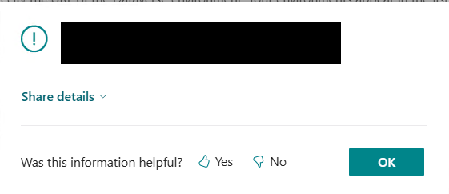
<!-- Auto-blurred via OCR redaction pipeline (1 region(s) detected: GUIDs/emails/secret-token keywords/hostnames/IPs). Please spot-check before relying on this for a public push. -->

Adding dataverse/ dynamics CRM delegated permission

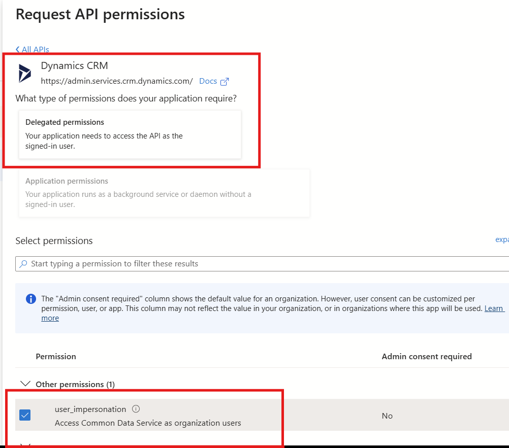
<!-- Auto-reviewed via OCR redaction pipeline: 0 sensitive text regions detected. OCR cannot catch non-text sensitive content (logos, photos, stylized graphics) -- please still skim before a public push. -->

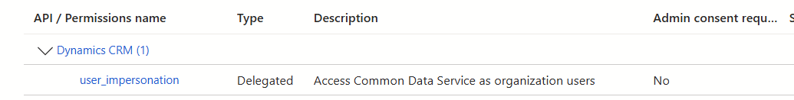
<!-- Auto-reviewed via OCR redaction pipeline: 0 sensitive text regions detected. OCR cannot catch non-text sensitive content (logos, photos, stylized graphics) -- please still skim before a public push. -->

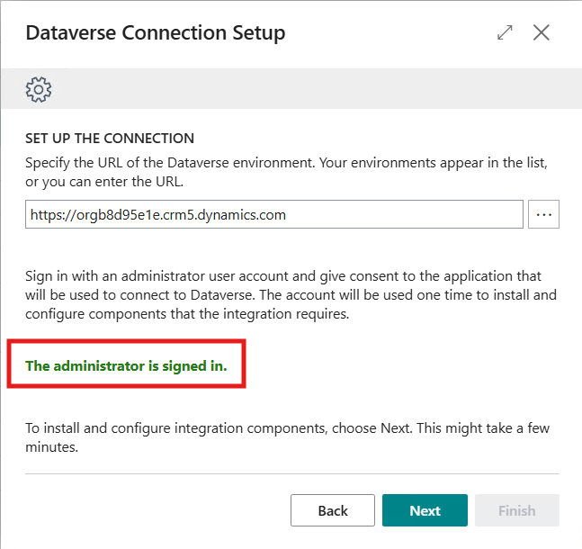
<!-- Auto-reviewed via OCR redaction pipeline: 0 sensitive text regions detected. OCR cannot catch non-text sensitive content (logos, photos, stylized graphics) -- please still skim before a public push. -->

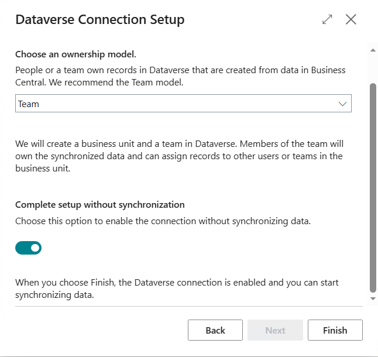
<!-- Auto-reviewed via OCR redaction pipeline: 0 sensitive text regions detected. OCR cannot catch non-text sensitive content (logos, photos, stylized graphics) -- please still skim before a public push. -->

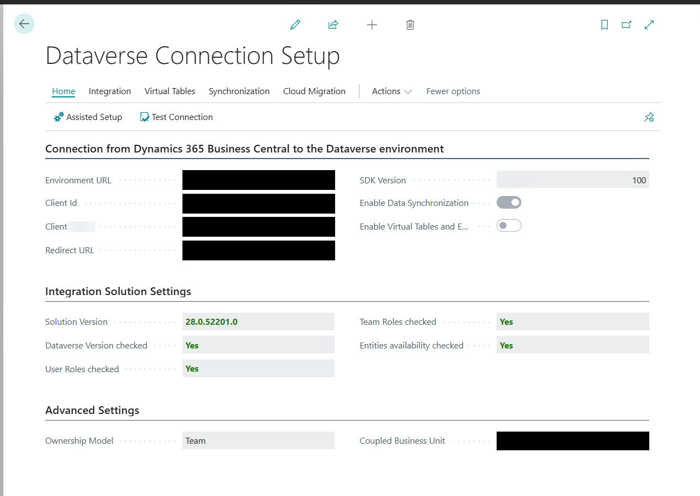
<!-- Auto-blurred via OCR redaction pipeline (1 region(s) detected: GUIDs/emails/secret-token keywords/hostnames/IPs). Please spot-check before relying on this for a public push. -->

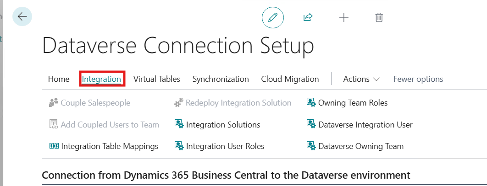
<!-- Auto-reviewed via OCR redaction pipeline: 0 sensitive text regions detected. OCR cannot catch non-text sensitive content (logos, photos, stylized graphics) -- please still skim before a public push. -->

Owning Team Roles (auto created)

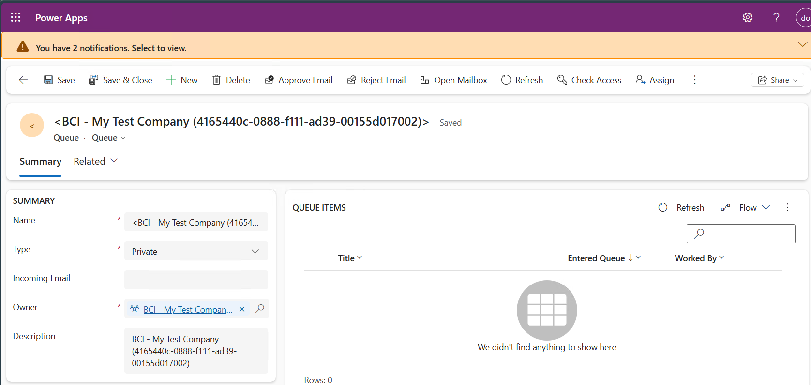
<!-- Auto-reviewed via OCR redaction pipeline: 0 sensitive text regions detected. OCR cannot catch non-text sensitive content (logos, photos, stylized graphics) -- please still skim before a public push. -->

Dataverse Integration User (auto created)

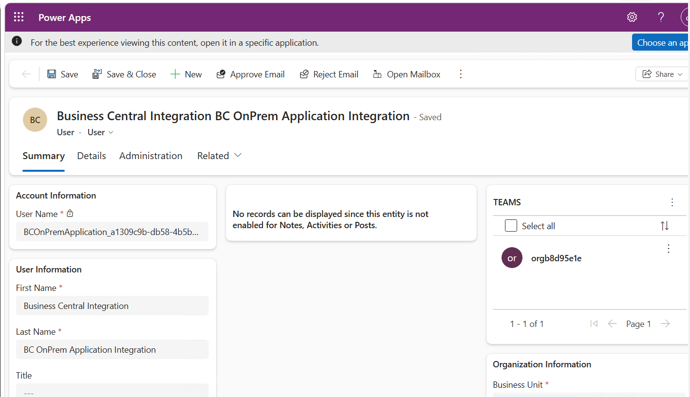
<!-- Auto-reviewed via OCR redaction pipeline: 0 sensitive text regions detected. OCR cannot catch non-text sensitive content (logos, photos, stylized graphics) -- please still skim before a public push. -->

#### Run test for currency table (ToIntegrateTable)

Field Mapping.
The integration field name lookup to dataverse table

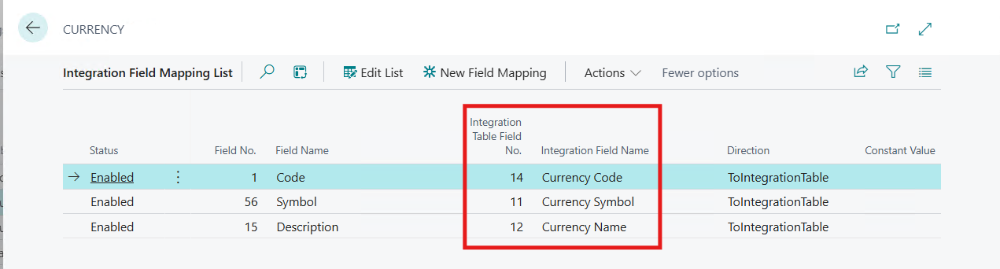
<!-- Auto-reviewed via OCR redaction pipeline: 0 sensitive text regions detected. OCR cannot catch non-text sensitive content (logos, photos, stylized graphics) -- please still skim before a public push. -->

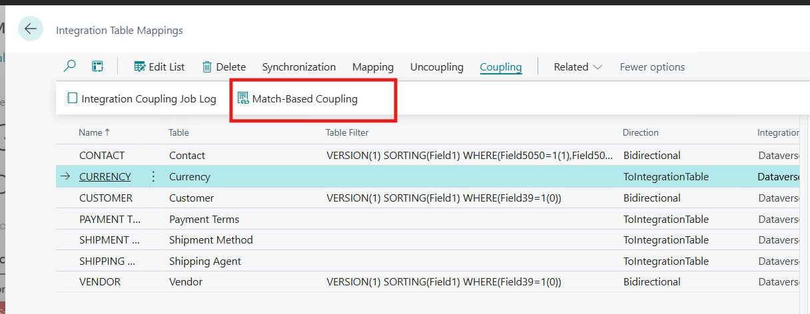
<!-- Auto-reviewed via OCR redaction pipeline: 0 sensitive text regions detected. OCR cannot catch non-text sensitive content (logos, photos, stylized graphics) -- please still skim before a public push. -->

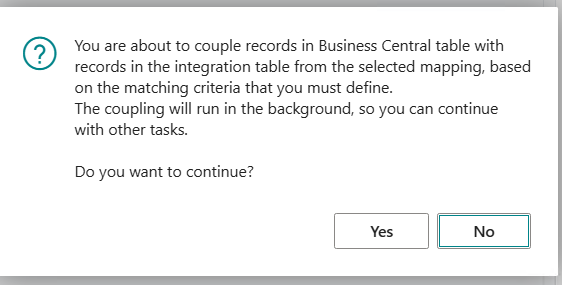
<!-- Auto-reviewed via OCR redaction pipeline: 0 sensitive text regions detected. OCR cannot catch non-text sensitive content (logos, photos, stylized graphics) -- please still skim before a public push. -->

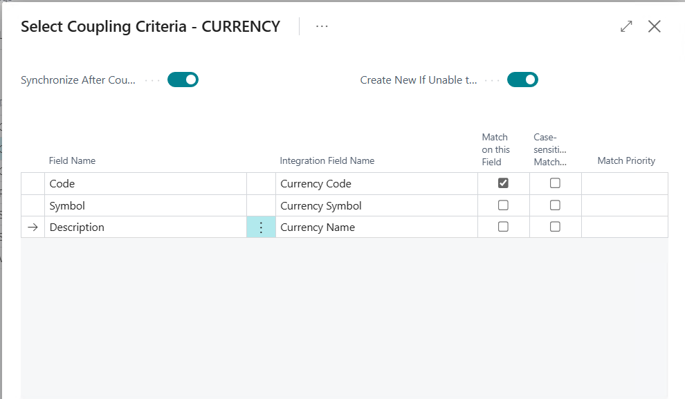
<!-- Auto-reviewed via OCR redaction pipeline: 0 sensitive text regions detected. OCR cannot catch non-text sensitive content (logos, photos, stylized graphics) -- please still skim before a public push. -->

Press OK button

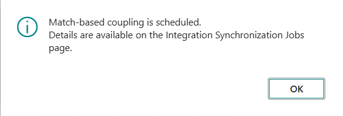
<!-- Auto-reviewed via OCR redaction pipeline: 0 sensitive text regions detected. OCR cannot catch non-text sensitive content (logos, photos, stylized graphics) -- please still skim before a public push. -->

Integration synch Jobs capture the situation

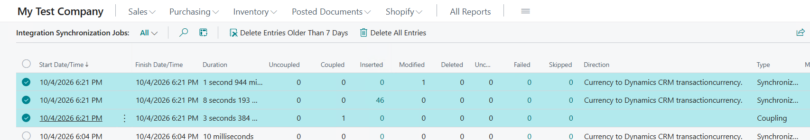
<!-- Auto-reviewed via OCR redaction pipeline: 0 sensitive text regions detected. OCR cannot catch non-text sensitive content (logos, photos, stylized graphics) -- please still skim before a public push. -->

Result in Dataverse

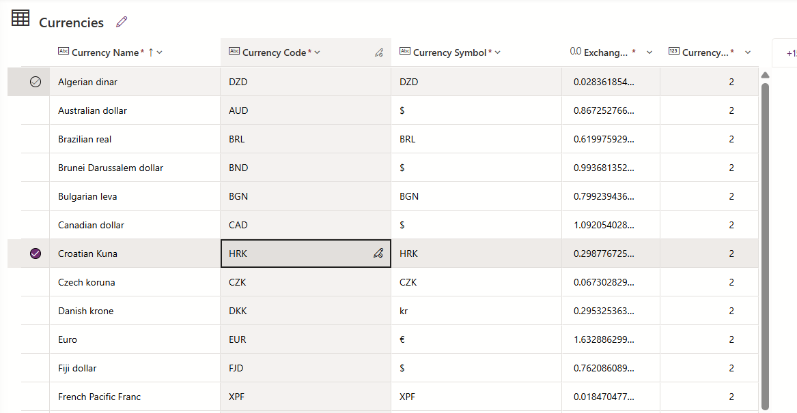
<!-- Auto-reviewed via OCR redaction pipeline: 0 sensitive text regions detected. OCR cannot catch non-text sensitive content (logos, photos, stylized graphics) -- please still skim before a public push. -->

Job queue entry related to currency.
The frequency is 30 min

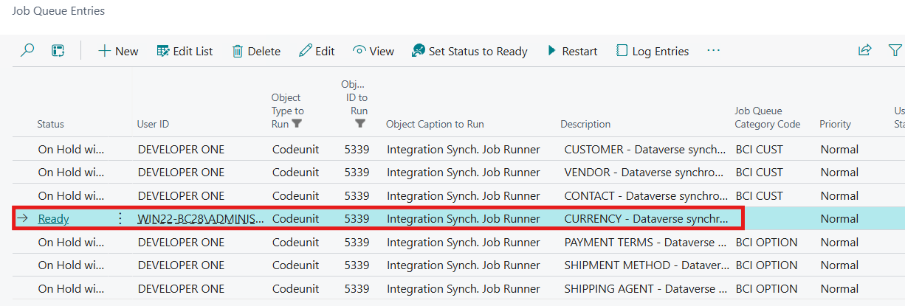
<!-- Auto-reviewed via OCR redaction pipeline: 0 sensitive text regions detected. OCR cannot catch non-text sensitive content (logos, photos, stylized graphics) -- please still skim before a public push. -->

#### Run test for Customer table (ToIntegrateTable)

The customer is mapped as an account table in the dataverse.

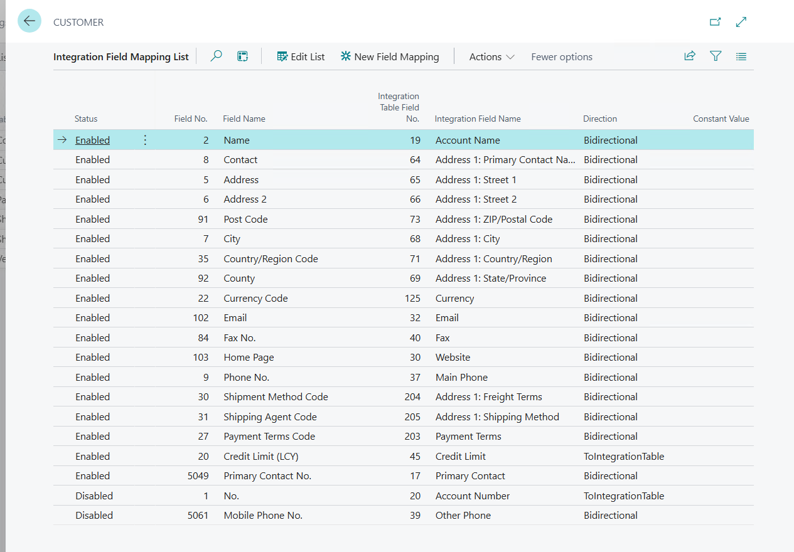
<!-- Auto-reviewed via OCR redaction pipeline: 0 sensitive text regions detected. OCR cannot catch non-text sensitive content (logos, photos, stylized graphics) -- please still skim before a public push. -->

Need to enable the No. fields

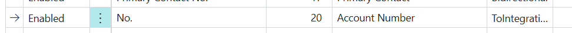
<!-- Auto-reviewed via OCR redaction pipeline: 0 sensitive text regions detected. OCR cannot catch non-text sensitive content (logos, photos, stylized graphics) -- please still skim before a public push. -->

Run Match-Based Coupling

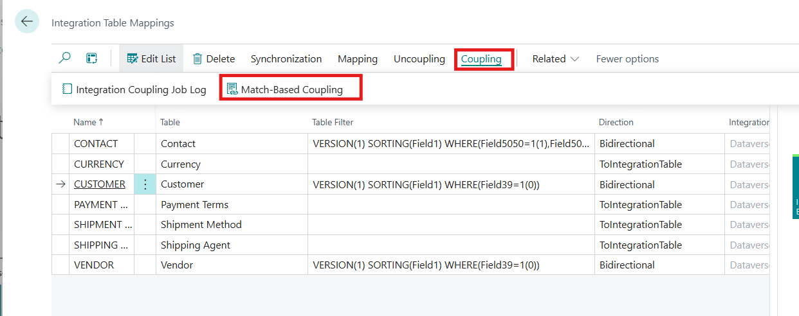
<!-- Auto-reviewed via OCR redaction pipeline: 0 sensitive text regions detected. OCR cannot catch non-text sensitive content (logos, photos, stylized graphics) -- please still skim before a public push. -->

Coupling detail:
The resolved option to select which side as master, the BC or on the dataverse

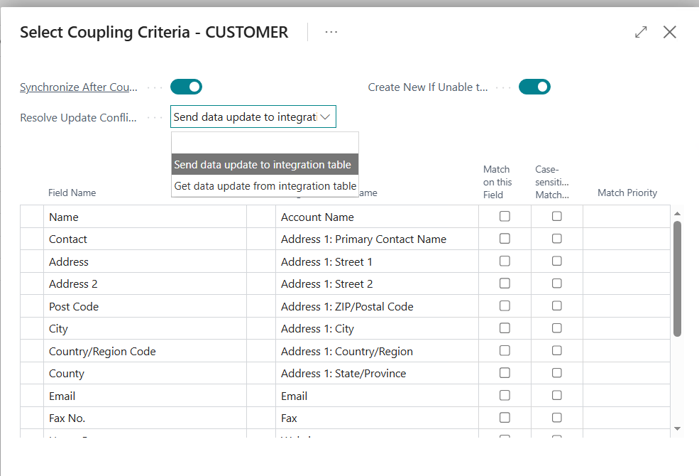
<!-- Auto-reviewed via OCR redaction pipeline: 0 sensitive text regions detected. OCR cannot catch non-text sensitive content (logos, photos, stylized graphics) -- please still skim before a public push. -->

Click the Account Number to Match on this field

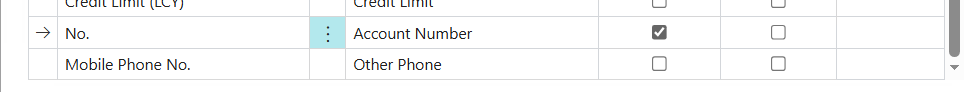
<!-- Auto-reviewed via OCR redaction pipeline: 0 sensitive text regions detected. OCR cannot catch non-text sensitive content (logos, photos, stylized graphics) -- please still skim before a public push. -->

Click ok, to run the job in the background.

The  job is on hold, and try set status to ready

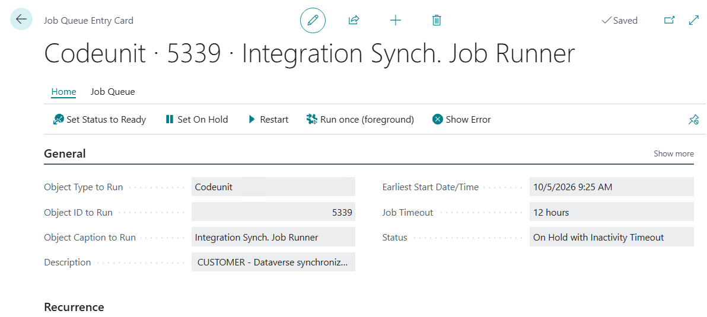
<!-- Auto-reviewed via OCR redaction pipeline: 0 sensitive text regions detected. OCR cannot catch non-text sensitive content (logos, photos, stylized graphics) -- please still skim before a public push. -->

Error because the payment term not yet synch

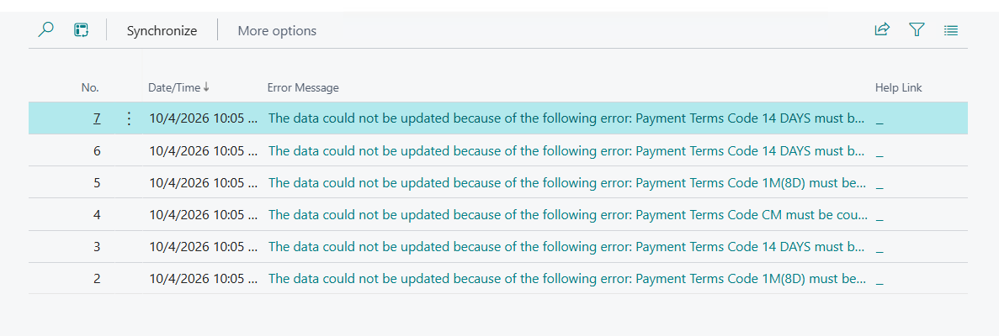
<!-- Auto-reviewed via OCR redaction pipeline: 0 sensitive text regions detected. OCR cannot catch non-text sensitive content (logos, photos, stylized graphics) -- please still skim before a public push. -->

`The data could not be updated because of the following error: Payment Terms Code 14 DAYS must be coupled to a Dataverse record.`

Disabled payment term first.

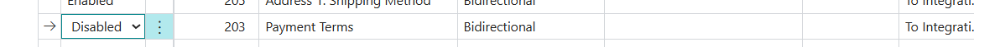
<!-- Auto-reviewed via OCR redaction pipeline: 0 sensitive text regions detected. OCR cannot catch non-text sensitive content (logos, photos, stylized graphics) -- please still skim before a public push. -->

Power Platform admin center→DEV environment → Setting → Audits & Logs → System Job

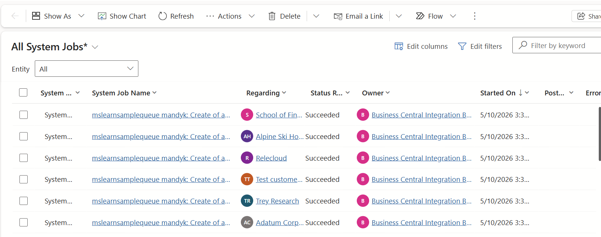
<!-- Auto-reviewed via OCR redaction pipeline: 0 sensitive text regions detected. OCR cannot catch non-text sensitive content (logos, photos, stylized graphics) -- please still skim before a public push. -->

Below account owner is
`BCI - <your-company> (XXXXXXXX-XXXX-XXXX-XXXX-XXXXXXXXXXXX)`

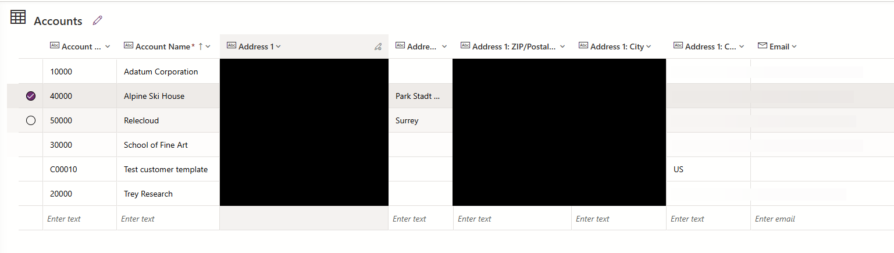
<!-- Auto-blurred via OCR redaction pipeline (5 region(s) detected: GUIDs/emails/secret-token keywords/hostnames/IPs). Please spot-check before relying on this for a public push. -->

#### Run test for Customer table (FromIntegrateTable)

Integration Table filter in default was:

`VERSION(1) SORTING(Field1) WHERE(Field6=1(3),Field54=1(0),Field202=1({``XXXXXXXX-XXXX-XXXX-XXXX-XXXXXXXXXXXX``}|{00000000-0000-0000-0000-000000000000}))`

Translate with field name
`WHERE(`
`	StateCode = Active,`
`	IsDeleted = No,`
`	CompanyId IN (`
`    	``XXXXXXXX-XXXX-XXXX-XXXX-XXXXXXXXXXXX``,`
`    	00000000-0000-0000-0000-000000000000`
`	)`
`)`

Replace `<your-company>` with the company selected in your own environment.

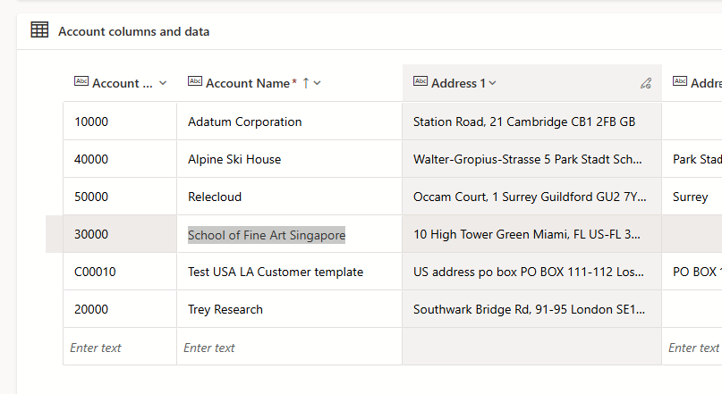
<!-- Auto-reviewed via OCR redaction pipeline: 0 sensitive text regions detected. OCR cannot catch non-text sensitive content (logos, photos, stylized graphics) -- please still skim before a public push. -->

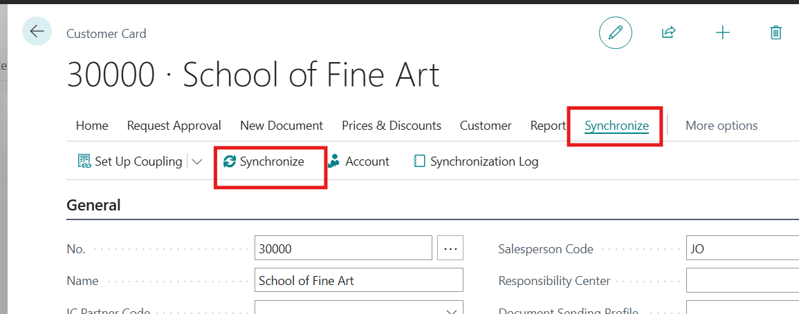
<!-- Auto-reviewed via OCR redaction pipeline: 0 sensitive text regions detected. OCR cannot catch non-text sensitive content (logos, photos, stylized graphics) -- please still skim before a public push. -->

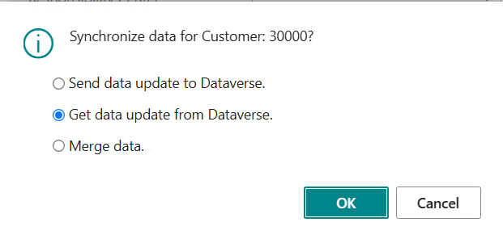
<!-- Auto-reviewed via OCR redaction pipeline: 0 sensitive text regions detected. OCR cannot catch non-text sensitive content (logos, photos, stylized graphics) -- please still skim before a public push. -->

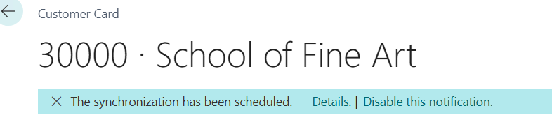
<!-- Auto-reviewed via OCR redaction pipeline: 0 sensitive text regions detected. OCR cannot catch non-text sensitive content (logos, photos, stylized graphics) -- please still skim before a public push. -->

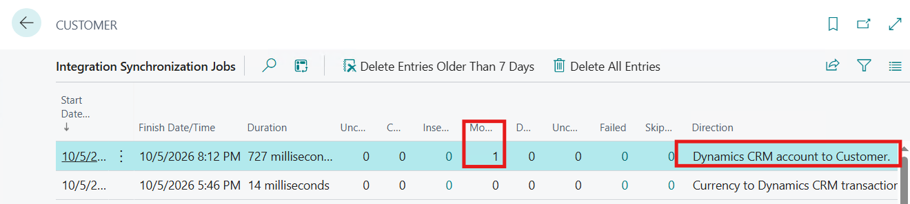
<!-- Auto-reviewed via OCR redaction pipeline: 0 sensitive text regions detected. OCR cannot catch non-text sensitive content (logos, photos, stylized graphics) -- please still skim before a public push. -->

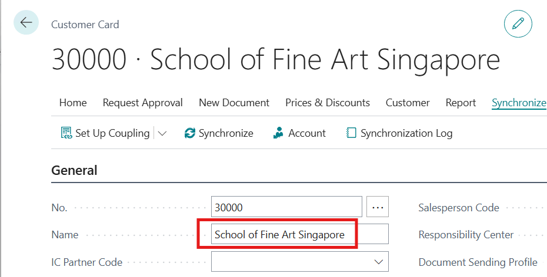
<!-- Auto-reviewed via OCR redaction pipeline: 0 sensitive text regions detected. OCR cannot catch non-text sensitive content (logos, photos, stylized graphics) -- please still skim before a public push. -->
