# Module #12-5: Exercise

> Part of: Module 12: Power Platform & Advanced Integration

## [Exercise - Create a testing process](https://learn.microsoft.com/en-us/training/modules/create-custom-connector-power-platform/6-exercise)

The lab exercised was customized with own exercise

### Create custom connector Get Customers with OAuth2.0

Use existing “BC OnPrem Application Integration”
Using Client Secret BC Email Secret

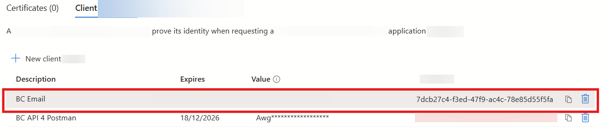
<!-- Auto-blurred via OCR redaction pipeline (8 region(s) detected: GUIDs/emails/secret-token keywords/hostnames/IPs). Please spot-check before relying on this for a public push. -->

API: `https://[your ID].example.com:7148/BC280-Entra/api/<your-publisher>/ak_app/v2.0/companies(XXXXXXXX-XXXX-XXXX-XXXX-XXXXXXXXXXXX)/ak_customers`

**Host : **
`[your ID].example.com:7148`
**Base URL: **
`/BC280-Entra/api/<your-publisher>/ak_app/v2.0`

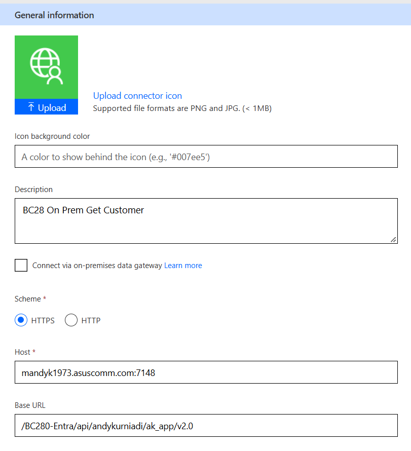
<!-- Auto-reviewed via OCR redaction pipeline: 0 sensitive text regions detected. OCR cannot catch non-text sensitive content (logos, photos, stylized graphics) -- please still skim before a public push. -->

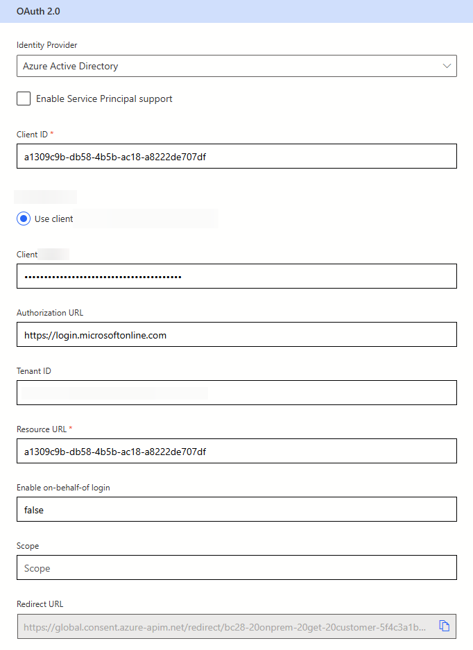
<!-- Auto-blurred via OCR redaction pipeline (4 region(s) detected: GUIDs/emails/secret-token keywords/hostnames/IPs). Please spot-check before relying on this for a public push. -->

`Identity Provider 	: Azure AD`
`Client ID		: XXXXXXXX-XXXX-XXXX-XXXX-XXXXXXXXXXXX`
`Client Secret	: <Client Secret>`
`
Authorized URL 	: https://login.microsoftonline.com`
`Tenant ID		: XXXXXXXX-XXXX-XXXX-XXXX-XXXXXXXXXXXX`
`Resource URL		: <your-resource-URL>`

`Scope 			: Scope `

`Redirect URL		:`
`https://global.consent.azure-apim.net/redirect/<your-connector-id>`

Add redirect URL Application Registration

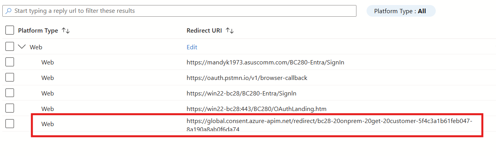
<!-- Auto-reviewed via OCR redaction pipeline: 0 sensitive text regions detected. OCR cannot catch non-text sensitive content (logos, photos, stylized graphics) -- please still skim before a public push. -->

Test Connection

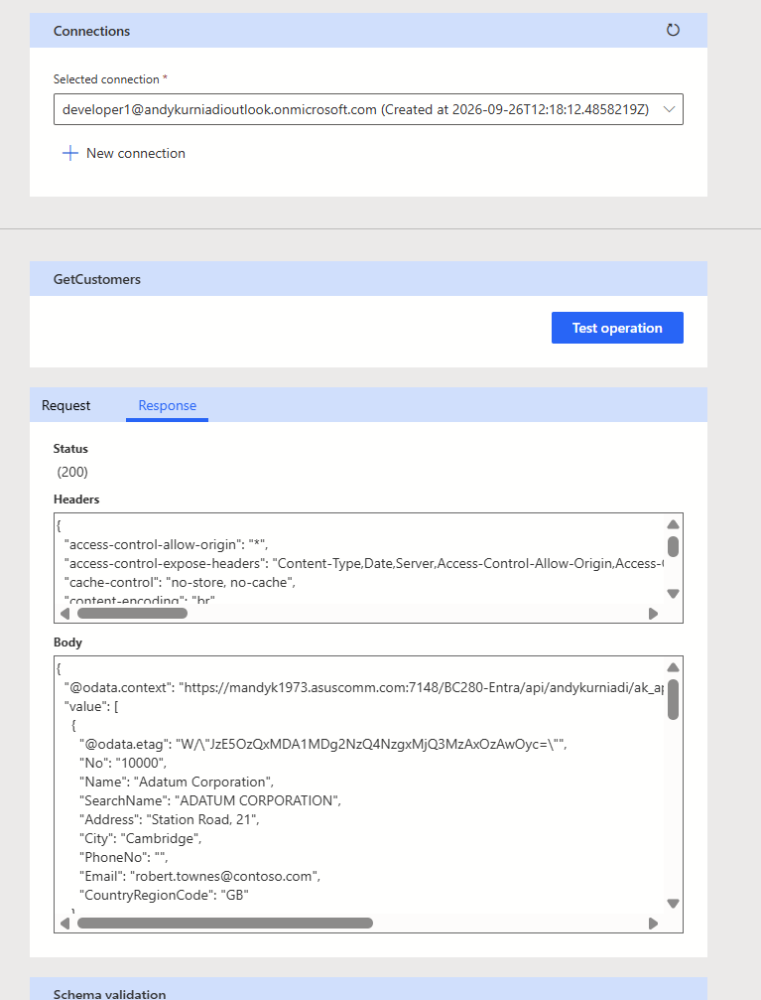
<!-- Auto-reviewed via OCR redaction pipeline: 0 sensitive text regions detected. OCR cannot catch non-text sensitive content (logos, photos, stylized graphics) -- please still skim before a public push. -->

#### Parameterized Company

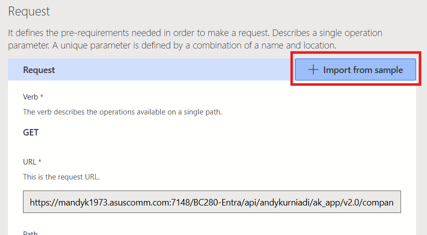
<!-- Auto-reviewed via OCR redaction pipeline: 0 sensitive text regions detected. OCR cannot catch non-text sensitive content (logos, photos, stylized graphics) -- please still skim before a public push. -->

Use relative path respect of base path url

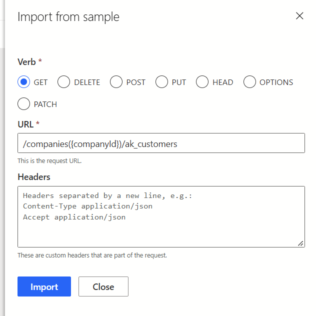
<!-- Auto-reviewed via OCR redaction pipeline: 0 sensitive text regions detected. OCR cannot catch non-text sensitive content (logos, photos, stylized graphics) -- please still skim before a public push. -->

/companies({companyId})/ak_customers

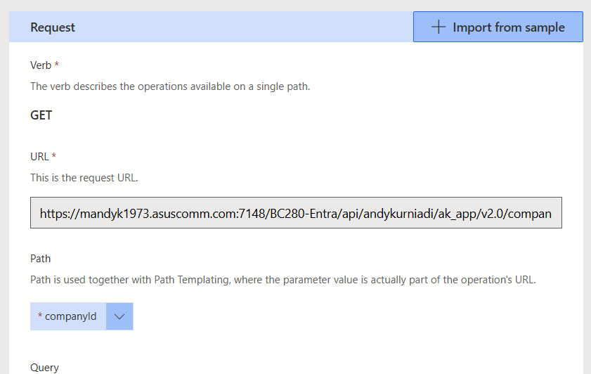
<!-- Auto-reviewed via OCR redaction pipeline: 0 sensitive text regions detected. OCR cannot catch non-text sensitive content (logos, photos, stylized graphics) -- please still skim before a public push. -->

Update the custom connector

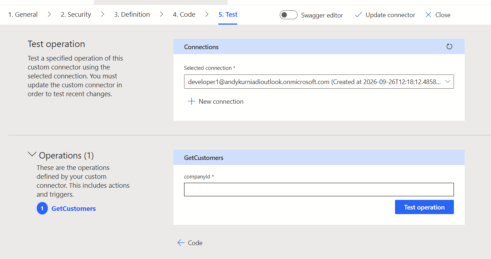
<!-- Auto-reviewed via OCR redaction pipeline: 0 sensitive text regions detected. OCR cannot catch non-text sensitive content (logos, photos, stylized graphics) -- please still skim before a public push. -->

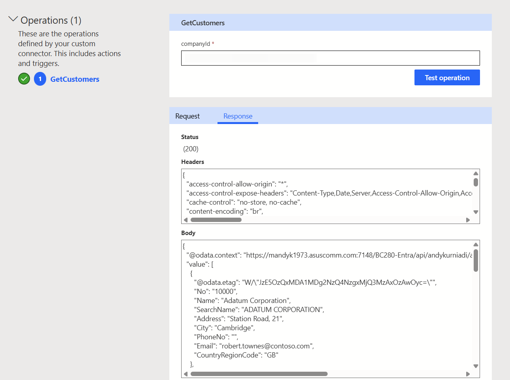
<!-- Auto-blurred via OCR redaction pipeline (1 region(s) detected: GUIDs/emails/secret-token keywords/hostnames/IPs). Please spot-check before relying on this for a public push. -->

From root api URI:
`https://[your ID].example.com:7148/BC280-Entra/api/v2.0/companies`

From your API publisher

`https://[your ID].example.com:7148/BC280-Entra/api/<your-publisher>/ak_app/v2.0/companies`

`{`
`  "@odata.context": ``"https://[your ID].example.com:7148/BC280-Entra/api/<your-publisher>/ak_app/v2.0/$metadata#companies"``,`
`  "value": [`
`    {`
`      "id": "XXXXXXXX-XXXX-XXXX-XXXX-XXXXXXXXXXXX",`
`      "systemVersion": "28.3.52162.52222",`
`      "timestamp": 48351,`
`      "name": "CRONUS International Ltd.",`
`      "displayName": "",`
`      "businessProfileId": "",`
`      "systemCreatedAt": "2026-07-02T02:25:57.89Z",`
`      "systemCreatedBy": "00000000-0000-0000-0000-000000000001",`
`      "systemModifiedAt": "2026-07-02T02:25:57.89Z",`
`      "systemModifiedBy": "00000000-0000-0000-0000-000000000001"`
`    },`
`    {`
`      "id": "XXXXXXXX-XXXX-XXXX-XXXX-XXXXXXXXXXXX",`
`      "systemVersion": "28.3.52162.52222",`
`      "timestamp": 524997,`
`      "name": "My Test Company",`
`      "displayName": "CRONUS International Ltd.",`
`      "businessProfileId": "",`
`      "systemCreatedAt": "2026-07-25T09:05:58.223Z",`
`      "systemCreatedBy": "XXXXXXXX-XXXX-XXXX-XXXX-XXXXXXXXXXXX",`
`      "systemModifiedAt": "2026-09-08T03:46:02.14Z",`
`      "systemModifiedBy": "XXXXXXXX-XXXX-XXXX-XXXX-XXXXXXXXXXXX"`
`    }`
`  ]`
`}`

Test company ID: `<YOUR-COMPANY-GUID>`

#### Create GetCompanies Action

**Note:** use Entra Server Instance
`https://[your ID].example.com:7148/BC280-Entra/api/<your-publisher>/ak_app/v2.0/`

{
"@odata.context": "https://[your ID].example.com:7248/BC280-NAVUP/api/<your-publisher>/ak_app/v2.0/$metadata",
"value": [
{
"name": "entityDefinitions",
"kind": "EntitySet",
"url": "entityDefinitions"
},
{
** "name": "companies",**
**      "kind": "EntitySet",**
**      "url": "companies"**
},
{
"name": "subscriptions",
"kind": "EntitySet",
"url": "subscriptions"
},
{
"name": "externaleventsubscriptions",
"kind": "EntitySet",
"url": "externaleventsubscriptions"
},
{
"name": "externalbusinesseventdefinitions",
"kind": "EntitySet",
"url": "externalbusinesseventdefinitions"
},
{
"name": "apicategoryroutes",
"kind": "EntitySet",
"url": "apicategoryroutes"
},
{
"name": "ak_customers",
"kind": "EntitySet",
"url": "ak_customers"
}
]
}

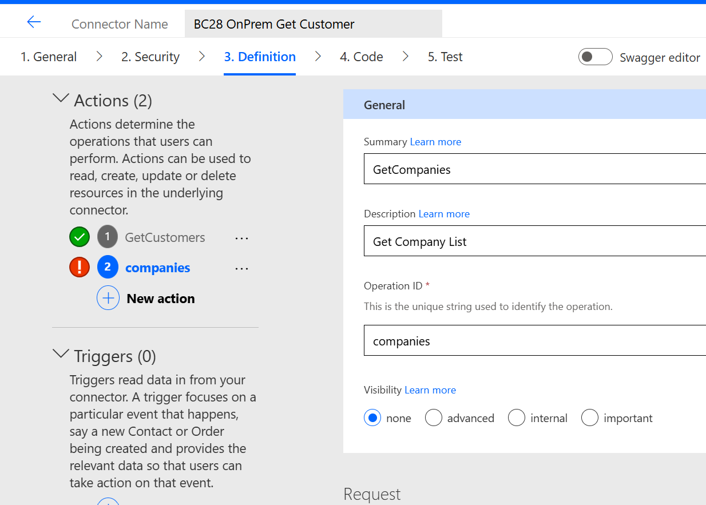
<!-- Auto-reviewed via OCR redaction pipeline: 0 sensitive text regions detected. OCR cannot catch non-text sensitive content (logos, photos, stylized graphics) -- please still skim before a public push. -->

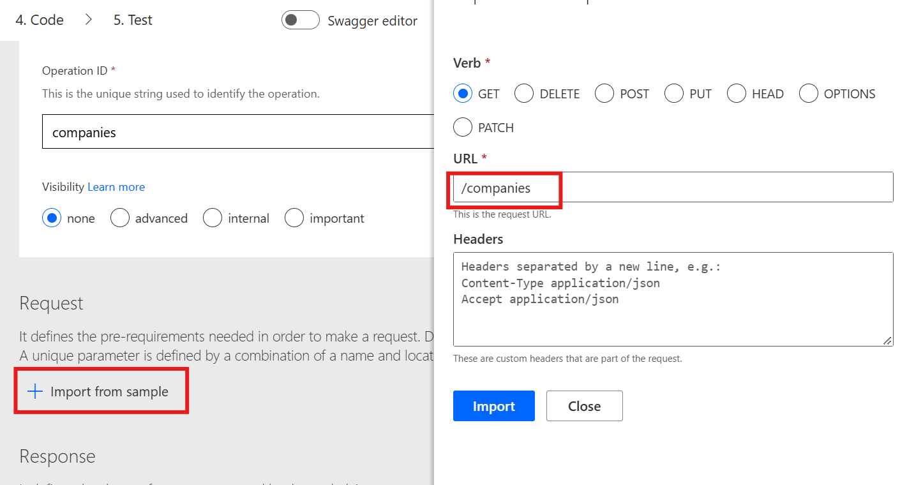
<!-- Auto-reviewed via OCR redaction pipeline: 0 sensitive text regions detected. OCR cannot catch non-text sensitive content (logos, photos, stylized graphics) -- please still skim before a public push. -->

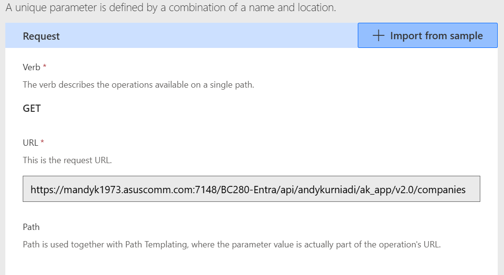
<!-- Auto-reviewed via OCR redaction pipeline: 0 sensitive text regions detected. OCR cannot catch non-text sensitive content (logos, photos, stylized graphics) -- please still skim before a public push. -->

Import response sample from full sample response so it able to detect the fields

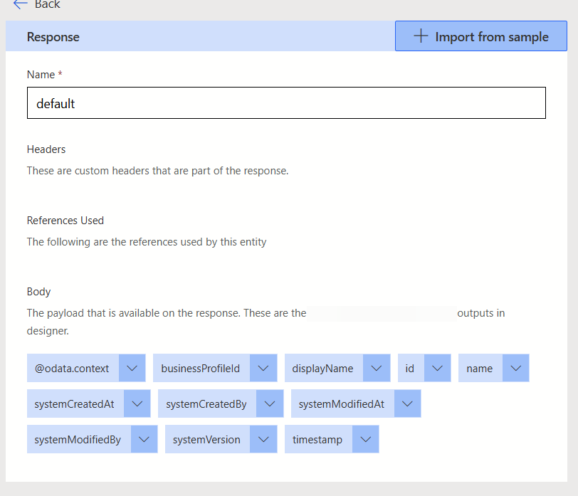
<!-- Auto-blurred via OCR redaction pipeline (1 region(s) detected: GUIDs/emails/secret-token keywords/hostnames/IPs). Please spot-check before relying on this for a public push. -->

Update the connector and test

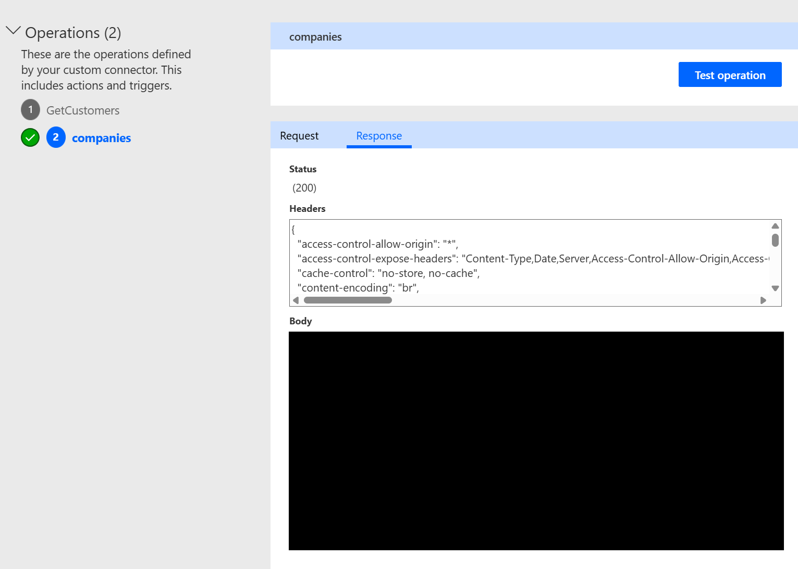
<!-- Auto-blurred via OCR redaction pipeline (3 region(s) detected: GUIDs/emails/secret-token keywords/hostnames/IPs). Please spot-check before relying on this for a public push. -->

#### Discovery: Create GetCompanyList that response only list id and name

`https://[your ID].example.com:7248/BC280-NAVUP/api/<your-publisher>/ak_app/v2.0/companies?**$select=id,name**`

`{`
`  "@odata.context": "https://[your ID].example.com:7248/BC280-NAVUP/api/<your-publisher>/ak_app/v2.0/$metadata#companies",`
`  "value": [`
`    {`
`      "id": "XXXXXXXX-XXXX-XXXX-XXXX-XXXXXXXXXXXX",`
`      "name": "CRONUS International Ltd."`
`    },`
`    {`
`      "id": "XXXXXXXX-XXXX-XXXX-XXXX-XXXXXXXXXXXX",`
`      "name": "My Test Company"`
`    }`
`  ]`
`}`

NOTE: Custom Connector not allowed to have 2 action with same path

#### Dynamic Dropdown List for Companyid parameter of GetCustomer

Reference:
[https://learn.microsoft.com/en-us/training/modules/custom-connectors-open-api/5-exercise](https://learn.microsoft.com/en-us/training/modules/custom-connectors-open-api/5-exercise)

<!-- Auto-reviewed via OCR redaction pipeline: 0 sensitive text regions detected. OCR cannot catch non-text sensitive content (logos, photos, stylized graphics) -- please still skim before a public push. -->

Click on companyId and scroll down to below portion

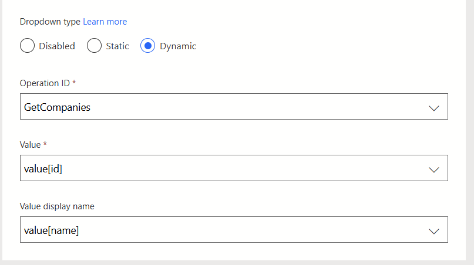
<!-- Auto-reviewed via OCR redaction pipeline: 0 sensitive text regions detected. OCR cannot catch non-text sensitive content (logos, photos, stylized graphics) -- please still skim before a public push. -->

Swagger part: (adding `x-ms-dynamic-list)`

`      summary: Get Customer List`
`      description: Get AK Customer List`
`      operationId: GetCustomer`
`      parameters:`
`        - name: companyId`
`          in: path`
`          required: true`
`          type: string`
`          x-ms-visibility: important`
`          x-ms-summary: Company ID`
`          x-ms-dynamic-values:`
`            operationId: GetCompanies`
`            value-collection: value`
`            value-path: id`
`            value-title: name`
`            parameters: {}`
`          x-ms-dynamic-list:`
`            operationId: GetCompanies`
`            itemsPath: value`
`            itemValuePath: id`
`            itemTitlePath: name`
`            parameters: {}`

The drop down list unable to show (unkown)

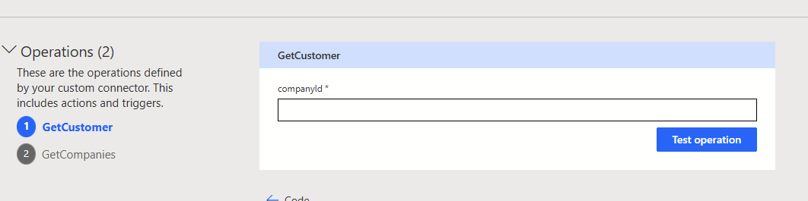
<!-- Auto-reviewed via OCR redaction pipeline: 0 sensitive text regions detected. OCR cannot catch non-text sensitive content (logos, photos, stylized graphics) -- please still skim before a public push. -->

### Creating Canvas App with BC28 OnPrem Custom Connector

Add Custom Connector BC28OnPrem

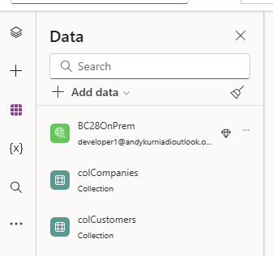
<!-- Auto-reviewed via OCR redaction pipeline: 0 sensitive text regions detected. OCR cannot catch non-text sensitive content (logos, photos, stylized graphics) -- please still skim before a public push. -->

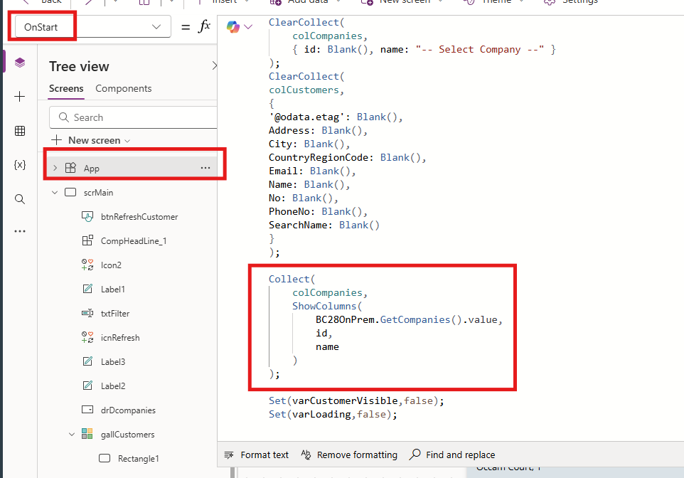
<!-- Auto-reviewed via OCR redaction pipeline: 0 sensitive text regions detected. OCR cannot catch non-text sensitive content (logos, photos, stylized graphics) -- please still skim before a public push. -->

Call GetCompanies with select id and name

`Collect(`
`    colCompanies,`
`    ShowColumns(`
`        BC28OnPrem.GetCompanies().value,`
`        id,`
`        name`
`    )`
`);`

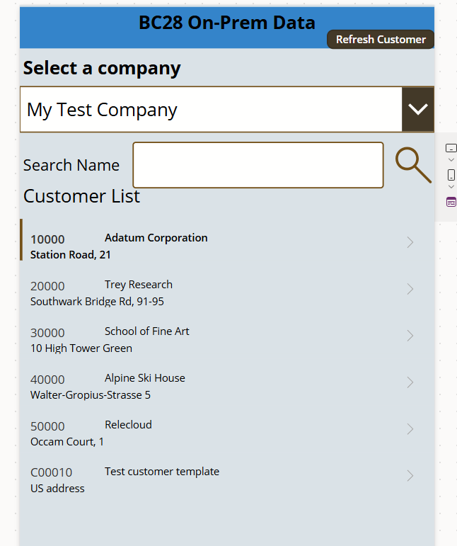
<!-- Auto-reviewed via OCR redaction pipeline: 0 sensitive text regions detected. OCR cannot catch non-text sensitive content (logos, photos, stylized graphics) -- please still skim before a public push. -->

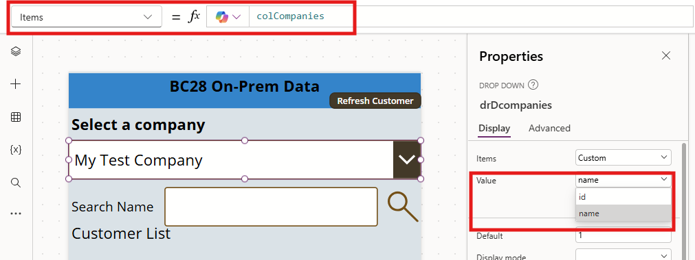
<!-- Auto-reviewed via OCR redaction pipeline: 0 sensitive text regions detected. OCR cannot catch non-text sensitive content (logos, photos, stylized graphics) -- please still skim before a public push. -->

Customer List use colCustomers

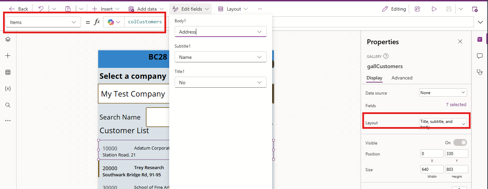
<!-- Auto-reviewed via OCR redaction pipeline: 0 sensitive text regions detected. OCR cannot catch non-text sensitive content (logos, photos, stylized graphics) -- please still skim before a public push. -->

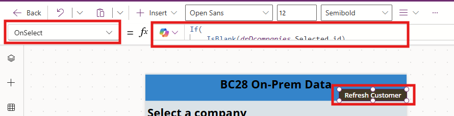
<!-- Auto-reviewed via OCR redaction pipeline: 0 sensitive text regions detected. OCR cannot catch non-text sensitive content (logos, photos, stylized graphics) -- please still skim before a public push. -->

`If(`
`    IsBlank(drDcompanies.Selected.id),`

`    Clear(colCustomers);`
`    Set(varCustomerVisible,false);`
`    Set(varLoading,false);`
`    Notify(`
`        "Select a company first",`
`        NotificationType.Error`
`    ),`

`    Set(varLoading,true);`
`    Set(varCustomerVisible,false);`
`    Clear(colCustomers);`

`    ClearCollect(`
`        colCustomers,`
`        BC28OnPrem.GetCustomer(`
`            drDcompanies.Selected.id`
`        ).value`
`    );`
`    Set(varLoading,false);`
`    Set(varCustomerVisible,!IsEmpty(colCustomers))`
`)`

Customer Detail use vertical container

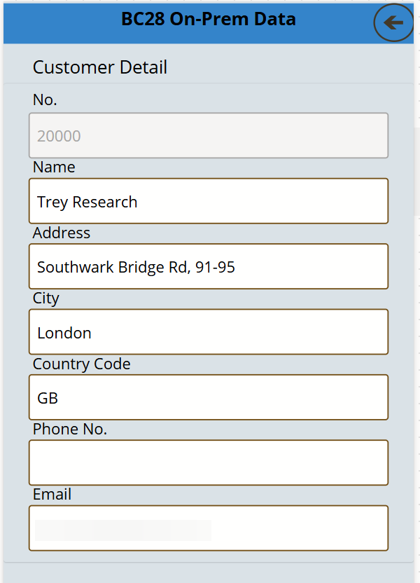
<!-- Auto-blurred via OCR redaction pipeline (1 region(s) detected: GUIDs/emails/secret-token keywords/hostnames/IPs). Please spot-check before relying on this for a public push. -->

Use Selected property to display the customer rec detail

`gallCustomers.Selected.No`
`gallCustomers.Selected.Name`
Etc.
