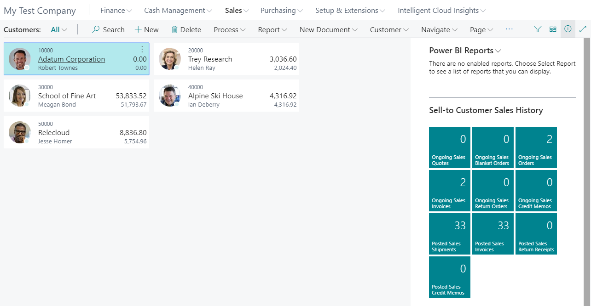

# Module #3-2: Exercise

> Part of: Module 2: Company & Organization Setup

## [**Exercise - Create a company with demo data**](https://learn.microsoft.com/en-us/training/modules/create-new-companies-dynamics-365-business-central/4-exercise)

Done Exercise→ Create a new company with demo data.

<!-- Auto-reviewed via OCR redaction pipeline: 0 sensitive text regions detected. OCR cannot catch non-text sensitive content (logos, photos, stylized graphics) -- please still skim before a public push. -->
