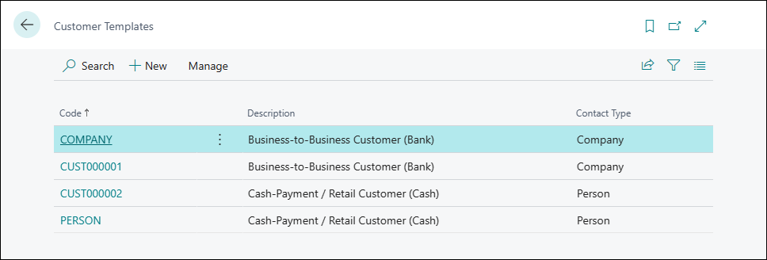
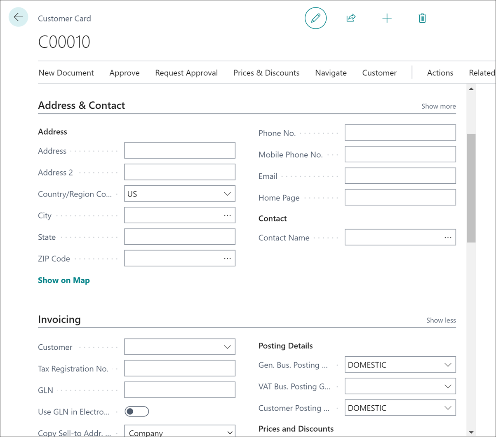

# Module #3-3: Exercise

> Part of: Module 2: Company & Organization Setup

## [**Exercise - Create a new customer template**](https://learn.microsoft.com/en-us/training/modules/migrate-data-dynamics-365-business-central/7-exercise)

Creating ‘DOMESTIC’ customer template

<!-- Auto-reviewed via OCR redaction pipeline: 0 sensitive text regions detected. OCR cannot catch non-text sensitive content (logos, photos, stylized graphics) -- please still skim before a public push. -->

Creating new customer of ‘DOMESTIC’ template

<!-- Auto-reviewed via OCR redaction pipeline: 0 sensitive text regions detected. OCR cannot catch non-text sensitive content (logos, photos, stylized graphics) -- please still skim before a public push. -->
