# Module #3-7: Exercise

> Part of: Module 3: Email & Communication Setup

## [**Exercise - Set up and send email**](https://learn.microsoft.com/en-us/training/modules/email-integration-dynamics-365-business-central/7-exercise)

Setup user to be able to send email from BC

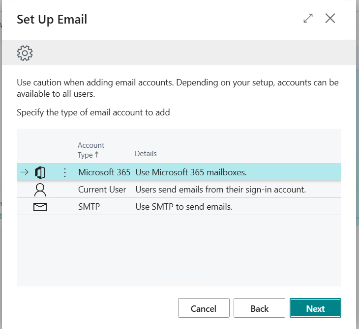
<!-- Auto-reviewed via OCR redaction pipeline: 0 sensitive text regions detected. OCR cannot catch non-text sensitive content (logos, photos, stylized graphics) -- please still skim before a public push. -->

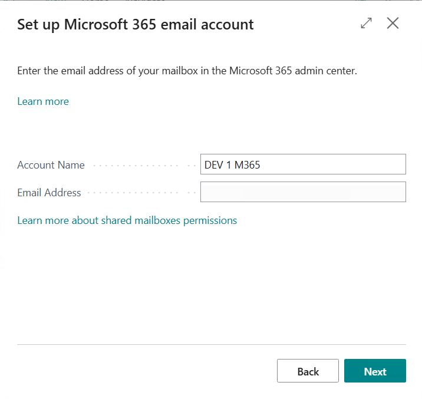
<!-- Auto-blurred via OCR redaction pipeline (1 region(s) detected: GUIDs/emails/secret-token keywords/hostnames/IPs). Please spot-check before relying on this for a public push. -->

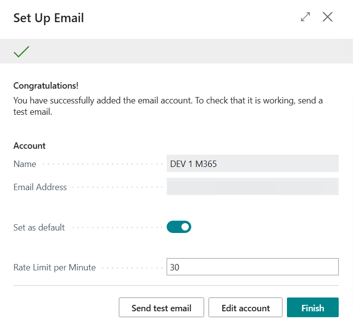
<!-- Auto-blurred via OCR redaction pipeline (1 region(s) detected: GUIDs/emails/secret-token keywords/hostnames/IPs). Please spot-check before relying on this for a public push. -->

Sent to `[your ID]@contoso.example` and received.

Done!

## **Own Exercise**

### Set Up Email “Public Folders” Logging In Exchange Online

Need to create shared mailbox
`https://admin.cloud.microsoft/exchange#`

Using the service account.
[Set up email logging - Business Central | Microsoft Learn](https://learn.microsoft.com/en-us/dynamics365/business-central/marketing-set-up-email-logging?wt.mc_id=d365bc_inproduct_page)

**Property**
**Value**
Name
Public Folders Management
Selected roles
Public Folders
Selected users
The email of the user account that Business Central will use to run the email logging job

**1. Create a new role group**
In Exchange admin center → Roles → Admin roles, click Add role group (not search for an existing one). Name it exactly **"Public Folders Management"** (note: Folders, plural).
**2. Assign the "Public Folders" role**
In the role selection step, add the single role called **"Public Folders"** (not "Public Folder Replication" or anything else — just that one).
**3. Add the email-logging account as a member**
Add the specific account that Business Central's scheduled job will use to connect to Exchange and process emails — this should be a dedicated, non-personal account per Microsoft's guidance, not your personal admin login.

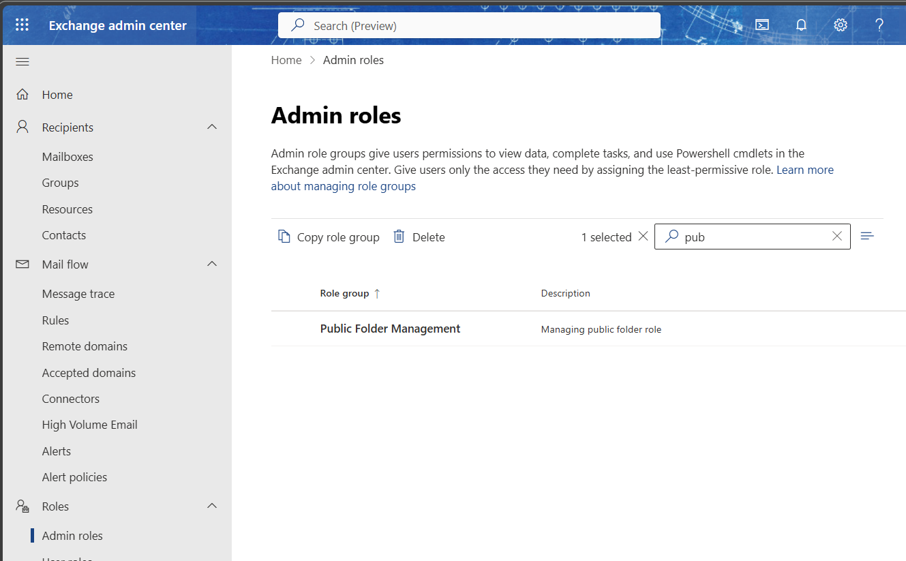
<!-- Auto-reviewed via OCR redaction pipeline: 0 sensitive text regions detected. OCR cannot catch non-text sensitive content (logos, photos, stylized graphics) -- please still skim before a public push. -->

Assigned to : `<service-account>`
Permission: “Public Folder”

**4. Create the public folder mailbox named "Public MailBox"**
With that role group in place, go create the public folder mailbox: Recipients → Public folders → Public folder mailboxes → add one named "Public MailBox". This is the container that will host the actual folder structure.
**5. Create the Email Logging folder structure**
Under Public folders, create a root folder named "Email Logging", then two sub-folders under it: \Email Logging\Queue\ and \Email Logging\Storage\.

The “Public Folder” menu link on the left bottom area.

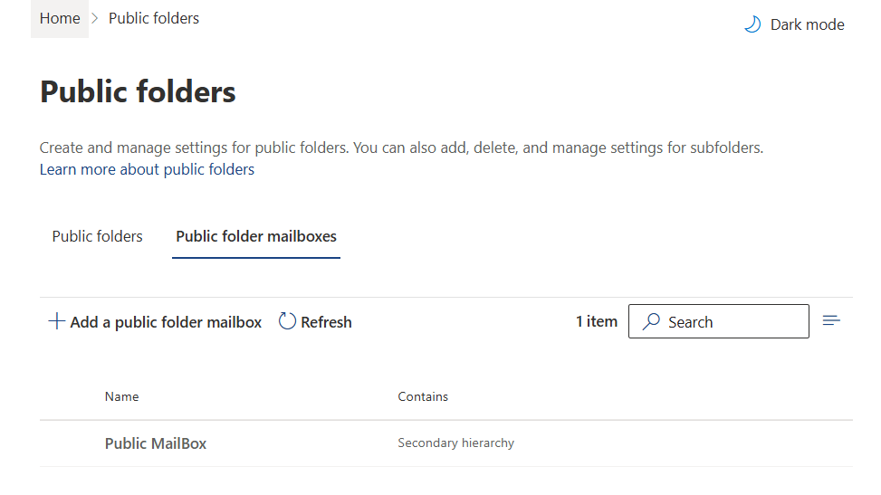
<!-- Auto-reviewed via OCR redaction pipeline: 0 sensitive text regions detected. OCR cannot catch non-text sensitive content (logos, photos, stylized graphics) -- please still skim before a public push. -->

Create root folder

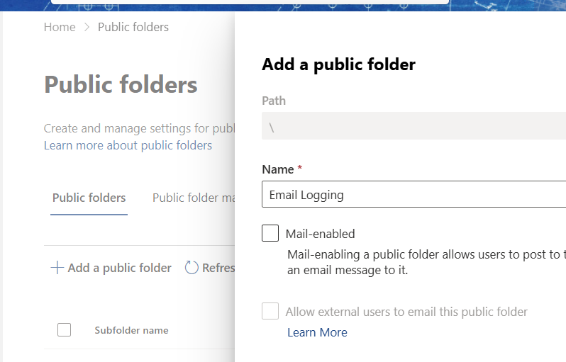
<!-- Auto-reviewed via OCR redaction pipeline: 0 sensitive text regions detected. OCR cannot catch non-text sensitive content (logos, photos, stylized graphics) -- please still skim before a public push. -->

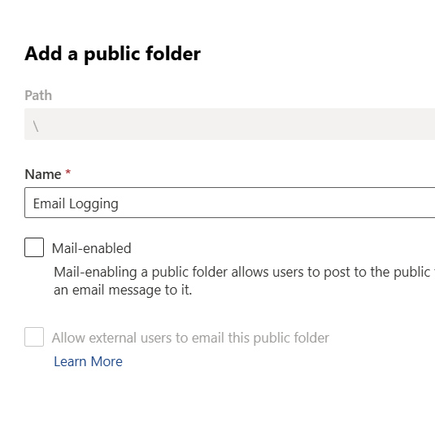
<!-- Auto-reviewed via OCR redaction pipeline: 0 sensitive text regions detected. OCR cannot catch non-text sensitive content (logos, photos, stylized graphics) -- please still skim before a public push. -->

Click folder icon on the right side of “Email Logging” before adding the sub folder

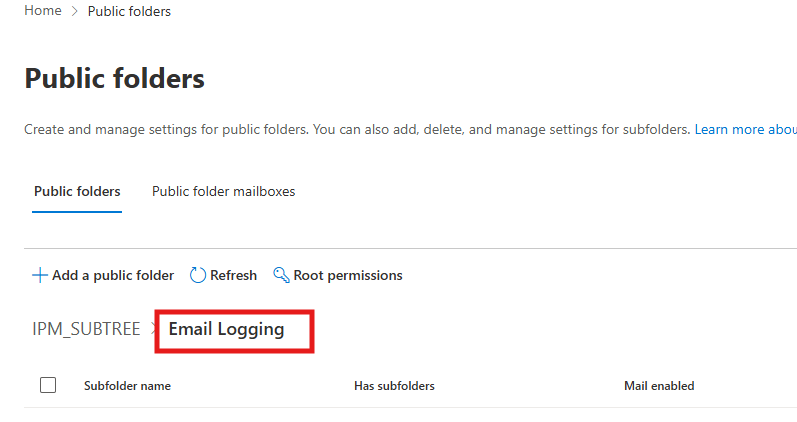
<!-- Auto-reviewed via OCR redaction pipeline: 0 sensitive text regions detected. OCR cannot catch non-text sensitive content (logos, photos, stylized graphics) -- please still skim before a public push. -->

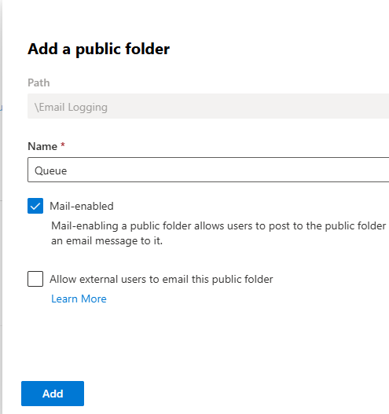
<!-- Auto-reviewed via OCR redaction pipeline: 0 sensitive text regions detected. OCR cannot catch non-text sensitive content (logos, photos, stylized graphics) -- please still skim before a public push. -->

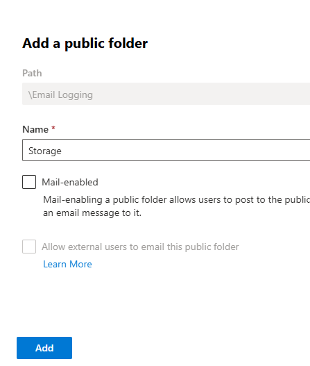
<!-- Auto-reviewed via OCR redaction pipeline: 0 sensitive text regions detected. OCR cannot catch non-text sensitive content (logos, photos, stylized graphics) -- please still skim before a public push. -->

**6. Set folder ownership and mail-enable Queue**
On both the Queue and Storage folders, set the email-logging account (the same one from step 3) as Owner — not just a member/reader. Then mail-enable the Queue folder specifically so it can receive the BCC'd copies from your mail flow rules.

Email Logging Set Permission.

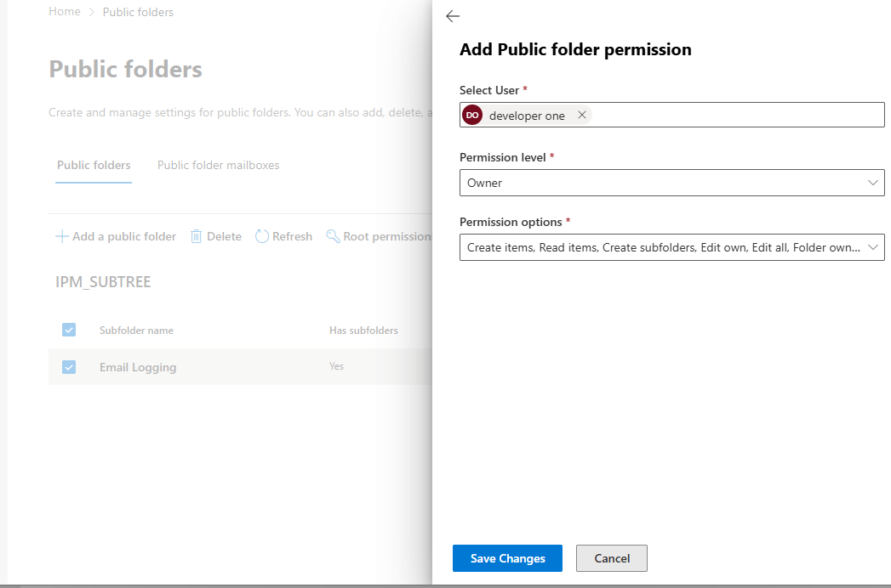
<!-- Auto-reviewed via OCR redaction pipeline: 0 sensitive text regions detected. OCR cannot catch non-text sensitive content (logos, photos, stylized graphics) -- please still skim before a public push. -->

Mail-Enable for Queue

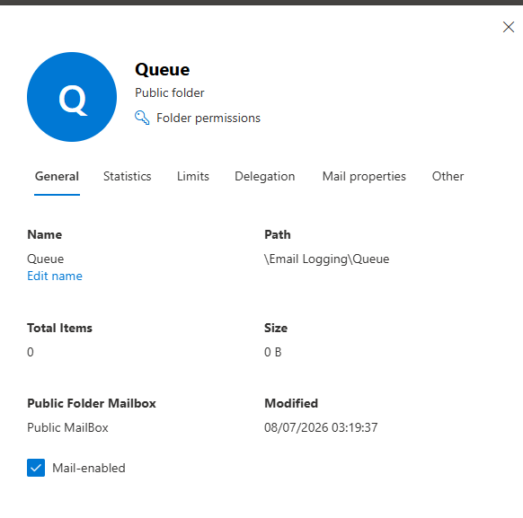
<!-- Auto-reviewed via OCR redaction pipeline: 0 sensitive text regions detected. OCR cannot catch non-text sensitive content (logos, photos, stylized graphics) -- please still skim before a public push. -->

Queue@[your ID].onmicrosoft.com

Mail-enable sending emails to the Queue public folder
Use PowerShell CLI online
Note: it does not work with UPN following script

`Connect-ExchangeOnline -UserPrincipalName <service-account>@[your ID].onmicrosoft.com `

Login first
`connect-exchangeonline ``-Device``  `
`To sign in, use a web browser to open the page https://login.microsoft.com/device and enter the code <DEVICE-CODE> to authenticate.`

`Get-ConnectionInformation`

`ConnectionId                    : XXXXXXXX-XXXX-XXXX-XXXX-XXXXXXXXXXXX`
`State                           : Connected`
`Id                              : 1`
`Name                            : ExchangeOnline_1`
`UserPrincipalName               : <service-account>@[your ID].onmicrosoft.com`
`ConnectionUri                   : https://outlook.office365.com`
`AzureAdAuthorizationEndpointUri : https://login.microsoftonline.com/organizations`
`TokenExpiryTimeUTC              : 8/8/2026 5:40:43 AM +00:00`
`CertificateAuthentication       : False`
`ModuleName                      : /tmp/tmpEXO_44ttulc5.g5e`
`ModulePrefix                    : `
`Organization                    : `
`DelegatedOrganization           : `
`AppId                           : `
`PageSize                        : 0`
`TenantID                        : XXXXXXXX-XXXX-XXXX-XXXX-XXXXXXXXXXXX`
`TokenStatus                     : Active`
`ConnectionUsedForInbuiltCmdlets : True`
`IsEopSession                    : False`

`Get-Command Add-PublicFolderClientPermission`

`CommandType     Name                                               Version    Source`
`-----------     ----                                               -------    ------`
`Function        Add-PublicFolderClientPermission                   0.0.1      tmpEXO_44ttulc5.g5e`

`Add-PublicFolderClientPermission -Identity "\Email Logging\Queue" -User Anonymous -AccessRights CreateItems`

`FolderName           User              AccessRights           SharingPermissionFlags`
`----------           ----              ------------           ----------------------`
`Queue                Anonymous         {CreateItems}          `

`Set-MailPublicFolder -Identity "\Email Logging\Queue" -RequireSenderAuthenticationEnabled $false`

`Get-PublicFolderClientPermission "\Email Logging\Queue"`

`FolderName           User                 AccessRights                SharingPermissionFlags`
`----------           ----                 ------------                ----------------------`
`Queue                Default              {Author}                                                        `
`Queue                Anonymous            {CreateItems}   `

**Create the two mail flow (BCC) rules**

`Queue@[your ID].onmicrosoft.com`

Inbound
Outbound

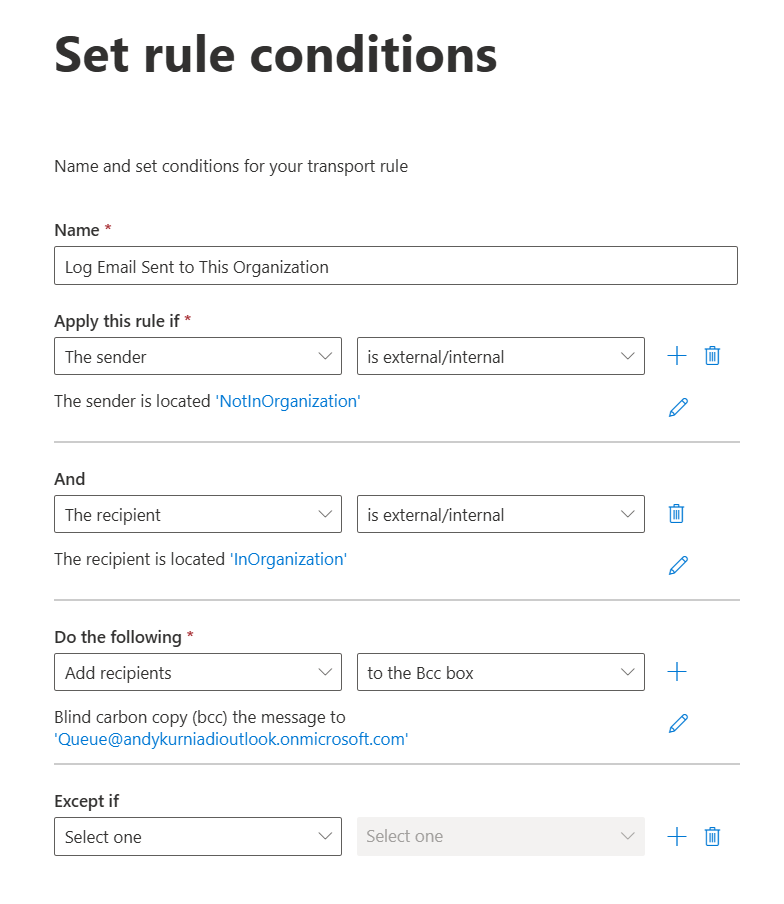
<!-- Auto-reviewed via OCR redaction pipeline: 0 sensitive text regions detected. OCR cannot catch non-text sensitive content (logos, photos, stylized graphics) -- please still skim before a public push. -->

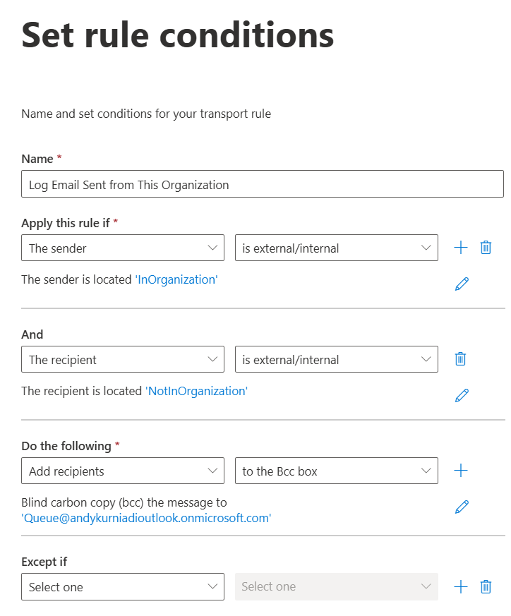
<!-- Auto-reviewed via OCR redaction pipeline: 0 sensitive text regions detected. OCR cannot catch non-text sensitive content (logos, photos, stylized graphics) -- please still skim before a public push. -->

Rule setting are similar for both inbound/outbound

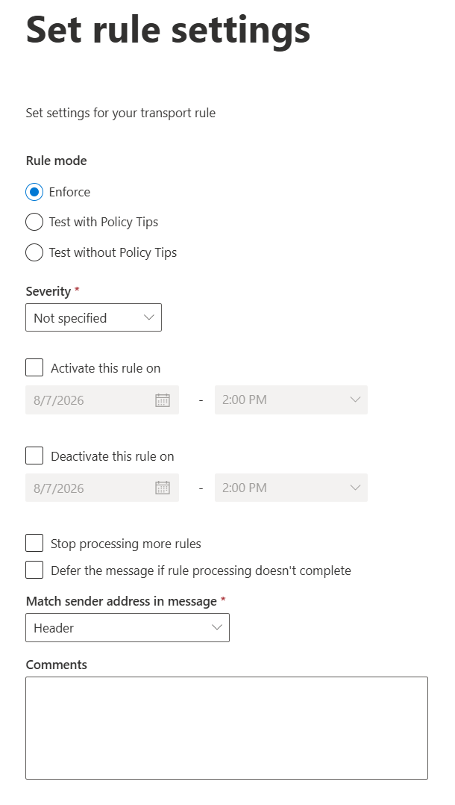
<!-- Auto-reviewed via OCR redaction pipeline: 0 sensitive text regions detected. OCR cannot catch non-text sensitive content (logos, photos, stylized graphics) -- please still skim before a public push. -->

Test the public queue folder.
- Send test email from `[your ID]@contoso.example` to `<service-account>@[your ID].onmicrosoft.com`.
- Add the public folder from Outlook while signed in to the service account.

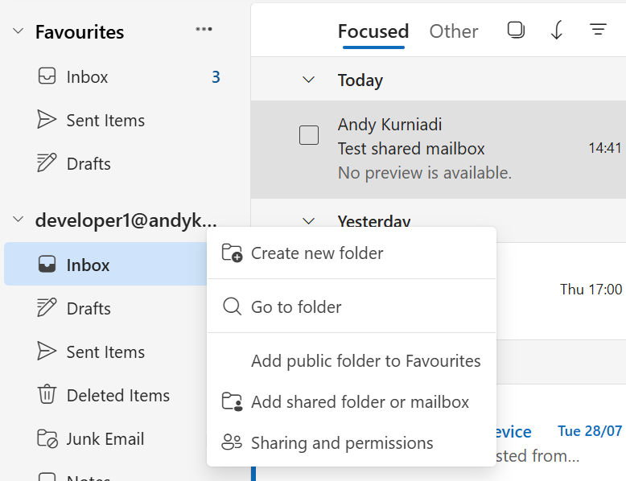
<!-- Auto-reviewed via OCR redaction pipeline: 0 sensitive text regions detected. OCR cannot catch non-text sensitive content (logos, photos, stylized graphics) -- please still skim before a public push. -->

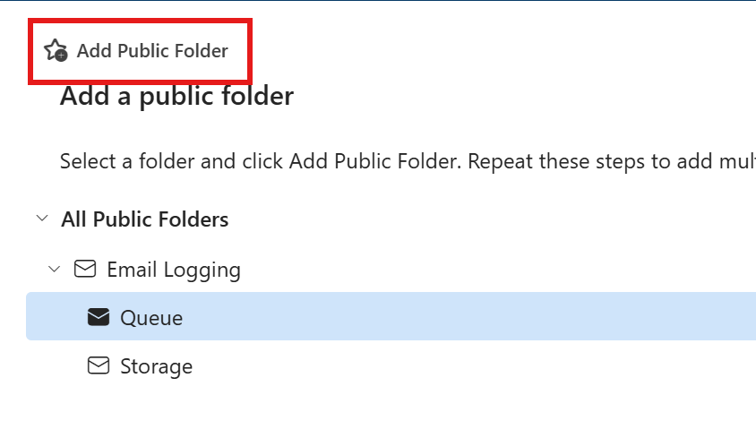
<!-- Auto-reviewed via OCR redaction pipeline: 0 sensitive text regions detected. OCR cannot catch non-text sensitive content (logos, photos, stylized graphics) -- please still skim before a public push. -->

Click the start

The public queue mailbox is added

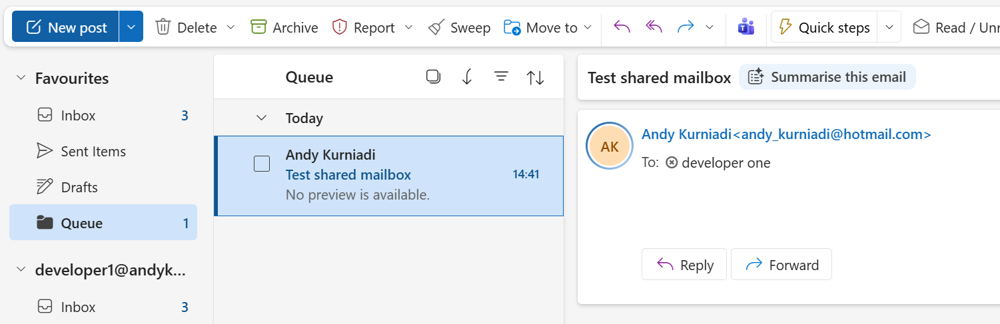
<!-- Auto-reviewed via OCR redaction pipeline: 0 sensitive text regions detected. OCR cannot catch non-text sensitive content (logos, photos, stylized graphics) -- please still skim before a public push. -->

Note: The BC Setup is not matched with local BC-on prem

I disabled the rule

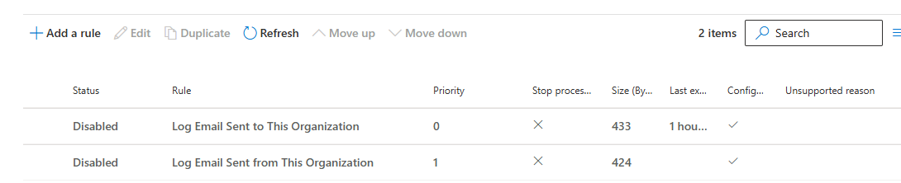
<!-- Auto-reviewed via OCR redaction pipeline: 0 sensitive text regions detected. OCR cannot catch non-text sensitive content (logos, photos, stylized graphics) -- please still skim before a public push. -->

### Set Up Shared Mailbox for BC on-prem On Exchange Online

Need to create shared mailbox
`https://admin.cloud.microsoft/exchange#`

Using the service account.
[Set up email logging - Business Central | Microsoft Learn](https://learn.microsoft.com/en-us/dynamics365/business-central/marketing-set-up-email-logging?wt.mc_id=d365bc_inproduct_page)

**Create the shared mailbox**
Exchange admin center → Recipients → Mailboxes → Add a shared mailbox. Give it a display name (e.g. "BC Email Logging") and an address like `emaillogging@[your ID].onmicrosoft.com`. This is a completely separate mailbox from the Queue public folder — don't reuse that address.

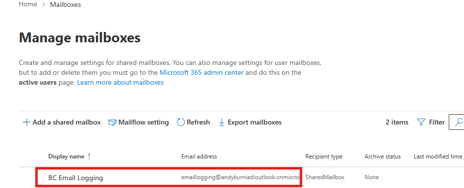
<!-- Auto-reviewed via OCR redaction pipeline: 0 sensitive text regions detected. OCR cannot catch non-text sensitive content (logos, photos, stylized graphics) -- please still skim before a public push. -->

`emaillogging@[your ID].onmicrosoft.com`

**Add the email-logging account as a member of the shared mailbox**
The account that you use for email logging is an Exchange Online account. The scheduled job uses the account to connect to the shared mailbox and process emails. This account shouldn't be associated with a specific person. Use a dedicated non-personal service account for this purpose. Open the shared mailbox → Delegation tab → add that account under "Read and manage (Full Access)."

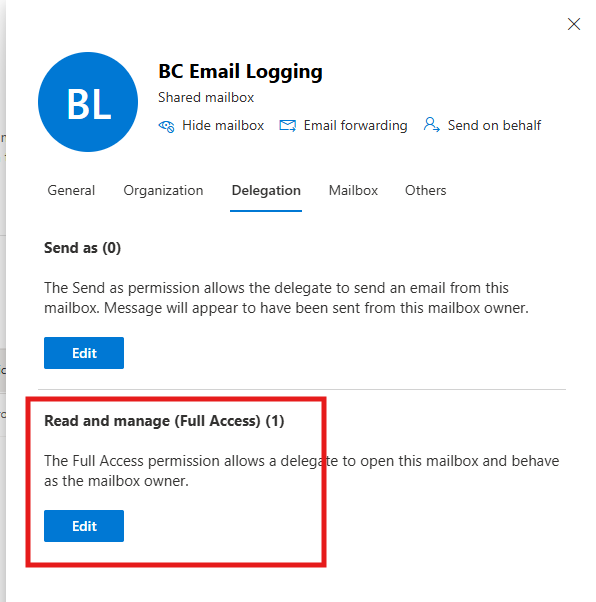
<!-- Auto-reviewed via OCR redaction pipeline: 0 sensitive text regions detected. OCR cannot catch non-text sensitive content (logos, photos, stylized graphics) -- please still skim before a public push. -->

Add the service account.

**Optional: grant Read access to the Archive folder for other viewers**
<cite index="58-1">You can allow another user to open an email message in Exchange related to an interaction log entry from Business Central by giving the user Read permission to the Archive folder in the shared mailbox.</cite> This is optional — skip it if no other user needs visibility.

**Create the two mail flow rules, BCC'ing the shared mailbox**
In Exchange admin center → Mail flow → Rules, create two rules named exactly the same as your public folder rules ("**Log Email Sent to This Organization" / "Log Email Sent from This Organization**") — or rename to distinguish them since you'll now have duplicates. <cite index="58-1">The inbound rule triggers when the sender is located outside the organization and the recipient is located inside; the outbound rule is the reverse. Both use "BCC the message to" pointing at the shared mailbox's address instead of the Queue folder's address.</cite>

Inbound
Outbound

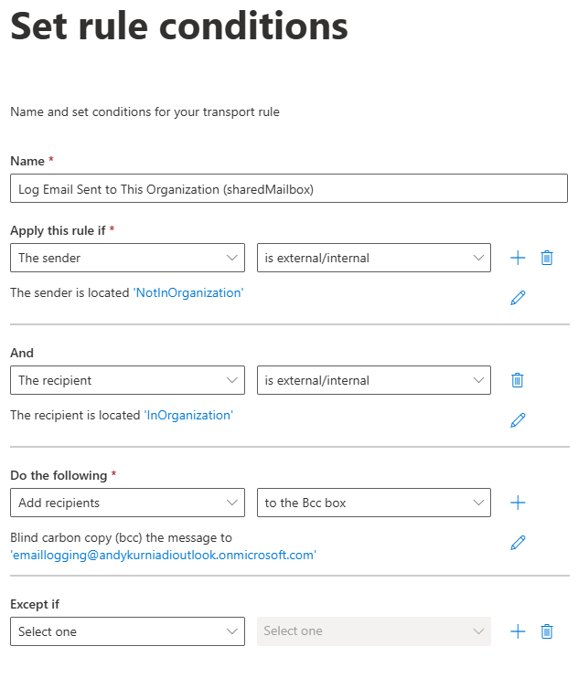
<!-- Auto-reviewed via OCR redaction pipeline: 0 sensitive text regions detected. OCR cannot catch non-text sensitive content (logos, photos, stylized graphics) -- please still skim before a public push. -->

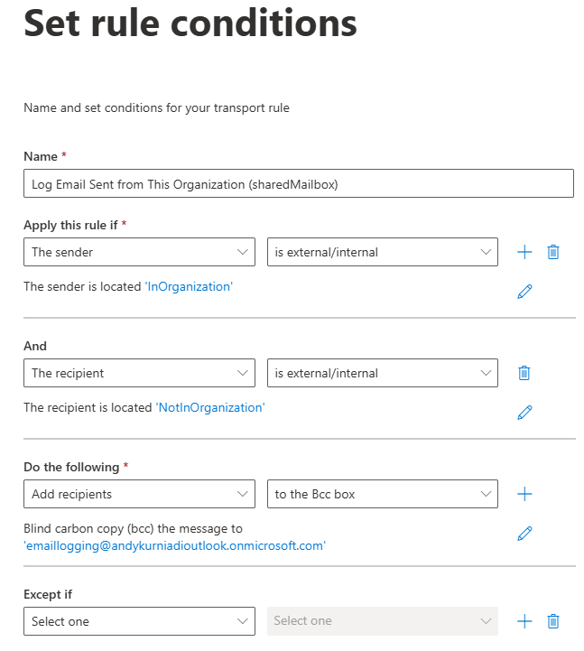
<!-- Auto-reviewed via OCR redaction pipeline: 0 sensitive text regions detected. OCR cannot catch non-text sensitive content (logos, photos, stylized graphics) -- please still skim before a public push. -->

Enabled Both Rules

Test sent email from Outlook using `[your ID]@contoso.example` to the service account.

In outlook client cloud, add shared mailbox

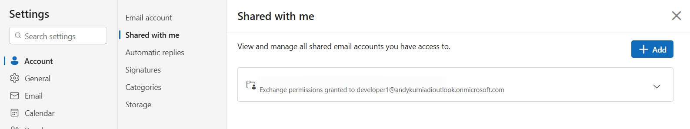
<!-- Auto-blurred via OCR redaction pipeline (1 region(s) detected: GUIDs/emails/secret-token keywords/hostnames/IPs). Please spot-check before relying on this for a public push. -->

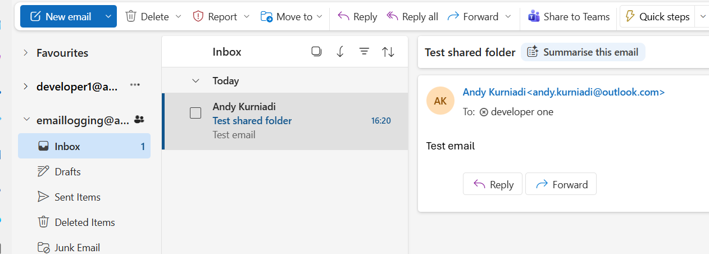
<!-- Auto-reviewed via OCR redaction pipeline: 0 sensitive text regions detected. OCR cannot catch non-text sensitive content (logos, photos, stylized graphics) -- please still skim before a public push. -->

In Application Registration
Add permission  “Mail.ReadWrite.Shared” and grant admin consent

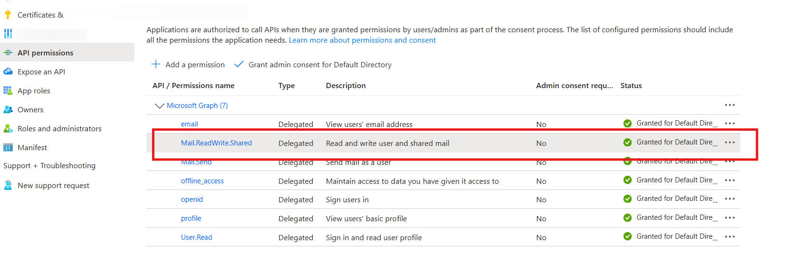
<!-- Auto-blurred via OCR redaction pipeline (2 region(s) detected: GUIDs/emails/secret-token keywords/hostnames/IPs). Please spot-check before relying on this for a public push. -->

### Setup Email Logging on BC on-prem

Use Business Manager Role Center

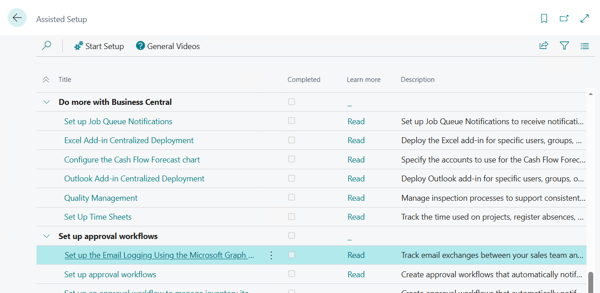
<!-- Auto-reviewed via OCR redaction pipeline: 0 sensitive text regions detected. OCR cannot catch non-text sensitive content (logos, photos, stylized graphics) -- please still skim before a public push. -->

Enable Manual Setup Done

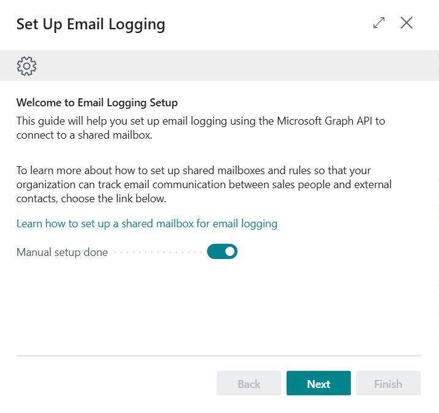
<!-- Auto-reviewed via OCR redaction pipeline: 0 sensitive text regions detected. OCR cannot catch non-text sensitive content (logos, photos, stylized graphics) -- please still skim before a public push. -->

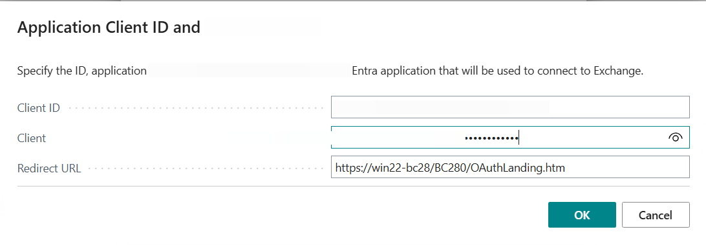
<!-- Auto-blurred via OCR redaction pipeline (4 region(s) detected: GUIDs/emails/secret-token keywords/hostnames/IPs). Please spot-check before relying on this for a public push. -->

Use the service account.

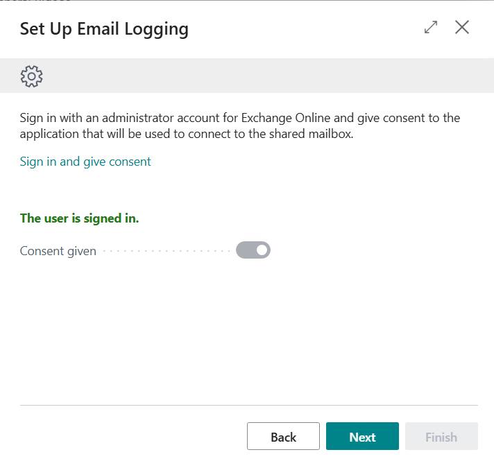
<!-- Auto-reviewed via OCR redaction pipeline: 0 sensitive text regions detected. OCR cannot catch non-text sensitive content (logos, photos, stylized graphics) -- please still skim before a public push. -->

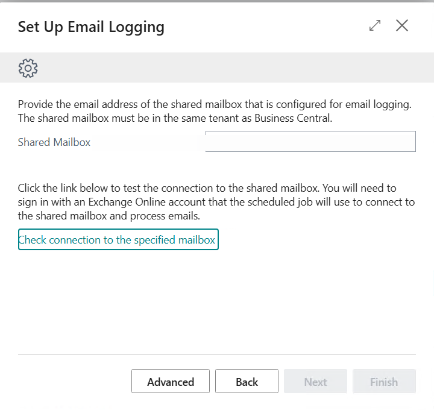
<!-- Auto-blurred via OCR redaction pipeline (1 region(s) detected: GUIDs/emails/secret-token keywords/hostnames/IPs). Please spot-check before relying on this for a public push. -->

It prompt to logged in as dev1

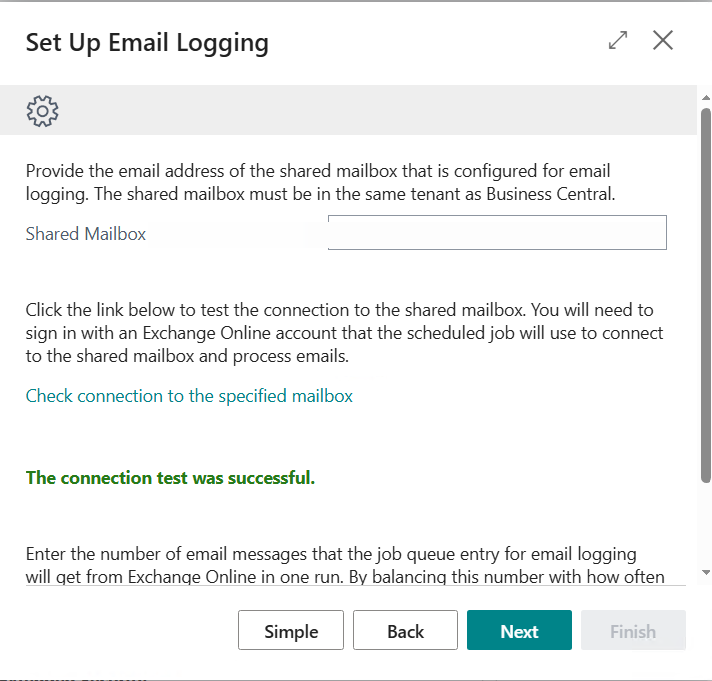
<!-- Auto-blurred via OCR redaction pipeline (1 region(s) detected: GUIDs/emails/secret-token keywords/hostnames/IPs). Please spot-check before relying on this for a public push. -->

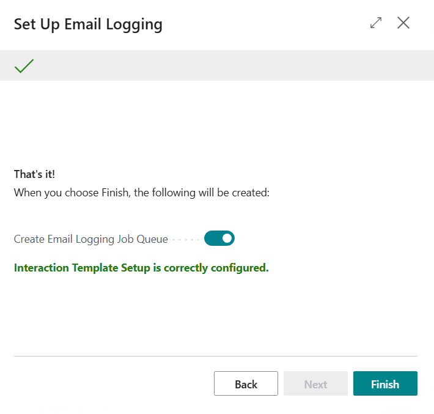
<!-- Auto-reviewed via OCR redaction pipeline: 0 sensitive text regions detected. OCR cannot catch non-text sensitive content (logos, photos, stylized graphics) -- please still skim before a public push. -->

New Job queue is automatically Created

### Setup Own Outlook Integration

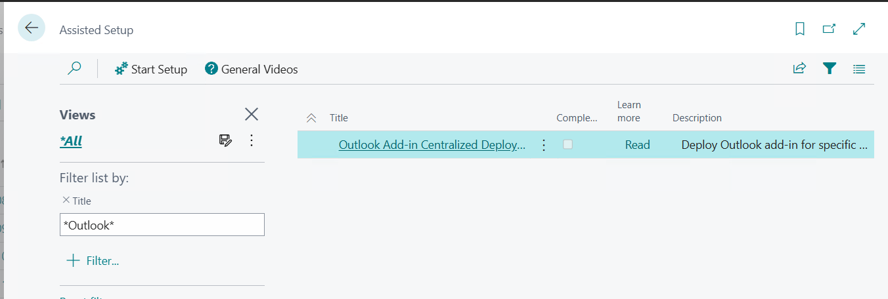
<!-- Auto-reviewed via OCR redaction pipeline: 0 sensitive text regions detected. OCR cannot catch non-text sensitive content (logos, photos, stylized graphics) -- please still skim before a public push. -->

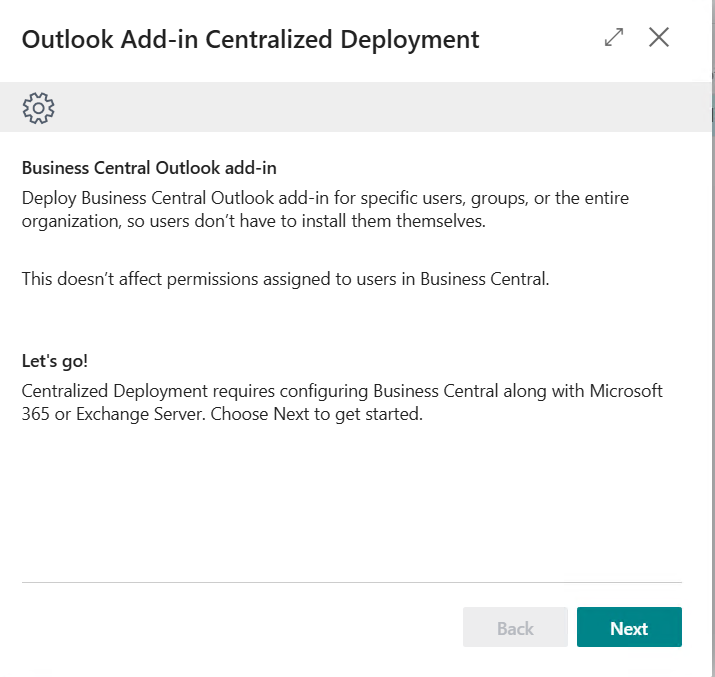
<!-- Auto-reviewed via OCR redaction pipeline: 0 sensitive text regions detected. OCR cannot catch non-text sensitive content (logos, photos, stylized graphics) -- please still skim before a public push. -->

Slightly different from online BC

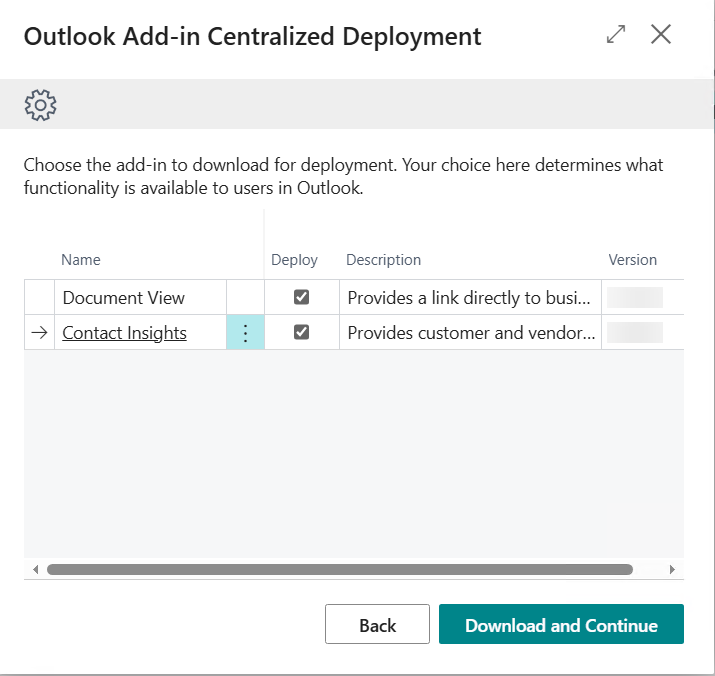
<!-- Auto-blurred via OCR redaction pipeline (2 region(s) detected: GUIDs/emails/secret-token keywords/hostnames/IPs). Please spot-check before relying on this for a public push. -->

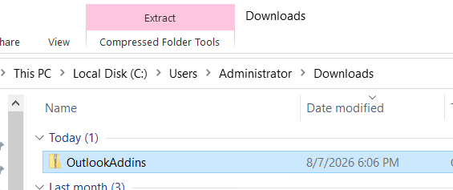
<!-- Auto-reviewed via OCR redaction pipeline: 0 sensitive text regions detected. OCR cannot catch non-text sensitive content (logos, photos, stylized graphics) -- please still skim before a public push. -->

Extract the zip (2 xml files)

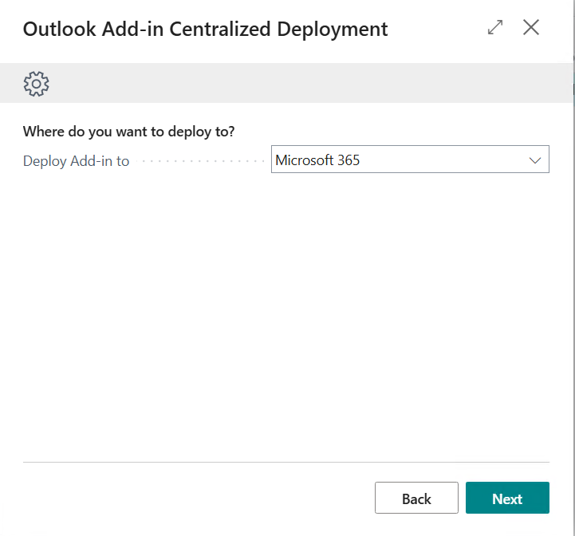
<!-- Auto-reviewed via OCR redaction pipeline: 0 sensitive text regions detected. OCR cannot catch non-text sensitive content (logos, photos, stylized graphics) -- please still skim before a public push. -->

**Microsoft 365** → mailboxes are in Exchange Online (your setup)
**Exchange Server** → mailboxes are on a local on-prem Exchange Server (e.g., Exchange 2016/2019)

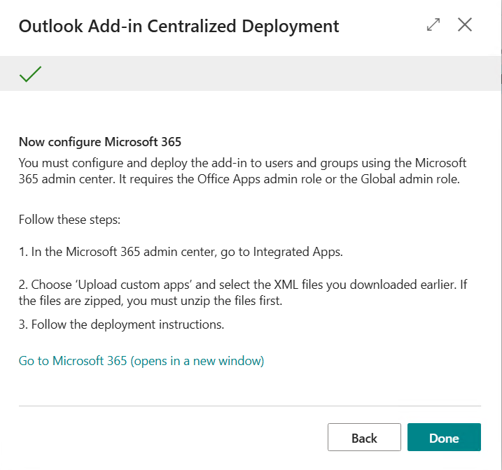
<!-- Auto-reviewed via OCR redaction pipeline: 0 sensitive text regions detected. OCR cannot catch non-text sensitive content (logos, photos, stylized graphics) -- please still skim before a public push. -->

Upload the 2 manifest XML from M 365 admin center

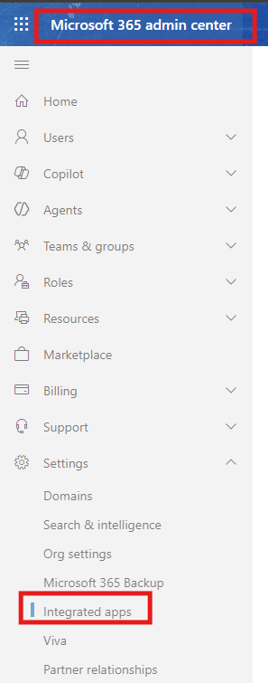
<!-- Auto-reviewed via OCR redaction pipeline: 0 sensitive text regions detected. OCR cannot catch non-text sensitive content (logos, photos, stylized graphics) -- please still skim before a public push. -->

Contact Insight

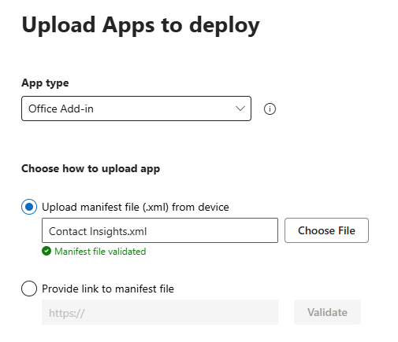
<!-- Auto-reviewed via OCR redaction pipeline: 0 sensitive text regions detected. OCR cannot catch non-text sensitive content (logos, photos, stylized graphics) -- please still skim before a public push. -->

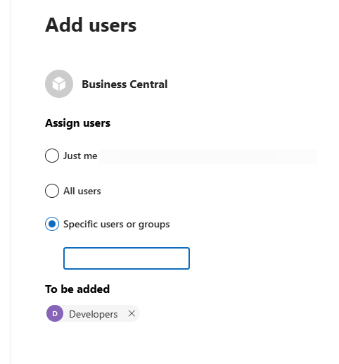
<!-- Auto-blurred via OCR redaction pipeline (1 region(s) detected: GUIDs/emails/secret-token keywords/hostnames/IPs). Please spot-check before relying on this for a public push. -->

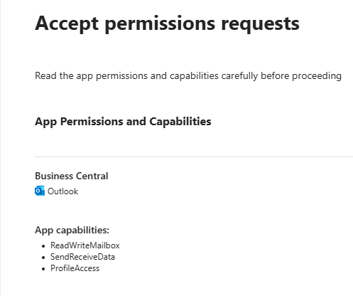
<!-- Auto-reviewed via OCR redaction pipeline: 0 sensitive text regions detected. OCR cannot catch non-text sensitive content (logos, photos, stylized graphics) -- please still skim before a public push. -->

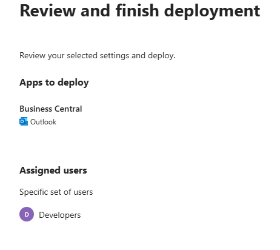
<!-- Auto-reviewed via OCR redaction pipeline: 0 sensitive text regions detected. OCR cannot catch non-text sensitive content (logos, photos, stylized graphics) -- please still skim before a public push. -->

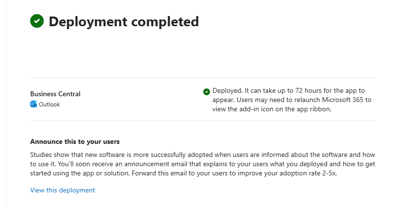
<!-- Auto-reviewed via OCR redaction pipeline: 0 sensitive text regions detected. OCR cannot catch non-text sensitive content (logos, photos, stylized graphics) -- please still skim before a public push. -->

Document View

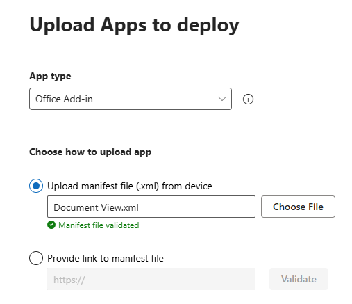
<!-- Auto-reviewed via OCR redaction pipeline: 0 sensitive text regions detected. OCR cannot catch non-text sensitive content (logos, photos, stylized graphics) -- please still skim before a public push. -->

Similar steps config like the contact Insight

Show under integrated app

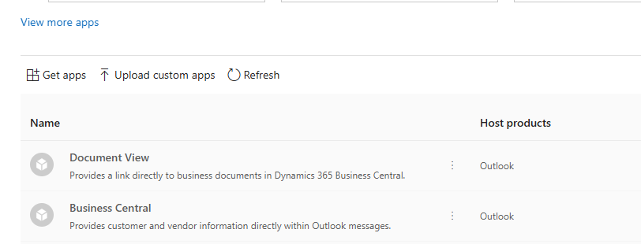
<!-- Auto-reviewed via OCR redaction pipeline: 0 sensitive text regions detected. OCR cannot catch non-text sensitive content (logos, photos, stylized graphics) -- please still skim before a public push. -->

Run the outlook in the hyper-v guess  BC-Onprem
The BC link menu appear, however but it can not access the BC
Because the default instance runs on windows local authentication

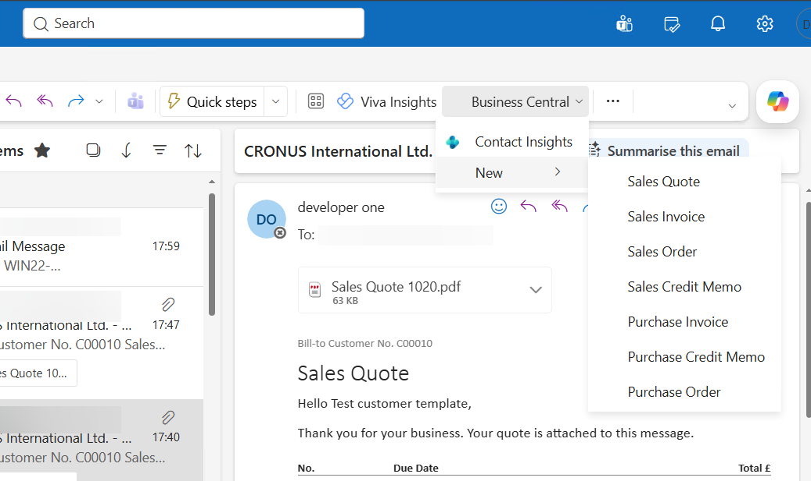
<!-- Auto-blurred via OCR redaction pipeline (4 region(s) detected: GUIDs/emails/secret-token keywords/hostnames/IPs). Please spot-check before relying on this for a public push. -->

### SMTP Email Account with Oauth2.0 Custom:

#### Required API Permission

**API:** Office 365 Exchange Online
 **Permission Type:** Application Permission
 **Permission:** SMTP.SendAsApp ✅
Microsoft's guidance explicitly says to:
- Azure Portal → App Registrations → Your App
- API Permissions → Add Permission
- **APIs my organization uses**
- Select **Office 365 Exchange Online**
- **Application permissions**
- Expand **SMTP**
- Add **SMTP.SendAsApp**
- Grant **Admin Consent**[ [learn.microsoft.com]](https://learn.microsoft.com/en-us/dynamics365/business-central/admin-multi-tenant-smtp)

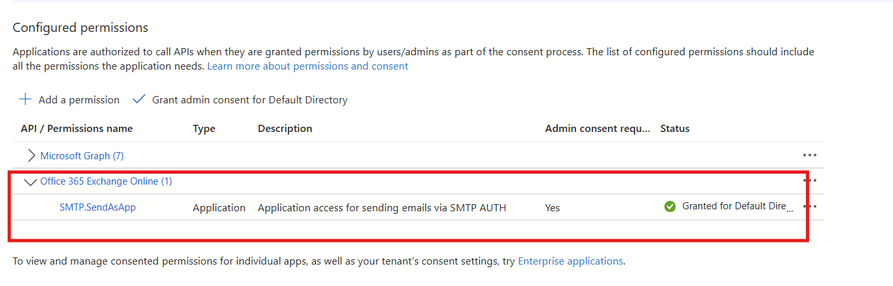
<!-- Auto-reviewed via OCR redaction pipeline: 0 sensitive text regions detected. OCR cannot catch non-text sensitive content (logos, photos, stylized graphics) -- please still skim before a public push. -->

App Registration ID		: XXXXXXXX-XXXX-XXXX-XXXX-XXXXXXXXXXXX
Enterprise App Object ID	: XXXXXXXX-XXXX-XXXX-XXXX-XXXXXXXXXXXX
Azure Portal → Enterprise Application
Entra Portal ([https://entra.microsoft.com/](https://entra.microsoft.com/)) → Enterprise Application

Using the Powershell 7.0

Install module ExchangeOnlineManagement
`Install-Module -Name ExchangeOnlineManagement -Scope CurrentUser`

Connect authenticate with device
`Connect-ExchangeOnline -Device`

Check SMTP client is not disabled

`Get-CASMailbox -Identity <service-account> | Select-Object SmtpClientAuthenticationDisabled`
`SmtpClientAuthenticationDisabled`

Set to Enable SMTP Client
`Set-TransportConfig -SmtpClientAuthenticationDisabled $false`

Set New Service Principal
Service ID ⇒ Object ID of enterprise app Entra for BC OnPrem
`New-ServicePrincipal ``
`    -AppId "XXXXXXXX-XXXX-XXXX-XXXX-XXXXXXXXXXXX" ``
`    -ServiceId "XXXXXXXX-XXXX-XXXX-XXXX-XXXXXXXXXXXX" ``
`    -DisplayName "BC SMTP OAuth"`

Add Recipient Permission
Thruster ⇒ Object ID

`Add-RecipientPermission ``
`-Identity "<service-account>@[your ID].onmicrosoft.com" ``
`-Trustee "XXXXXXXX-XXXX-XXXX-XXXX-XXXXXXXXXXXX" ``
`-AccessRights SendAs ``
`-Confirm:$false`

Add Mailbox Permission
User ⇒ Object ID
`Add-MailboxPermission ``
`-Identity "<service-account>@[your ID].onmicrosoft.com" ``
`-User "XXXXXXXX-XXXX-XXXX-XXXX-XXXXXXXXXXXX" ``
`-AccessRights FullAccess ``
`-AutoMapping:$false`

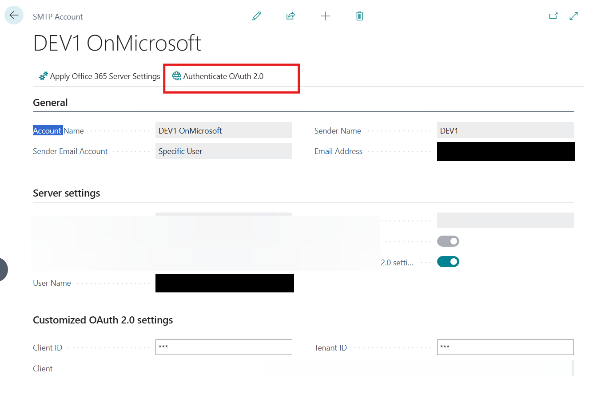
<!-- Auto-blurred via OCR redaction pipeline (2 region(s) detected: GUIDs/emails/secret-token keywords/hostnames/IPs). Please spot-check before relying on this for a public push. -->

**Check Module #3-6 Own Exercise **
Setup email for current user to get client ID, Client Secret, tenant ID, and redirect URI
