# Module #4-8: Exercise

> Part of: Module 4: Creating Business Objects - Tables & Pages

Labs\M4_8_CreateTablePageExtension
Use MAI-Code-1.1- Flash Model

## [Exercise - Create a table extension](https://learn.microsoft.com/en-gb/training/modules/debug-deploy-extension/6-exercise)

[https://learn.microsoft.com/en-gb/training/modules/debug-deploy-extension/6-exercise](https://learn.microsoft.com/en-gb/training/modules/debug-deploy-extension/6-exercise)
Prompt Instruction 1:
`"Analyst the exercise lab https://learn.microsoft.com/en-gb/training/modules/debug-deploy-extension/6-exercise and summary up the table extension requirement to create"`

Prompt Instruction 2:
`"Create the table extension as per the lab exercise" `

## [Exercise - Create a page extension](https://learn.microsoft.com/en-gb/training/modules/debug-deploy-extension/7-exercise)

[https://learn.microsoft.com/en-gb/training/modules/debug-deploy-extension/7-exercise](https://learn.microsoft.com/en-gb/training/modules/debug-deploy-extension/7-exercise)
Prompt Instruction 1:
`"Analyst following lab exercise https://learn.microsoft.com/en-gb/training/modules/debug-deploy-extension/7-exercise and sum up the page extension requirement"`

Prompt Instruction 2:
`"Help create the new page extension and skip extra setup"`

## Own Exercise

### Attach Debug Test

Attach debugging lets you attach the AL debugger to an **already running session** or the next session of a user instead of launching a new client.

Launch.Json: New Configuration Set for attached debug
Request → attach
breakOnNext → WebClient  (WebClient, WebServiceClient, Background)
`        {`
`            "name": "Attach Debug Local server",`
`            "request":"attach",`
`            "type": "al",`
`            "environmentType": "OnPrem",`
`            "server": "http://win22-bc28",`
`            "serverInstance": "BC280",`
`            "port": 7049,`
`            "authentication": "Windows",`
`            "breakOnError": "All",`
`            "enableLongRunningSqlStatements": true,`
`            "enableSqlInformationDebugger": true,`
`            "tenant": "default",`
`            "breakOnNext": "WebClient"      `
`        },`

**May adding userId, sessionID config to specific target**

**            //Following setting is not valid for attach debug**
"startupObjectId": 50133,
"startupObjectType": "Page",
"usePublicURLFromServer": true,
"launchBrowser": true,

Make a break point in codes **F9**

Select “Attach Debug Local Server”

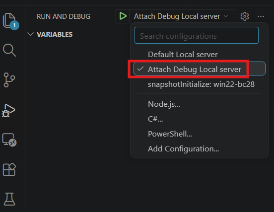
<!-- Auto-reviewed via OCR redaction pipeline: 0 sensitive text regions detected. OCR cannot catch non-text sensitive content (logos, photos, stylized graphics) -- please still skim before a public push. -->

Client session, perform process that having break point and it will run debug mode

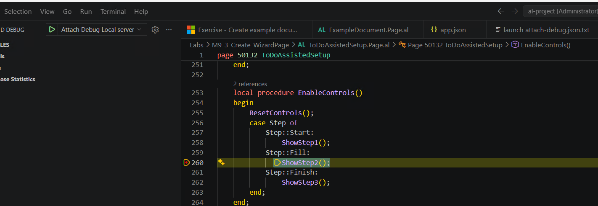
<!-- Auto-reviewed via OCR redaction pipeline: 0 sensitive text regions detected. OCR cannot catch non-text sensitive content (logos, photos, stylized graphics) -- please still skim before a public push. -->

Once done debug, click the disconnect

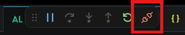
<!-- Auto-reviewed via OCR redaction pipeline: 0 sensitive text regions detected. OCR cannot catch non-text sensitive content (logos, photos, stylized graphics) -- please still skim before a public push. -->

### Snapshot Debug Test, download and profiler

Snapshot port and services need to enable

PowerShell:
Set-NAVServerConfiguration -ServerInstance BC280 -KeyName "SnapshotDebuggerEnabled" -KeyValue true

<add key="SnapshotDebuggerServicesPort" value="7083" />
<add key="SnapshotDebuggerEnabled" value="true" />

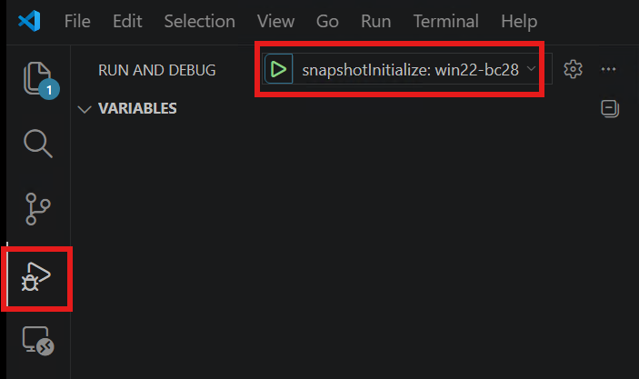
<!-- Auto-reviewed via OCR redaction pipeline: 0 sensitive text regions detected. OCR cannot catch non-text sensitive content (logos, photos, stylized graphics) -- please still skim before a public push. -->

Use command palette to run: AL: Initialize Snapshot Debugging

Click bugs button below

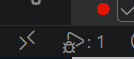
<!-- Auto-reviewed via OCR redaction pipeline: 0 sensitive text regions detected. OCR cannot catch non-text sensitive content (logos, photos, stylized graphics) -- please still skim before a public push. -->

Ctrl+shift+P → AL: Show All the Snapshot

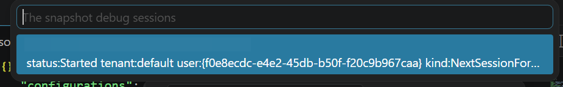
<!-- Auto-blurred via OCR redaction pipeline (1 region(s) detected: GUIDs/emails/secret-token keywords/hostnames/IPs). Please spot-check before relying on this for a public push. -->

Do user perform transaction in BC web client

Finish the snapshot ALT+F7 or command palette: AL:Finish snapshot debugging on the server

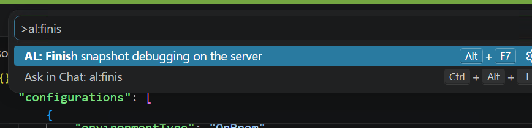
<!-- Auto-reviewed via OCR redaction pipeline: 0 sensitive text regions detected. OCR cannot catch non-text sensitive content (logos, photos, stylized graphics) -- please still skim before a public push. -->

In output terminal:

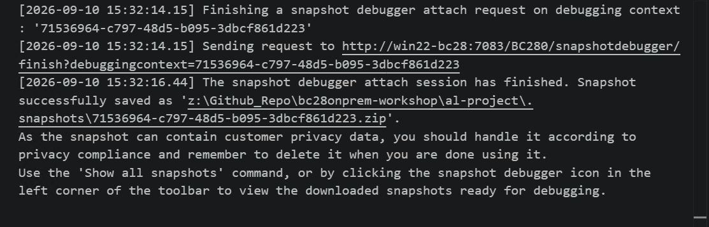
<!-- Auto-reviewed via OCR redaction pipeline: 0 sensitive text regions detected. OCR cannot catch non-text sensitive content (logos, photos, stylized graphics) -- please still skim before a public push. -->

The snapshot zip file

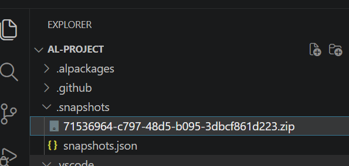
<!-- Auto-reviewed via OCR redaction pipeline: 0 sensitive text regions detected. OCR cannot catch non-text sensitive content (logos, photos, stylized graphics) -- please still skim before a public push. -->

Method 1: Command palette AL:Generate profile file

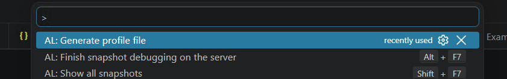
<!-- Auto-reviewed via OCR redaction pipeline: 0 sensitive text regions detected. OCR cannot catch non-text sensitive content (logos, photos, stylized graphics) -- please still skim before a public push. -->

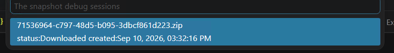
<!-- Auto-reviewed via OCR redaction pipeline: 0 sensitive text regions detected. OCR cannot catch non-text sensitive content (logos, photos, stylized graphics) -- please still skim before a public push. -->

Method 2: Right click on the downloaded snapshot file

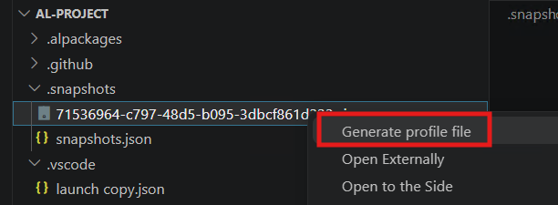
<!-- Auto-reviewed via OCR redaction pipeline: 0 sensitive text regions detected. OCR cannot catch non-text sensitive content (logos, photos, stylized graphics) -- please still skim before a public push. -->

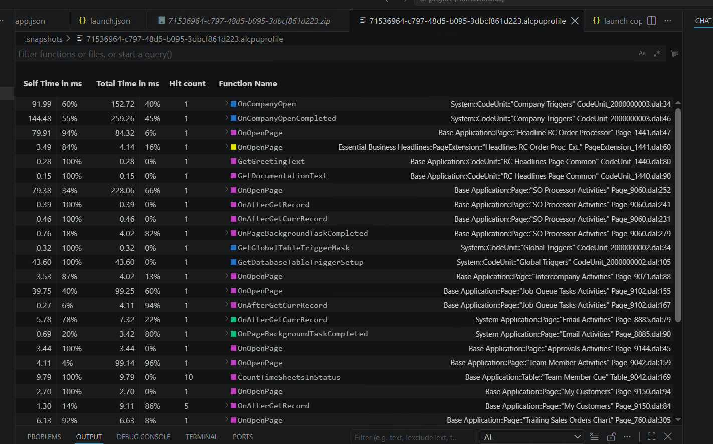
<!-- Auto-reviewed via OCR redaction pipeline: 0 sensitive text regions detected. OCR cannot catch non-text sensitive content (logos, photos, stylized graphics) -- please still skim before a public push. -->
