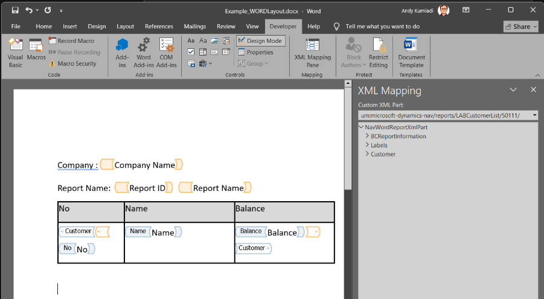
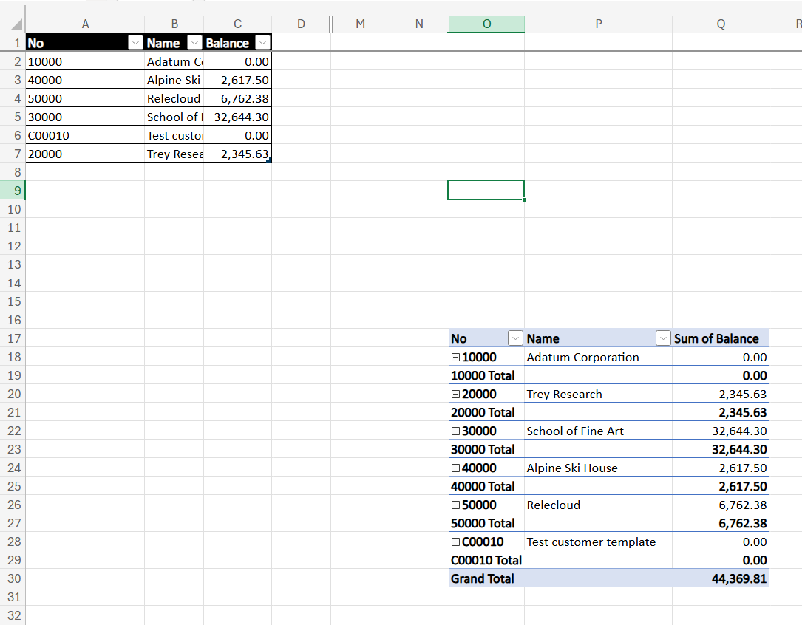

# Module #5-4: Exercise

> Part of: Module 5: Reporting & Analytics

## [Exercise - Create a basic report](https://learn.microsoft.com/en-gb/training/modules/add-layout-report/4-exercise)

vscode path: Labs\M5_4_CreateBasicReport

Use Copilot Agent to generate the report:
- .rdl report layout
- Word report layout
- Excel report layout

[https://learn.microsoft.com/en-gb/training/modules/add-layout-report/4-exercise](https://learn.microsoft.com/en-gb/training/modules/add-layout-report/4-exercise)

Use MAI-Code-1.1- Flash Model

Prompt Instruction 1:
_“Analyst the lab exercise based on this web content https://learn.microsoft.com/en-gb/training/modules/add-layout-report/4-exercise and sum up the intension”_

Prompt Instruction 2:
_“List down the steps based on the web content”_

Step-by-step list from the exercise
Based on the Microsoft Learn exercise, the workflow is:
- Create a page extension
- Add a new AL file such as CustomerList.PageExt.al
- Extend the Customer List page
- Use a trigger to run the report when the page opens
- Create the report object
- Add a new report file such as LABCustomerList.Report.al
- Define:
- report number
- caption
- application area
- usage category
- dataset
- rendering layouts
- Define the report dataset
- Use a data item for Customer
- Add columns such as:
- No.
- Name
- Balance (LCY)
- Set captions and data item sorting
- Include fields that should appear in the report
- Add multiple layouts
- Define an RDLC layout
- Define a Word layout
- Define an Excel layout
- Set the default rendering layout
- Save the report and build the project
- Generate the layout files
- Build the project with Ctrl+Shift+B
- This creates the generated layout files such as:
- LABCustomerList.rdl
- Example_WORDLayout.docx
- Example_EXCELLayout.xlsx
- Create the RDLC layout
- Open the .rdl file externally in Report Builder
- Use the Table Wizard
- Select the dataset
- Drag fields into the Values area
- Finish the table
- Adjust column width and alignment
- Save and close
- Create the Word layout
- Open the generated Word file
- Insert a 2-row, 3-column table
- Enable the Developer ribbon if needed
- Open XML Mapping Pane
- Bind the table headers to dataset fields
- Add a repeating row for Customer data
- Insert plain text content controls for:
- No
- Name
- Balance
- Save the Word document
- Create the Excel layout
- Open the Excel template
- Use Insert > PivotTable > From Table/Range
- Set the table/range to the dataset
- Add fields such as Name and Customer in the PivotTable fields
- Save the workbook
- Test the report
- Open the Customer List page
- Confirm that the report runs
- Check that it renders correctly in the available layout type

Prompt Instruction 3:
_“Apply the step 1 and 2 and once done check and verify it against the source”_

Prompt Instruction 4: → generate rdl report layout
_“Analyst the lab exercise web content https://learn.microsoft.com/en-gb/training/modules/add-layout-report/4-exercise and focus on the LabCustomerList.rdl layout requirement. act as report expert developer to update the report requirement.”_

Note: the output tested and correct.

Prompt Instruction 5: → generate word and excel
_“You can continue with word and excel and verify the output with the lab exercise as target reference”_

Note: template excel and word file is generated, but unable to compile

Prompt Instruction 6: → error compile for word and excel template

_“z:\Github_Repo\bc28onprem-workshop\al-project\LABCustomerList.Report.al(45,13): error AL0444: Malformed Word report layout at location './layouts/Example_WORDLayout.docx'. The issue is: 'Invalid report layout. No NAV Part found.'._
_z:\Github_Repo\bc28onprem-workshop\al-project\LABCustomerList.Report.al(53,13): error AL0444: Malformed Excel report layout at location './layouts/Example_EXCELLayout.xlsx'. The issue is: 'The Excel layout is malformed or does no contain a Workbook part.'.”_

AI Response
✅ Root cause fixed
The errors were caused by malformed Office layout packages, not by the AL report definition itself. The fix was to remove the invalid generated Word/Excel layout files and regenerate them through the AL build pipeline using LABCustomerList.Report.al and the RDLC in LABCustomerList.rdl.

Verified result
I ran the build again and it succeeded:

al_build returned: success = true
Result: “Package build completed successfully”
This regenerated the expected layout files:

Example_WORDLayout.docx
Example_EXCELLayout.xlsx

Prompt Instruction 7:
_“The word printed in the report is blank. verify it”_

AI Response
Verification result: the Word report is blank
I verified the generated Word layout in Example_WORDLayout.docx by inspecting its package contents. The document body is effectively empty:

The file contains a blank paragraph only
There is no table
There are no mapped repeating content controls for No, Name, or Balance
The generated custom XML contains only metadata and labels, not populated report rows
This matches the symptom of a blank printed Word report.

Prompt Instruction 8:
_“Update the word template”_

AI Response
✅ Word template updated successfully
The Word layout has been rebuilt with the required customer report structure:

✓ Table structure: 2 rows × 3 columns
✓ Header row: No, Name, Balance (with gray background)
✓ Data row: Content controls mapped to Customer dataset
✓ XML bindings: Each field bound to the correct XPath in the NavWordReportXmlPart

**Additional header info added by manual**

Word template, need to enable Developer tab
right click on the ribbon→ check the developer Tab.
**Note following: **
- Design mode → Editing mode for xml mapping
- Using legacy XML part → urn:microsoft-dynamics-nav/reports/LABCustomerList/50111/
- Select the xml node and right click insert content control as

<!-- Auto-reviewed via OCR redaction pipeline: 0 sensitive text regions detected. OCR cannot catch non-text sensitive content (logos, photos, stylized graphics) -- please still skim before a public push. -->

**Pivot Table in Excel Report**

<!-- Auto-reviewed via OCR redaction pipeline: 0 sensitive text regions detected. OCR cannot catch non-text sensitive content (logos, photos, stylized graphics) -- please still skim before a public push. -->
