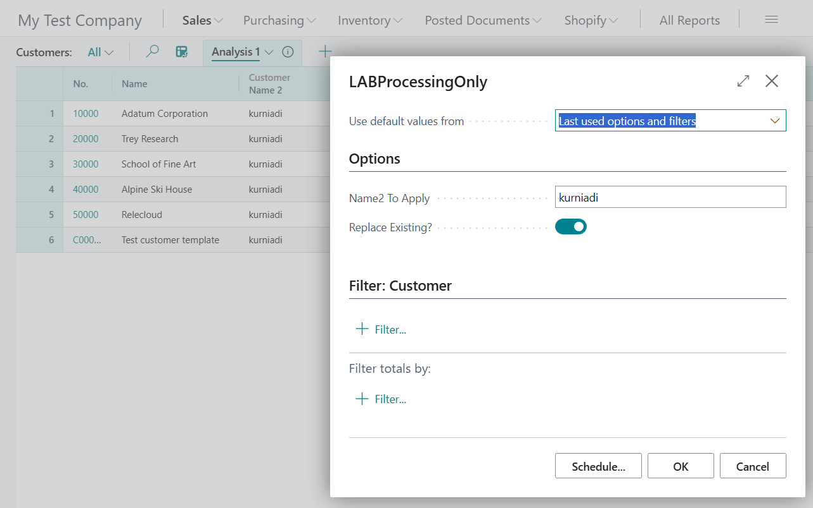

# Module #5-7: Exercise

> Part of: Module 5: Reporting & Analytics

## [**Exercise - Create a processing-only report**](https://learn.microsoft.com/en-gb/training/modules/understand-report-triggers-functions/5-exercise)

Use Github Copilot to create processing report:
Use Copilot Agent to generate the report

[https://learn.microsoft.com/en-gb/training/modules/understand-report-triggers-functions/5-exercise](https://learn.microsoft.com/en-gb/training/modules/understand-report-triggers-functions/5-exercise)

Use MAI-Code-1.1- Flash Model

Prompt Instruction 1:

_“Analyst the lab exercise https://learn.microsoft.com/en-gb/training/modules/understand-report-triggers-functions/5-exercise and summary up the objective in point list item” _

Prompt Instruction 2:
_“Create the processing report according to the lab and check and verify the result against the source lab”_

<!-- Auto-reviewed via OCR redaction pipeline: 0 sensitive text regions detected. OCR cannot catch non-text sensitive content (logos, photos, stylized graphics) -- please still skim before a public push. -->
