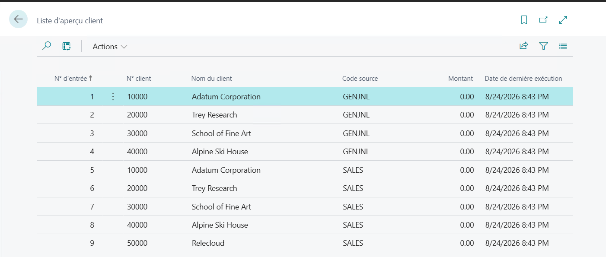

# Module #6-10: Exercise

> Part of: Module 6: Programming in AL

`Vscode Path: Labs\M6_10_Multilanguage_dev`
`Agent Model: MAI-Code-1.1-Flash`

## [**Exercise - Multilanguage development**](https://learn.microsoft.com/en-gb/training/modules/manage-multilanguage-development/4-exercise)

Prompt Instruction 1:
`“Generate translation file for target lanugage "fr-FR" and provide the translation”`

<!-- Auto-reviewed via OCR redaction pipeline: 0 sensitive text regions detected. OCR cannot catch non-text sensitive content (logos, photos, stylized graphics) -- please still skim before a public push. -->
