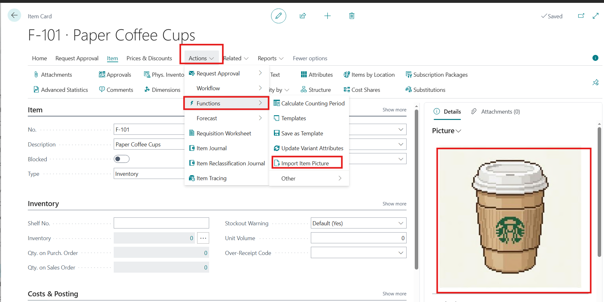

# Module #7-1: Exercise

> Part of: Module 7: File Handling & XMLports

## Own Exercise:

### Creating a New Skill:

In plan mode, session agents may create subagents with different models chosen by agent runtime. The skill is to limit the agent model selection that can be used for certain tasks.

`/create-skill <write the skill description that need to create>`
Copilot will generate .MD file
Path	:` .github\skills\Plan-model-selection`
File	:` SKILL.MD`

---
name: plan-model-selection
description: 'Use when creating or executing a plan in plan mode. Restrict model selection to the approved planning models: Claude Haiku 4.5, Claude Sonnet 4.6, GPT-5 mini, and GPT-5.6 Luna. Preserve the requested model when available and report availability limits clearly.'
argument-hint: 'Describe the task to plan and optionally name one approved model.'
user-invocable: true
disable-model-invocation: false
---

**# Plan Model Selection**

**## When to Use**

Use this skill whenever the user asks to:

- create, revise, or execute a plan;
- use plan mode;
- choose a model for planning; or
- restrict planning to a specified model set.

**## Approved Models**

Use only these models for plan-mode work:

1. `Claude Haiku 4.5`
2. `Claude Sonnet 4.6`
3. `GPT-5 mini`
4. `GPT-5.6 Luna`
5. `MAI-Code-1.1-Flash` (for code generation tasks)

Treat these names as the approved friendly labels. If the host exposes different canonical model identifiers, map them only when the mapping is unambiguous.

**## Procedure**

1. Detect that the request is planning-related before selecting a model.
2. Check whether the user explicitly requested one of the approved models.
3. If a requested approved model is available, use that model.
4. If no model was requested, select one model from the approved list according to the host's model availability and the task's complexity.
5. Do not select a model outside the approved list.
6. If none of the approved models is available, do not silently substitute another model. Explain the limitation and ask the user how to proceed.
7. Keep the plan focused on the user's task, with assumptions, implementation steps, decision points, and verification checks.
8. At the end of the plan, state which approved model was selected or state that selection could not be completed.

**## Model Preference Guidance**

- Use `Claude Haiku 4.5` for short, straightforward plans.
- Use `Claude Sonnet 4.6` for plans requiring broader repository context or nuanced tradeoffs.
- Use `GPT-5 mini` for compact implementation plans and quick iteration.
- Use `GPT-5.6 Luna` when the host identifies it as the suitable approved model for the task.

Do not claim that a model was used unless the host confirms the selection. If a friendly label cannot be matched confidently to an available canonical model, report that ambiguity instead of guessing.

**## Completion Checks**

Before returning a plan, verify that:

- the selected model is in the approved list;
- no unapproved fallback was silently chosen;
- the plan identifies the concrete files, symbols, or behavior involved when repository context exists;
- the plan includes at least one falsifiable verification step; and
- model availability or naming ambiguity is disclosed when relevant.

### Creating custom prompt:

Similar prompt need to write for each lab, and custom prompt is to achieve consistent result and output format

`/Create-Prompt <write the custom instruction>`

Copilot will generate .MD file
Path	:` ``.github\Prompts`
File	`: al-lab-object-planning.prompt.md`

agent: Plan
description: 'Analyze a Business Central AL lab exercise, itemize objectives, assign valid object IDs in range, and consolidate the technical work needed for new or updated objects.'
---
**# Use skill**
/skill plan-model-selection

**# AL Lab Object Planning**

You are working in a Microsoft Dynamics 365 Business Central AL extension project.

Analyze the selected lab exercise in the workspace and produce an implementation-ready planning summary.
You must ask before proceeding if any of the following information is missing:
1. The link or the URL to the lab exercise or provide the lab folder path in the workspace to proceed with the analysis.
2. The target path folder in the workspace where the new or updated AL objects should be created or modified.

**## Objective**
Review the relevant lab content under the Labs folder and determine:
1. the objective of the exercise;
2. each required object or modification;
3. whether the object is new or an update to an existing object;
4. a valid AL object ID within the current project range; and
5. the technical implementation details needed to complete the object or update.

**## Required Inputs**
Use these as the source of truth when available:
- the selected lab folder or files in Labs/
- the extension metadata in app.json
- the current object ID range in app.json
- any existing object patterns already present in the project

**## Rules**
- Validate all proposed object IDs against the allowed range in app.json.
- Prefer the next free valid ID in range when a new object is required.
- Do not propose IDs outside the configured idRanges.
- If the object already exists, do not create a duplicate; describe the update required.
- Keep the output implementation-focused and suitable for a developer or reviewer.
- When the exercise includes multiple steps, itemize them in a logical sequence.

**## Output Format**
Return a structured plan with these sections:

**### 1. Exercise Summary**
- Lab name or folder
- Business purpose of the exercise
- Overall goal

**### 2. Objectives Breakdown**
List each objective as a numbered item.
For each objective, include:
- objective name
- what the user is expected to learn or implement
- expected outcome

**### 3. Object Inventory**
For each object involved, include:
- object type (Table, Page, Codeunit, Report, Enum, TableExtension, PageExtension, etc.)
- object name
- action: New object or Update existing object
- proposed object ID
- valid range check: confirm the ID is within the configured range from app.json
- reason for the ID choice

**### 4. Technical Implementation Notes**
For each object, summarize:
- purpose of the object
- key properties and fields / actions / triggers involved
- required AL syntax patterns or code structure
- dependencies or references to other objects
- any required page action, table relation, UI behavior, report logic, or event handling

**### 5. Consolidated Implementation Plan**
Provide a short, actionable list of what to create or modify first, including:
- new object creation steps
- modification steps for existing objects
- validation or testing steps
- any app.json changes needed

**### 6. Final Recommendation**
Conclude with a clear recommendation such as:
- create these objects,
- update these existing objects,
- keep the project in the current valid ID range,
- no app.json change required, or
- app.json range update is required if the exercise demands a broader object space.

**## Context-Specific Guidance for This Repository**
This workspace uses a Business Central AL extension with the configured range in app.json.
Use that range as the authoritative source when identifying valid object IDs.

When analyzing the labs:
- review the files under Labs/ for the exercise pattern;
- compare with current project structure and naming conventions;
- map the lab requirements to AL object types already used in the solution;
- keep the plan aligned with the extension version and current feature set.

**## Example final wording**
A strong final answer should read like a planning document rather than generic advice, for example:

- Objective 1: Create a table to store course data.
- New object: Table Course, ID 50100, valid range 50100..50149.
- Technical implementation: define fields, keys, caption, and table relations required by the lab.
- Update existing object: Page Course List, ID 50101, extend page actions and source table binding.

**## Execution**
Execute the analysis directly from the selected files and the project metadata. Do not invent objects that do not correspond to the exercise.

`Vscode Path: Labs\M7_1_read_write_file`
`Agent Model: MAI-Code-1.1-Flash`

## [Exercise - Read and write files](https://learn.microsoft.com/en-us/training/modules/introduction-basics-file-management/5-exercise)

Prompt Instruction 1: (use custom prompt)
`“/al-lab-object-planning”`

Agent ask following question:
`“””
``Q:`` Which lab folder in the workspace should I analyze for the implementation plan?`
`A:`` https://learn.microsoft.com/en-us/training/modules/introduction-basics-file-management/5-exercise`
`Q:`` Where should the objects be created or updated in this project?`
`A:`` M7_1_read_write_file`
`“””`

Prompt Instruction 2:
`“Start implementation and check the output with the source lab exercise”`

<!-- Auto-reviewed via OCR redaction pipeline: 0 sensitive text regions detected. OCR cannot catch non-text sensitive content (logos, photos, stylized graphics) -- please still skim before a public push. -->
