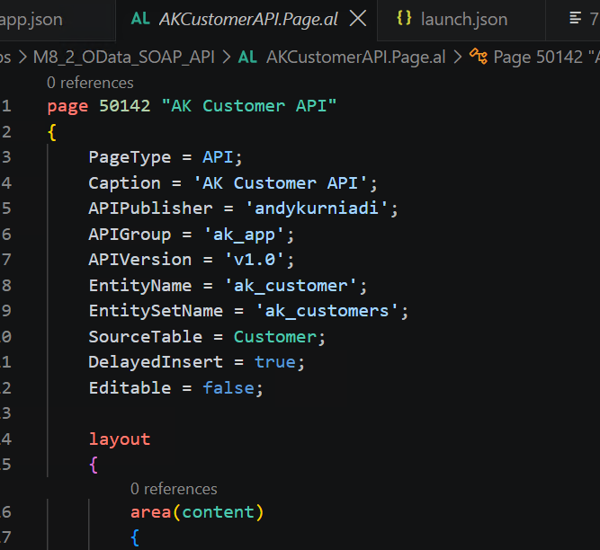
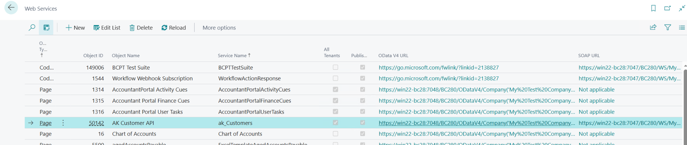
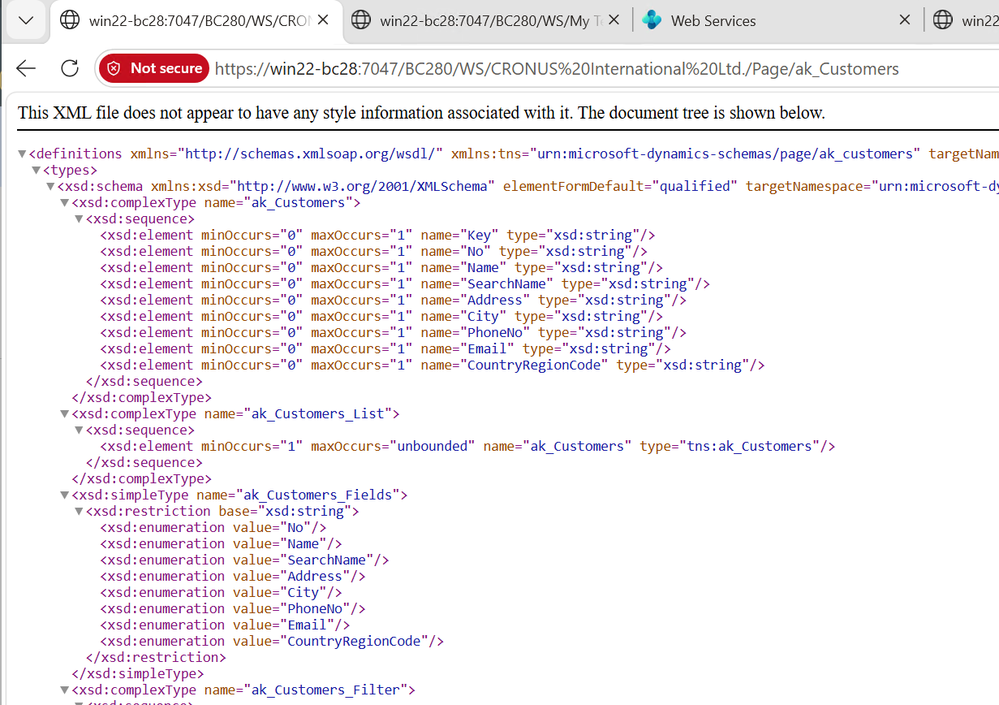
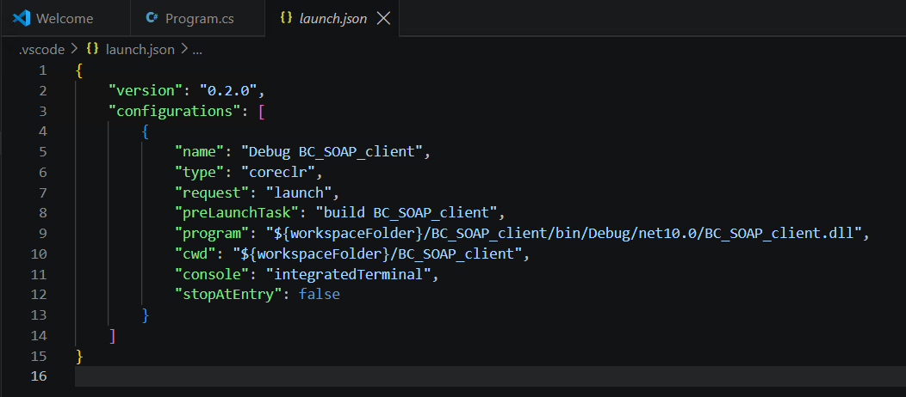

# Module #8-2: Exercise

> Part of: Module 8: Integration & Web Services

## Own Exercise:

### Create Customer_ws for ODATA, SOAP and API Service

`Vscode Path: Labs\M8_2_OData_SOAP_API`
`Agent Model: MAI-Code-1.1-Flash`

Prompt Instruction 1:
`“``/plan`` create a new customer page card object to be used in webservice for OData, SOAP and API service. Show some general fields and find the unique object id and target object into folder M8_2_OData_SOAP_API”`

Agent Response:
`”” ``Plan:`` Customer API page for OData, SOAP, and API`
`This will create a focused customer web-service page in the target lab folder, using a standard Business Central API page pattern so it is discoverable through OData, SOAP, and the API stack.`
`Recommended implementation`
- `Use object ID: 50105`
- `Type: page`
- `Source table: Customer`
- `Target folder: M8_2_OData_SOAP_API`
- `Page mode: PageType = API with EntityName and EntitySetName metadata`
`Steps`
- `Confirm app-level constraints and object ID availability from app.json and the existing AL object numbering pattern. The app is already in a 50100-50149 range, so 50105 is a clean, unused choice.`
- `Create a new API page in M8_2_OData_SOAP_API with:`
- `PageType = API`
- `SourceTable = Customer`
- `APIPublisher, APIGroup, APIVersion`
- `EntityName = CustomerApi`
- `EntitySetName = CustomerApi`
- `Add a small General section with common customer fields such as No., Name, Search Name, Address, City, Phone No., Email, and Country/Region. This keeps the object readable and useful for web-service access.`
- `Validate the page compiles in the app and confirms the object is exposed correctly to the service metadata layer.`
- `Verify the object is discoverable and usable via the standard customer web-service route for OData/API consumption.`
`””`

Prompt Instruction 2:
`“”revise following:`
`use object id 50123 and validate the ID`
`use following for API configuration`
`APIPublisher = '<your-publisher>'`
`APIGroup = 'ak_app'`
`EntityName = 'ak_customer'`
`EntitySetName = 'ak_customers'`

`validate the value`
`“”`

Agent Response:
`“”Updated plan`
- `Create the new API page in M8_2_OData_SOAP_API using a unique page ID such as 50142.`
- `Set the page metadata exactly as:`
- `APIPublisher = '<your-publisher>'`
- `APIGroup = 'ak_app'`
- `EntityName = 'ak_customer'`
- `EntitySetName = 'ak_customers'`
- `Use SourceTable = Customer and expose a small General section with fields such as No., Name, Address, City, Phone No., and Email.`
- `Validate the page compiles cleanly and confirms the entity is available through the standard API/OData endpoint.`
- `Test the endpoint name and entity set to confirm it resolves to ak_customer and ak_customers.`
`If you want, I can now turn this into the exact AL page object to place inside M8_2_OData_SOAP_API.””`

Prompt Instruction 3:
`“”Start implementation”” `

<!-- Auto-reviewed via OCR redaction pipeline: 0 sensitive text regions detected. OCR cannot catch non-text sensitive content (logos, photos, stylized graphics) -- please still skim before a public push. -->

<!-- Auto-reviewed via OCR redaction pipeline: 0 sensitive text regions detected. OCR cannot catch non-text sensitive content (logos, photos, stylized graphics) -- please still skim before a public push. -->

`<your-server>:7047/BC280/WS/CRONUS International Ltd./Page/ak_Customers`

<!-- Auto-reviewed via OCR redaction pipeline: 0 sensitive text regions detected. OCR cannot catch non-text sensitive content (logos, photos, stylized graphics) -- please still skim before a public push. -->

### Create C# Console Client Consume BC SOAP web service

`Vscode Path: other-project\Labs\M8_2_OData_SOAP_API`
`Agent Model: GPT-5.6 Luna`

Require: C# & C# DEV Kit extension
Prompt Instruction 1:
`“Create C# console project named BC_SOAP_client”`` `

Prompt Instruction 2:
`“``/plan`` I want to create a C# console app that consumes a SOAP web service at <your-server>:7047/BC280/WS/<your-company>/Page/ak_Customers. Use Windows authentication without hardcoding credentials. List customers filtered by country, defaulting to 'GB', and optionally prompt for a country code.”`

Agent ask question following:
`“””`
`Q:`` What Windows credentials should the planned client hardcode: domain\username and password, or should it use placeholders such as CONTOSO\soapuser / password?`
`A:`` Use placeholders for the username and password; do not hardcode credentials.`
`Q: Can the implementation assume the live endpoint exposes the standard Business Central Customers page WSDL at the supplied URL plus `?wsdl`, with generated proxy code committed to the project?`
`A:`` Yes, generate from live WSDL - Use the endpoint's WSDL as the source of truth for the SOAP proxy.`
`Q:`` Should the country filter use the SOAP Customers page field `Country_Region_Code` and display the standard customer fields returned by the service?`
`A:`` Yes, standard field - Filter by Business Central's Country/Region Code field and list common customer fields.`
`“””`

Note: switch back to agent
Prompt Instruction 3:
`“Start implementation”`

**Note:** run great console: `dotnet run --project ".\BC_SOAP_client\BC_SOAP_client.csproj"`
But not for run with F5 or ctrl+F5
Prompt Instruction 4:
`“Run F5 on the .csproject will prompt asking xml for debugging, how to run using F5 without xml extension?”`

Agent response:
`“””
The project file is valid and the workspace has no .vscode debugger configuration. The XML prompt is coming from VS Code’s generic debugger selection, so I’m adding a standard C# coreclr launch configuration in JSON, using the built console DLL and the integrated terminal for the country-code prompt.`
`Created launch.json`
`The F5 profile is now present and uses coreclr, so VS Code will no longer ask for an XML debugger. I’m adding a pre-launch build task as well, so F5 compiles the project automatically before starting the SOAP client.`
`Created tasks.json`
`The debugger files are configured; the validation command was interrupted before producing build output, so I’m rerunning the project build once to confirm the referenced path and task target are sound.`
`Configured F5 debugging without the XML debugger prompt.`
`Added:`
- `launch.json`
- `Uses the C# coreclr debugger.`
- `Launches BC_SOAP_client.dll.`
- `Uses the integrated terminal for country-code input.`
- `tasks.json`
- `Builds the .csproj automatically before debugging.`
`“””`

<!-- Auto-reviewed via OCR redaction pipeline: 0 sensitive text regions detected. OCR cannot catch non-text sensitive content (logos, photos, stylized graphics) -- please still skim before a public push. -->

Run output:
`PS Z:\Github_Repo\bc28onprem-workshop\other-project\Labs\M8_2_OData_SOAP_API\CSharp_ConsoleClientSoap>  & 'c:\Users\Administrator\.vscode\extensions\ms-dotnettools.csharp-2.160.4-win32-x64\.debugger\x86_64\vsdbg.exe' '--interpreter=vscode' '--connection=64fd576a94674828b39473647c57c101' `
`Country/Region Code [GB]: GB`
`Customers in GB: 3`
`10000 | Adatum Corporation | Cambridge | GB | robert.townes@contoso.com`
`20000 | Trey Research | London | GB | helen.ray@contoso.com`
`50000 | Relecloud | Guildford | GB | jesse.homer@contoso.com`
