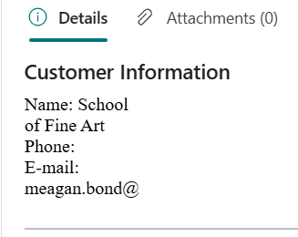
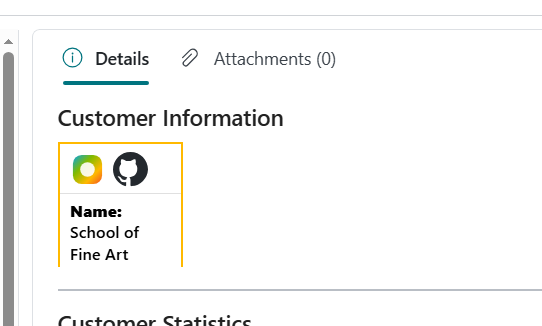

# Module #8-4: Exercise

> Part of: Module 8: Integration & Web Services

## [Exercise - Build a control add-in object](https://learn.microsoft.com/en-us/training/modules/build-control-add-ins/6-exercise)

`Vscode Path: Labs\M8_4_Build_Control_Addin`
`Agent Model: MAI-Code-1.1-Flash`

Prompt Instruction 1: (**switch to plan mode**)
`“``/al-lab-object-planning`` Analyst lab exercise https://learn.microsoft.com/en-us/training/modules/build-control-add-ins/6-exercise”`

Prompt Instruction 2:
`“Start implementation”`

Note: the iframe unable to fullwith because under the factbox section

<!-- Auto-reviewed via OCR redaction pipeline: 0 sensitive text regions detected. OCR cannot catch non-text sensitive content (logos, photos, stylized graphics) -- please still skim before a public push. -->

Custom script with start_copilot.js → Displaying image svg

<!-- Auto-reviewed via OCR redaction pipeline: 0 sensitive text regions detected. OCR cannot catch non-text sensitive content (logos, photos, stylized graphics) -- please still skim before a public push. -->
