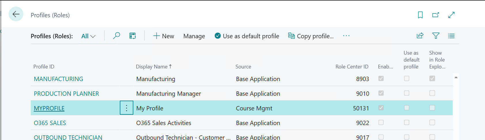
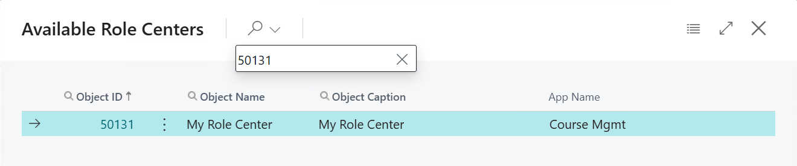
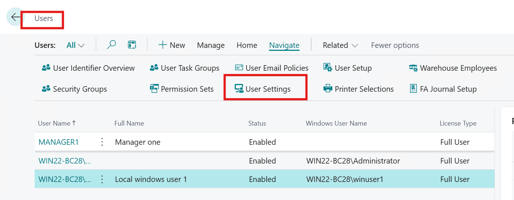
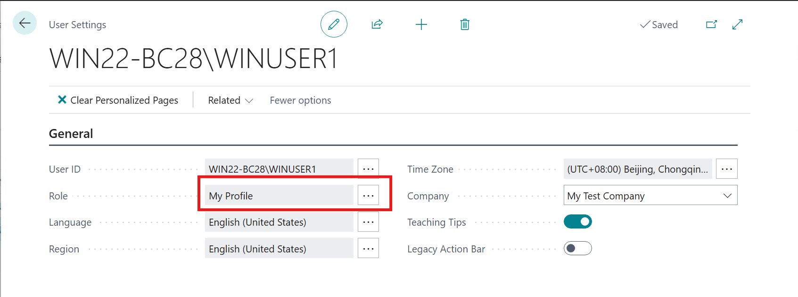
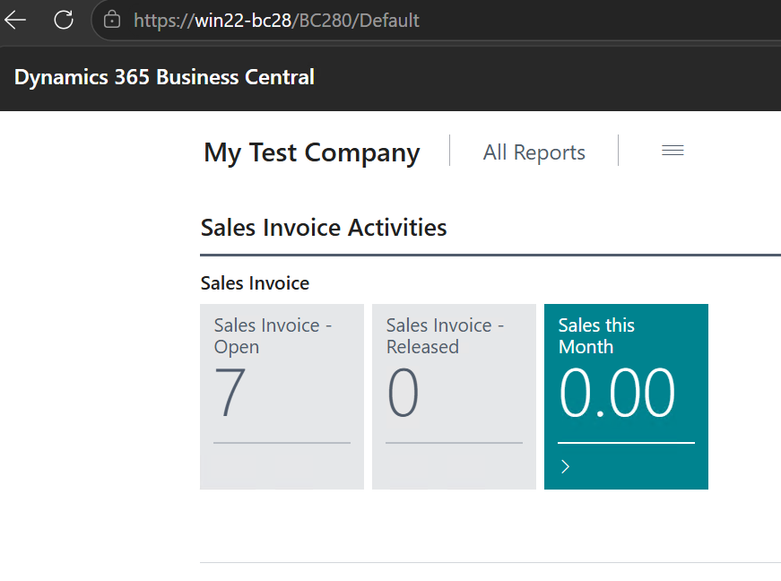

# Module #9-2: Exercise

> Part of: Module 9: User Interface & Role Centers

## [Exercise - Create a Role Center page with an Activity page](https://learn.microsoft.com/en-us/training/modules/develop-role-center/7-exercise)

`Vscode Path: Labs\M9_2_Create_RoleCenter`
`Agent Model: MAI-Code-1.1-Flash`

Prompt Instruction 1: (**switch to plan mode**)
_“_**_/al-lab-object-planning analyst_**_ lab exercise https://learn.microsoft.com/en-us/training/modules/develop-role-center/7-exercise”_

Agent Response:
`“..`

## `6. Final Recommendation`

`Create the objects in the selected lab folder M9_2_Create_RoleCenter, using the standard Microsoft Learn exercise objects and IDs:`
- `Table Sales Invoice Cue — ID 50130`
- `Page Sales Invoice Activities — ID 50130`
- `Page My Role Center — ID 50131`
- `Query Custom Ledg. Entry Sales — ID 50130`
- `Profile My Profile — name-based, no numeric ID`
`This stays within the valid range defined in app.json, so no app.json change is required. The implementation should be a clean new-object exercise rather than an update to an existing project object.`
`Created 3 todos”`

Prompt Instruction 2: (**switch to agent mode**)
`“Start implementation” `

Generated profile and role center

<!-- Auto-reviewed via OCR redaction pipeline: 0 sensitive text regions detected. OCR cannot catch non-text sensitive content (logos, photos, stylized graphics) -- please still skim before a public push. -->

<!-- Auto-reviewed via OCR redaction pipeline: 0 sensitive text regions detected. OCR cannot catch non-text sensitive content (logos, photos, stylized graphics) -- please still skim before a public push. -->

How to switch the user to use custom profile “my profile”

<!-- Auto-reviewed via OCR redaction pipeline: 0 sensitive text regions detected. OCR cannot catch non-text sensitive content (logos, photos, stylized graphics) -- please still skim before a public push. -->

Go to user settings→my profiles

<!-- Auto-reviewed via OCR redaction pipeline: 0 sensitive text regions detected. OCR cannot catch non-text sensitive content (logos, photos, stylized graphics) -- please still skim before a public push. -->

After win-user1 re-login.

<!-- Auto-reviewed via OCR redaction pipeline: 0 sensitive text regions detected. OCR cannot catch non-text sensitive content (logos, photos, stylized graphics) -- please still skim before a public push. -->

The drill down provided for ”Sales This Month”
