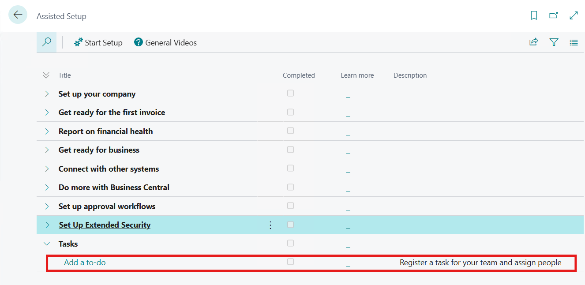
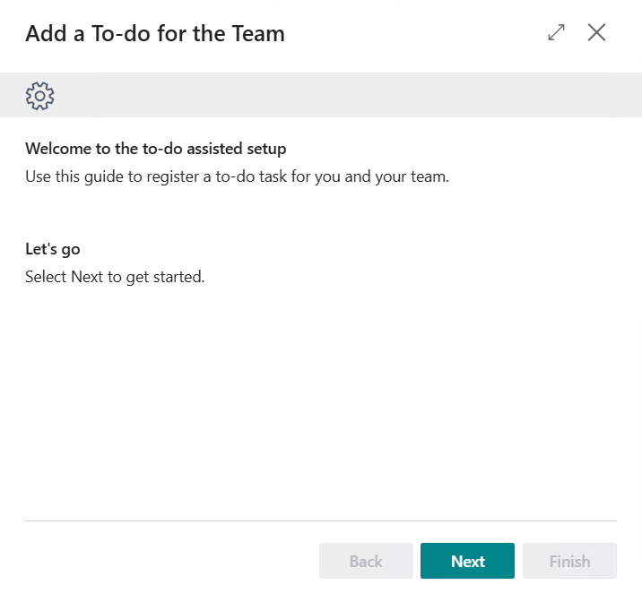
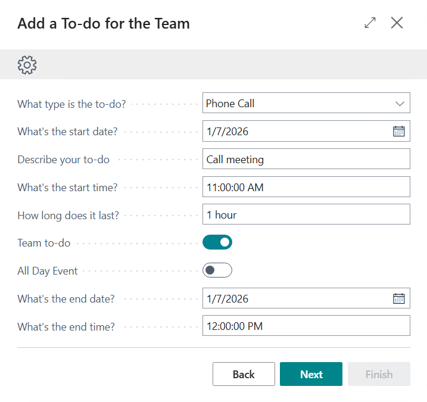
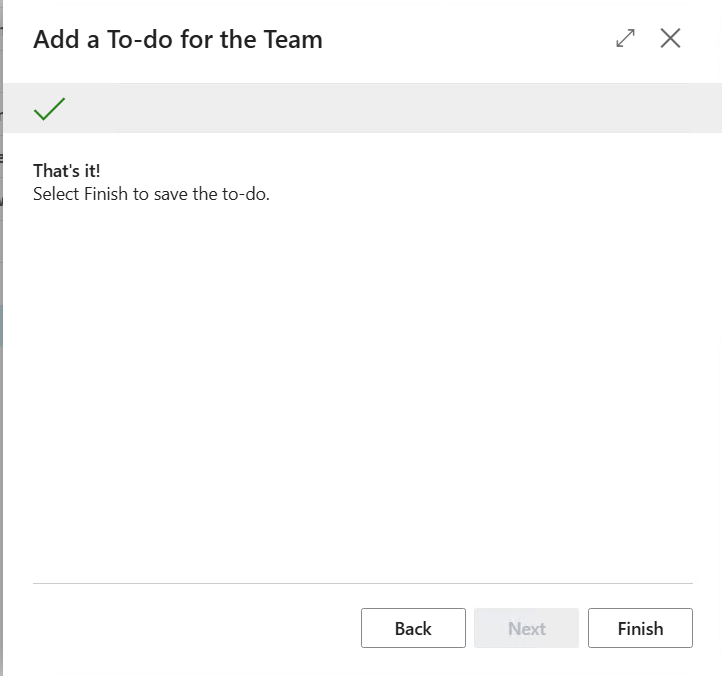
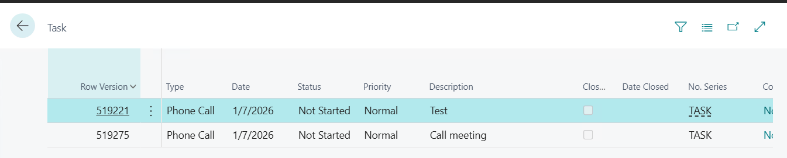

# Module #9-3: Exercise

> Part of: Module 9: User Interface & Role Centers

## [Exercise - Build a wizard page with Assisted Setup](https://learn.microsoft.com/en-us/training/modules/build-assisted-setup/5-exercise)

`Vscode Path: Labs\M9_3_Create_WizardPage`
`Agent Model: MAI-Code-1.1-Flash`
Prompt Instruction 1: (**switch to plan mode**)
`“``/al-lab-object-planning`` “`
`
`Agent Response: (agent ask 2 questions as per skill prompt)
`“`
`Q: Which lab exercise should I analyze, or paste the lab URL if you have it?`
`A: https://learn.microsoft.com/en-us/training/modules/build-assisted-setup/5-exercise`
`Q: Which workspace folder should the implementation target?`
`A: M9_3_Create_WizardPage`
`“`

Agent Response:
`“
6. Final Recommendation`
- `Create the following new objects:`
- `ToDoAssistedSetup page, ID 50132`
- `AddToDoAssistedSetup codeunit, ID 50133`
- `AssistedSetupGroup enum extension, ID 50134`
- `Do not create a duplicate To-do table; reuse the base application table.`
- `Keep the project in the current valid ID range: 50100..50149.`
- `No app.json change is required for this exercise.`
`“`

Prompt Instruction 2: (**switch to plan mode**)
**“**`Start implementation`**” **

**Bug fix:** the page is not editable due error on ToDoRec.get()
Below codes are the corrections:
Create an temporary variable assign to rec

`    trigger OnOpenPage()`
`    begin`
`        //ToDoRec.Get();`
`        ToDoRecTemp.Init();`
`        ToDoRecTemp."No." := '';`
`        ToDoRecTemp.Insert();`

`        Rec := ToDoRecTemp;`
`        CurrPage.Update();`
`    end;`
`    var`
`        ToDoRecTemp: Record "To-do" temporary; // Temporary record to hold the to-do data during the wizard process`

<!-- Auto-reviewed via OCR redaction pipeline: 0 sensitive text regions detected. OCR cannot catch non-text sensitive content (logos, photos, stylized graphics) -- please still skim before a public push. -->

The new assisted setup record created when the page is loaded.

<!-- Auto-reviewed via OCR redaction pipeline: 0 sensitive text regions detected. OCR cannot catch non-text sensitive content (logos, photos, stylized graphics) -- please still skim before a public push. -->

<!-- Auto-reviewed via OCR redaction pipeline: 0 sensitive text regions detected. OCR cannot catch non-text sensitive content (logos, photos, stylized graphics) -- please still skim before a public push. -->

<!-- Auto-reviewed via OCR redaction pipeline: 0 sensitive text regions detected. OCR cannot catch non-text sensitive content (logos, photos, stylized graphics) -- please still skim before a public push. -->

After click “Finish” the record was created.

<!-- Auto-reviewed via OCR redaction pipeline: 0 sensitive text regions detected. OCR cannot catch non-text sensitive content (logos, photos, stylized graphics) -- please still skim before a public push. -->
