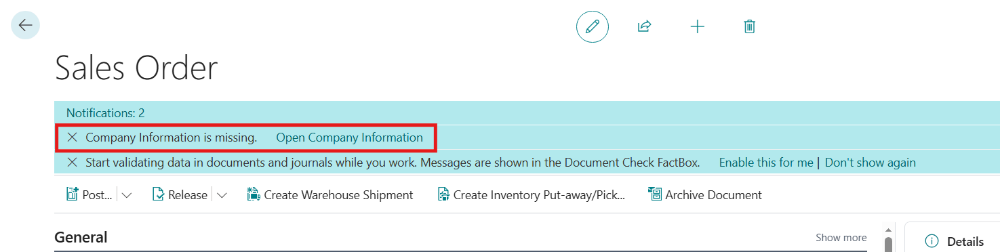
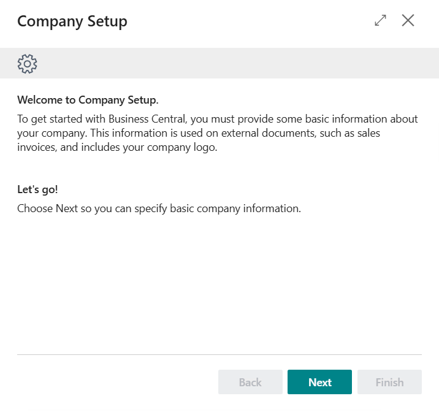
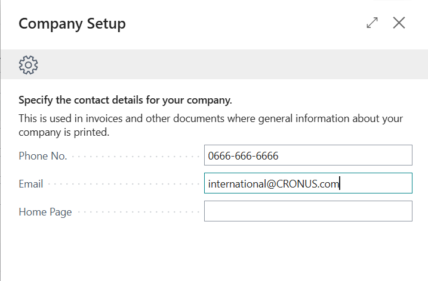

# Module #9-4: Exercise

> Part of: Module 9: User Interface & Role Centers

## [**Exercise - Create a notification**](https://learn.microsoft.com/en-us/training/modules/send-notifications/4-exercise)

`Vscode Path: Labs\M9_4_Create_Notification`
`Agent Model: GPT-5.6 Luna`

Prompt Instruction 1: (**switch to plan mode**)
`“``/al-lab-object-planning`` “`

Agent Response: (agent ask 2 questions as per skill prompt)
`“`
`Q: What URL should I use as the source for the lab exercise?`
`A: https://learn.microsoft.com/en-us/training/modules/send-notifications/4-exercise`
`Q: Where should the planned new or updated AL objects be created or modified?`
`A: M9_4_Create_Notification`
`“`
`“`
`Final Recommendation`
`Create NotificationCompanyInfo.CodeUnit.al in M9_4_Create_Notification using object ID 50141. Keep the project’s existing 50100..50149 range and make no app.json changes. Use ShowCompanyInfoWizard consistently for the notification action handler.
``“`

Prompt Instruction 2: (**switch to Agent mode**)
`“Start implementation”`

<!-- Auto-reviewed via OCR redaction pipeline: 0 sensitive text regions detected. OCR cannot catch non-text sensitive content (logos, photos, stylized graphics) -- please still skim before a public push. -->

Due missing email

<!-- Auto-reviewed via OCR redaction pipeline: 0 sensitive text regions detected. OCR cannot catch non-text sensitive content (logos, photos, stylized graphics) -- please still skim before a public push. -->

<!-- Auto-reviewed via OCR redaction pipeline: 0 sensitive text regions detected. OCR cannot catch non-text sensitive content (logos, photos, stylized graphics) -- please still skim before a public push. -->

There is no more notification once email is filled in.
