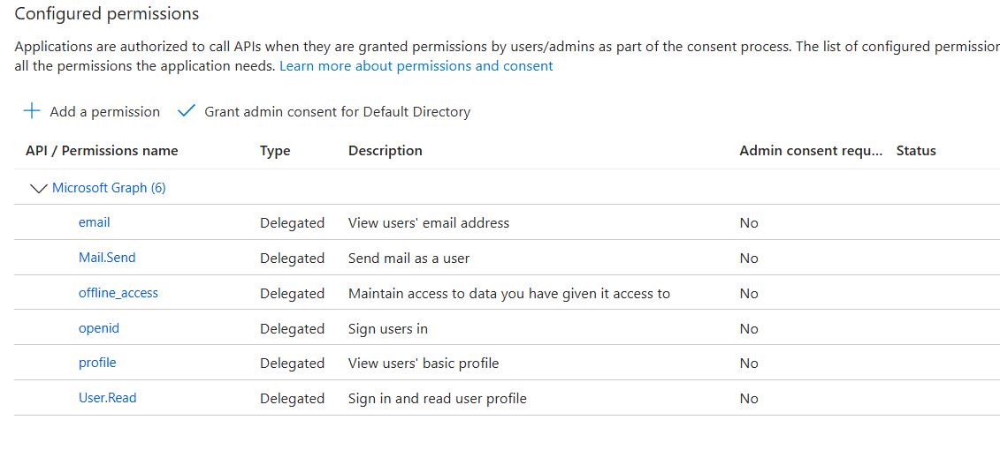

# Lab 2: Create a Microsoft Entra application registration

## Goal

Create the application registration used by Business Central to authenticate Microsoft 365 email operations.

## Create the registration

In the Microsoft Entra admin center:

1. Open **App registrations** and select **New registration**.
2. Give the application a recognizable name, such as `BC28 On-Prem Email`.
3. Choose the supported account type that matches the intended deployment. Use **Accounts in this organizational directory only** for a single-tenant deployment; choose a multitenant option only when the application must serve users in other Entra tenants.
4. Create the registration and record the **Application (client) ID** and **Directory (tenant) ID**.
5. Under **Certificates & secrets**, create a client secret. Copy its **Value** immediately and store it in an approved secret store; it cannot be retrieved later.

## Configure the redirect URI

Under **Authentication**, add a **Web** redirect URI:

```text
https://win22-bc28:443/BC280/OAuthLanding.htm
```

This must exactly match the public HTTPS Business Central URL configured in Lab 1.

## Add delegated Microsoft Graph permissions

Under **API permissions**, add Microsoft Graph **Delegated permissions**:

- `Mail.Send`
- `offline_access`
- `openid`
- `profile`
- `email`

Grant tenant consent when your organization requires administrator approval.



## Record local configuration

Copy `templates\app-registration-values.example.json` to a local ignored values file and add the tenant ID, client ID, secret location, public URL, and redirect URI. Do not commit the populated file.
