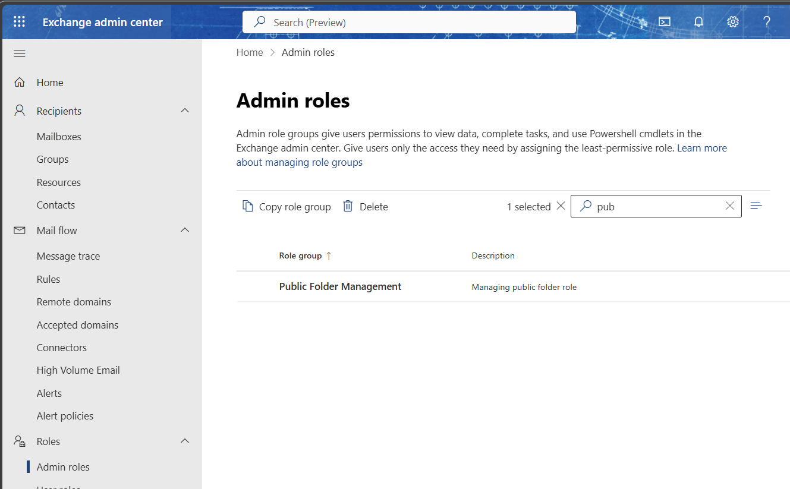
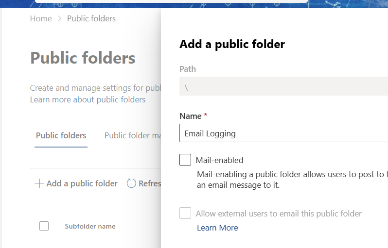
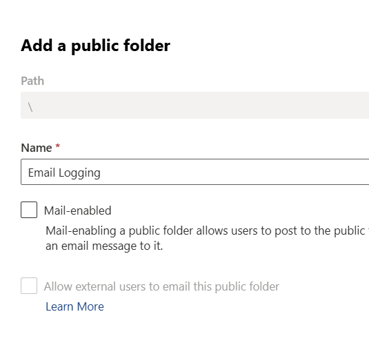
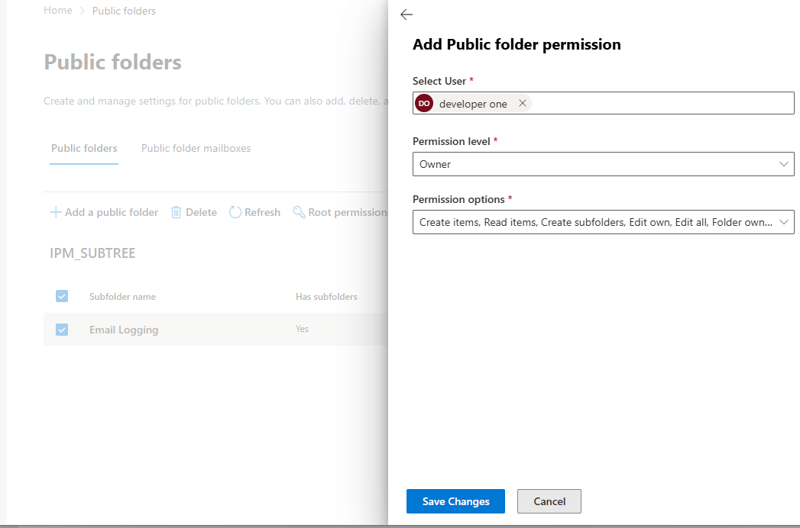
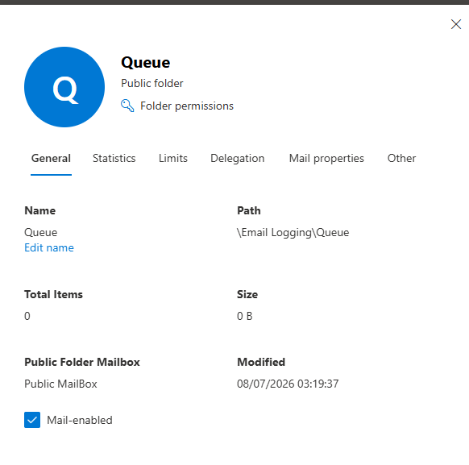
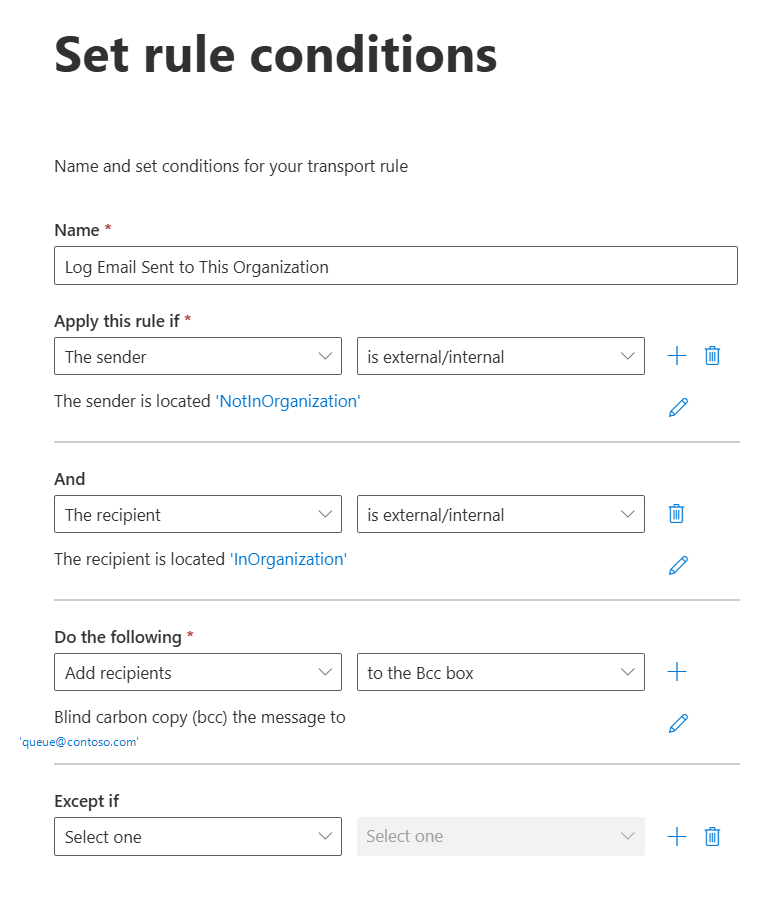
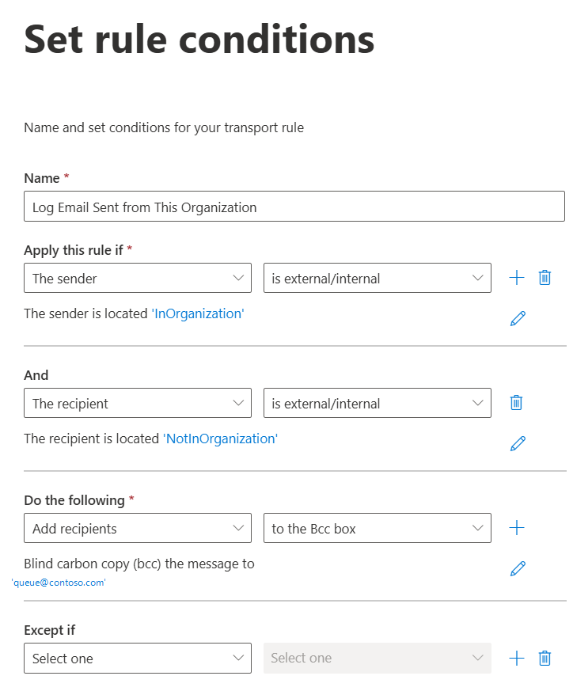
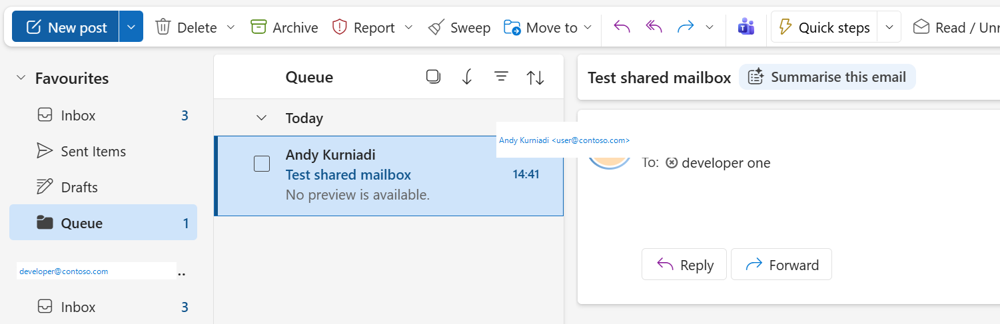

# Lab 7: Configure public-folder email logging

## Goal

Enable legacy-style Business Central email logging with Exchange Online public folders.

> If you are also testing shared-mailbox logging, disable the shared-mailbox mail flow rules before validating this lab.

## 1. Create required Exchange role group

In Exchange admin center:

1. Open **Roles > Admin roles**.
2. Create a new role group named `Public Folders Management`.
3. Add the role `Public Folders`.
4. Add the account used by Business Central logging as a member.



## 2. Create public-folder mailbox and folders

1. Go to **Recipients > Public folders > Public folder mailboxes** and create a mailbox named `Public MailBox`.
2. Under **Public folders**, create:
   - `\Email Logging\`
   - `\Email Logging\Queue\`
   - `\Email Logging\Storage\`

Set the logging account as owner on `Queue` and `Storage`.









## 3. Mail-enable Queue and set permissions

Use Exchange Online PowerShell:

```powershell
Connect-ExchangeOnline -Device

Add-PublicFolderClientPermission `
  -Identity "\Email Logging\Queue" `
  -User Anonymous `
  -AccessRights CreateItems

Set-MailPublicFolder `
  -Identity "\Email Logging\Queue" `
  -RequireSenderAuthenticationEnabled $false
```

Verify:

```powershell
Get-PublicFolderClientPermission "\Email Logging\Queue"
```

## 4. Create BCC transport rules to Queue

Create inbound and outbound Exchange transport rules and BCC to the Queue public folder SMTP address.







## 5. Configure Business Central email logging

Run **Set up email logging** in Business Central and follow the Microsoft Learn setup for public-folder logging.

## Validate

1. Send a test message matching inbound and outbound rules.
2. Verify copies arrive in the Queue public folder.
3. Confirm Business Central processes and logs the messages.

